| 时间       | 作者 | 备注 |
| ---------- | ---- | ---- |
| 2026.01.12 | Kai  | 一稿 |
| 2026.01.14 | Kai  | 二稿 |
| 2026.01.19 | Kai  | 三稿 |
| 2026.01.20 | Kai  | 四稿 |

# 一、 背景介绍

## 1.1 需求介绍

**目的**：模拟真实连续牌局，提供给用户贴近真实环境

## 1.1.1 需求点整理

- **新增**
  - 查看牌局进行实时牌谱
  - 补充筹码
  - 查看对战报告
  - 主动退出牌局
- **修改**
  - 牌局增加局数配置
- **不用处理**
  - ai风格定制化
  - 专项训练
  - hero下注超时，**当前已有功能已支持**
  - 局内设置，**当前局和下一局生效都需要支持，目前已支持**
  - 牌谱保存
  - 异常处理：杀掉进程
  - 牌局进行中：体力，用户虚拟币控制买入量

## 1.1.2 需求点细节

- 查看牌局进行实时牌谱
  - 获取牌谱接口：get_hand_history
  - 牌谱数据：牌局进行中实时产生
- 补充筹码
  - 增加筹码接口：add_chips
  - 注：详细的业务逻辑单独加个和table_manager平级的模块来处理
  - 为前端补充筹码成功ui表现准备数据
  - 主动补充，被动补充
  - hero补充，ai补充
- 查看对战报告
  - 需要记录对战报告数据：排名信息，盈利筹码， 特殊手牌，行动统计
    - 盈利筹码=最终筹码-初始筹码-补充筹码
    - 排名信息：一个session牌局结束后，盈利筹码排名
    - 特殊手牌：赢筹码最多的手牌和输筹码最多的手牌
    - 行动统计：2种，正确：玩家选择结果和ai推荐相同，具体有个规则判断；争议：其他都是这样
    - 具体规则参考 https://www.tapd.cn/tapd_fe/my/work?dialog_preview_id=story_1152052188001000782 行动统计小节
  - 数据记录：牌局进行中实时产生
  - 获取对战报告接口：get_report
- 主动退出牌局
  - 及时清理牌桌内存
  - 主动退出牌局接口：quit_game
- hero下注超时，离线再次恢复牌局
  - 只需要接着上一个时间点，前端get_table信息后，再补发一个check/fold就可以了
- 牌局增加局数配置

- 行动统计规则：
  - 正确：
    - check/fold/allin时， 玩家实际选择与AI推荐完全一致，且答案频率大于0.5%
    - raise和bet时，推荐胜率大于0.5%，
    - chips相同（如果是下注类操作）
  - 争议：其他所有情况
    - betType不一致
    - chips不一致
    - 玩家超时操作（视为争议）

## 1.2 周边文档链接(包括策划案、UI交互等资料)

UI交互：https://www.figma.com/design/ppYWqjVwUltyDUEfFHsDhT/%E3%80%90UI%E7%A8%BF%E3%80%91%E5%A4%8D%E7%9B%98%E7%BB%83%E4%B9%A0?t=lleKgmbATfozJhPl-0

## 1.3 需求的TAPD单链接

TAPD链接：【开发【示例】】
https://www.tapd.cn/tapd_fe/52052188/story/detail/1152052188001000790

## 1.4 需求变更记录

暂无

# 二、 参考方案介绍

## 2.1 设计原则

- **职责分离**：`TableManager` 专注管理游戏逻辑，新增 `SessionManager` 管理周边业务数据
- **事件驱动**：通过 `event` 进行通信，保持架构一致性
- **最小侵入**：不修改核心游戏逻辑，通过事件监听实现
- **数据隔离**：业务数据独立存储，不影响游戏状态机

## 2.2 数据结构

### 2.2.1 数据放置原则

**核心原则**：按数据特性分别放置，平衡职责分离和前端访问便利性

| 数据类型               | 放置位置                 | 理由                                       |
| ---------------------- | ------------------------ | ------------------------------------------ |
| `maxHands`             | **table + TableSession** | 配置数据，创建时确定，前端需要实时看到进度 |
| `totalHands`           | **table + TableSession** | 实时状态，前端需要频繁看到进度             |
| `isCanDestroy`           | **table + TableSession** | 实时状态,是否可以被销毁            |
| `playerStats`          | **TableSession**         | 详细统计，只在报告页面查看，数据量大       |
| `bestCardSession`      | **TableSession**         | 详细数据，只在报告页面查看                 |
| `pendingChipAdditions` | **TableSession**         | 业务逻辑数据，不需要实时展示               |
| `rankings`             | **TableSession**         | 计算成本高，只在报告页面查看               |

**数据同步策略**：

- `maxHands` 和 `totalHands` 同时存在于 `table` 和 `TableSession` 中
- `table` 中的字段用于前端展示（通过 `get_table` 返回，高频访问）
- `TableSession` 中的字段用于业务逻辑（补充筹码、限制检查等）
- 每次更新时，必须同时更新两者，保证数据一致性
- 其他详细业务数据只放在 `TableSession` 中，通过 `get_report` 接口获取

### 2.2.2 数据结构定义

1. **table 对象增加字段**（用于前端实时展示）

```typescript
// 在 src/feature/game_server/mode/table.ts 中增加
class table {
  // ... 现有字段

  // 新增：轻量级实时展示数据
  isCanDestroy: boolean  // 是否可以被销毁    
  canDestroyTime: number  // 能够销毁时间，isCanDestroy=true时，canDestroyTime=now(), now()-canDestroyTime >= 1分钟，执行销毁
  subState: string // 二级状态，state=end subState=ing时需要检测hero.chips
  maxHands: number // 最大局数，0表示不限制
  totalHands: number // 当前已完成局数
}
```

2. 新增**TableSession**类存储table非玩法核心业务数据

```typescript
class TableSession {
  isCanDestroy: boolean  // 是否可以被销毁
  canDestroyTime: number  // 能够销毁时间，isCanDestroy=true时，canDestroyTime=now(), now()-canDestroyTime >= 1分钟，执行销毁
  tableId: string // 牌桌id
  state: string // 牌桌状态
  subState: string // 二级状态，state=end subState=ing时需要检测hero.chips
  httpRspFlag: HttpRspFlag // http返回标记数据
  maxHands: number // 最大局数（与table同步）
  totalHands: number // 总局数（与table同步）
  playerSessions: Map<number, PlayerSession> // {seatIdx->PlayerSession}
  // 当前下注玩家的座位索引
  currentOperSeatIdx: number // 当前下注玩家的座位索引
  // 注：这里记录时当前轮到谁操作，当前ai的推荐结果，只需要一个
  currentAiResponse: AIResponseData // hero当前ai返回数据（用来和操作行为一起计算玩家正确和争议数量）
  createdAt: number
  updatedAt: number
}

class PlayerSession {
  uid: number // 玩家id
  seatIdx: number // 座位编号
  isAI: boolean // 是否是ai
  initChips: number // session最开始的筹码
  chips: number // 当前最新的实时筹码
  pendingChipAdditions: ChipAddition[] // 补充筹码列表,所有补充筹码遍历这里算，一次处理完，这里就清空
  // 注：这里没有直接存一个number,是为了记录详细的补充筹码记录
  applyChipAdditions: ChipAddition[] // 总增加筹码
  returnChipAdditions: ChipAddition[] // 总退还筹码
  bestCardSession: CardSession // 盈最多牌局
  worstCardSession: CardSession // 输最多牌局
  correctActionCount: number // 正确行动数量
  controversyActionCount: number // 争议行动数量
}

class ChipAddition {  
  chips: number // 补充筹码
  sequenceId: string // 序列id
}

class CardSession {
  cards: Card[] // 手牌
  cardId: string // 关联牌局id
  amount: number // 输赢数量
}
```

**注**： 牌局结束后，身上筹码加上需要补充的筹码，比如[add1, add2, add3],前2个没超过，第3个超过了，则第3个返回

**数据同步说明**：

- `maxHands` 和 `totalHands` 需要同时存在于 `table` 和 `TableSession` 中
- 创建牌桌时：同时设置 `table.maxHands` 和 `TableSession.maxHands`
- 每局结束时：同时更新 `table.totalHands` 和 `TableSession.totalHands`
- 保证数据一致性，避免前端展示和业务逻辑数据不一致

2. 新增**session_manager**类管理非玩法核心业务逻辑

```typescript
class SessionManager {
  private static instance: SessionManager
  private tableSessions: Map<string, TableSession> = new Map()

  // 单例模式
  static getInstance(): SessionManager

  // 生命周期管理
  createTableSession(tableId: string, config?: SessionConfig): TableSession
  getTableSession(tableId: string): TableSession | undefined
  destroyTableSession(tableId: string): void

  // 相关功能接口 

  // 事件监听设置
  private setupEventListeners(): void
}
```

3. 类结构图

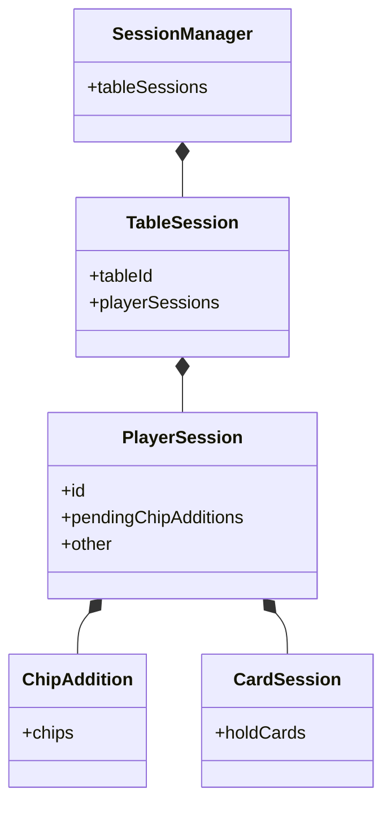
```mermaid
classDiagram
  class SessionManager
  class TableSession
  class PlayerSession
  class ChipAddition
  class CardSession
  SessionManager : +tableSessions
  TableSession : +tableId
  TableSession : +playerSessions
  PlayerSession : +id
  PlayerSession : +pendingChipAdditions
  PlayerSession : +other
  ChipAddition : +chips
  CardSession : +holdCards
  SessionManager *-- TableSession
  TableSession *-- PlayerSession
  PlayerSession *-- ChipAddition
  PlayerSession *-- CardSession
```

5. 增加SessionEvent

```typescript
// 需要新增的事件
enum GameEvent {
  // 原有事件

  // session增加的事件
  // ------------------table触发的---------------------
  // 生命周期
  // 创建table完成
  create_table = 'create_table',
  // 牌局结束
  end_game = 'end_game',
  // 行动统计
  hero_ai_response = 'hero_ai_response', // hero轮次时的AI推荐响应
  hero_oper_action = 'hero_oper_action', // hero操作统计

  // ------------------api触发的-------------------
  // 退出游戏
  quit_game = 'quit_game',  // 退出游戏
  // 补充筹码
  add_chips = 'add_chips', // 补充筹码请求
  // 对战报告
  get_report = 'get_report', // 获取对战报告 
}
```

6. 增加TableEvent（StateEvent）

```typescript
// 在状态机中使用的状态事件
enum TableEvent {  
  // 等待操作处理事件（在 end.waiting 状态中处理）
  add_chips = 'add_chips', // 补充筹码应用（由 sessionManager 通过 StateEvent 发送）  
  end_game_rsp_hero_chips_enough = 'end_game_rsp_hero_chips_enough', // end_game处理完成响应（由 sessionManager 通过 StateEvent 发送）
  end_game_rsp_hero_chips_no_enough = 'end_game_rsp_hero_chips_no_enough', // end_game处理完成响应（由 sessionManager 通过 StateEvent 发送）
  hero_add_chips = 'hero_add_chips', // end_game处理完成响应（由 sessionManager 通过 StateEvent 发送）
  // 将来可扩展其他等待操作事件
}
```

**注**：
- 网络或者其他非逻辑异常情况，造成牌局卡死，后续再思考怎么处理

7. 数据一致

- 必须保证table和table_session同时存在，同时消失
- `maxHands` 和 `totalHands` 需要保持同步：
  - 创建牌桌时：`table.maxHands = TableSession.maxHands`（从配置中读取）
  - 每局结束时：`table.totalHands = TableSession.totalHands`（同步更新）
  - 其他详细业务数据只存在于 `TableSession` 中，不放在 `table` 上

8. 添加一个牌局结束action_end

```typescript
/** 行为：牌局结束 */
export const action_end = t.Composite(
  [
    action_base,
    t.Object({      
      maxHands: t.Number({ minimum: 0, description: '最大牌局数' }),
      totalHands: t.Number({
        minimum: 0,
        description: '完成牌局数，maxHands>0 && totalHands>=maxHands 则牌局局数达到上限',
      }),
    }),
  ],
  {
    description: '牌局结束同步信息',
  }
)
```

9. 添加一个end_game_rsp行为
```typescript
/** 行为：tableSession处理返回 */
export const action_end_game_rsp = t.Composite(
  [
    action_base,
    t.Object({      
      playerList: 记录补充筹码后，玩家身上的筹码
    }),
  ],
  {
    description: '牌局结束同步信息',
  }
)
```

10. 返回全量数量需要增加一个subState二级子状态
```typescript
// 继承：用t.Composite来继承
/** 行为：切换状态 */
export const action_switch_sub_state = t.Composite(
  [
    action_base,
    t.Object({
      newSubState: t.Enum(tableStateDict, { default: table_state_Type.init, description: '牌桌二级子状态' }), // 最新状态
    }),
  ],
  { description: '切换子状态' }
)
```

11. hero最低筹码bb数，产品可配
```typescript
MIN_NEED_BB_NUM = 50  // 目前最低50个bb筹码数
```

# 三、 系统交互

**\[流程图线条做一个约定：新增（蓝色）、有调整（红色）、不变的用黑色]**

**2个核心模块数据靠发送事件交互**

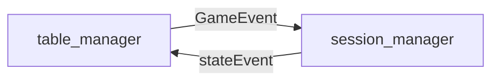
```mermaid
flowchart LR
  s1[table_manager]--GameEvent-->s3[session_manager]--stateEvent-->s1
```

**注：时序图需要明显看到同步和异步逻辑，划线定义**
- 尖角实线表示异步逻辑
- 虚线表示同步逻辑
- 圆角实现表示快速跳过步骤（异步+同步）

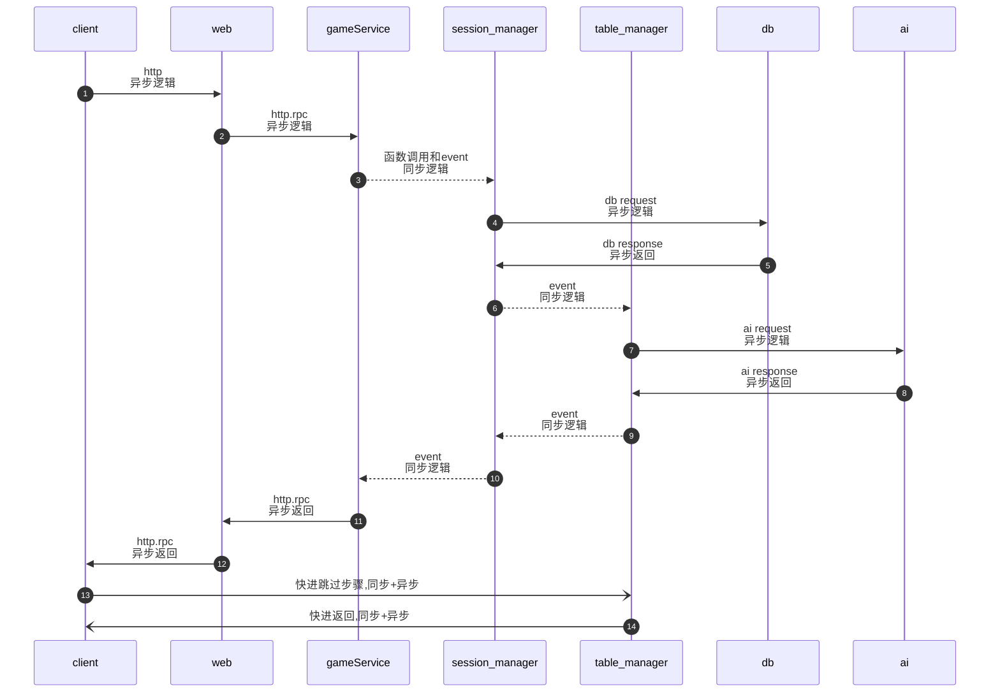
```mermaid
sequenceDiagram
  participant c as client
  participant w as web
  participant gs as gameService
  participant sm as session_manager
  participant tm as table_manager  
  participant db as db
  participant ai as ai
  autonumber
  c->>w: http<br>异步逻辑
  w->>gs: http.rpc<br>异步逻辑
  gs-->>sm: 函数调用和event<br>同步逻辑
  sm->>db: db request<br>异步逻辑
  db->>sm: db response<br>异步返回
  sm-->>tm: event<br>同步逻辑
  tm->>ai: ai request<br>异步逻辑
  ai->>tm: ai response<br>异步返回 
  tm-->>sm: event<br>同步逻辑
  sm-->>gs: event<br>同步逻辑
  gs->>w: http.rpc<br>异步返回
  w->>c: http.rpc<br>异步返回
  c-)tm: 快进跳过步骤,同步+异步
  tm-)c: 快进返回,同步+异步
```

## 3.1 是否有新增服务器

无

## 3.2 是否有CS交互，ss交互

### 3.2.1 创建牌桌

#### 3.2.1.1 创建牌桌

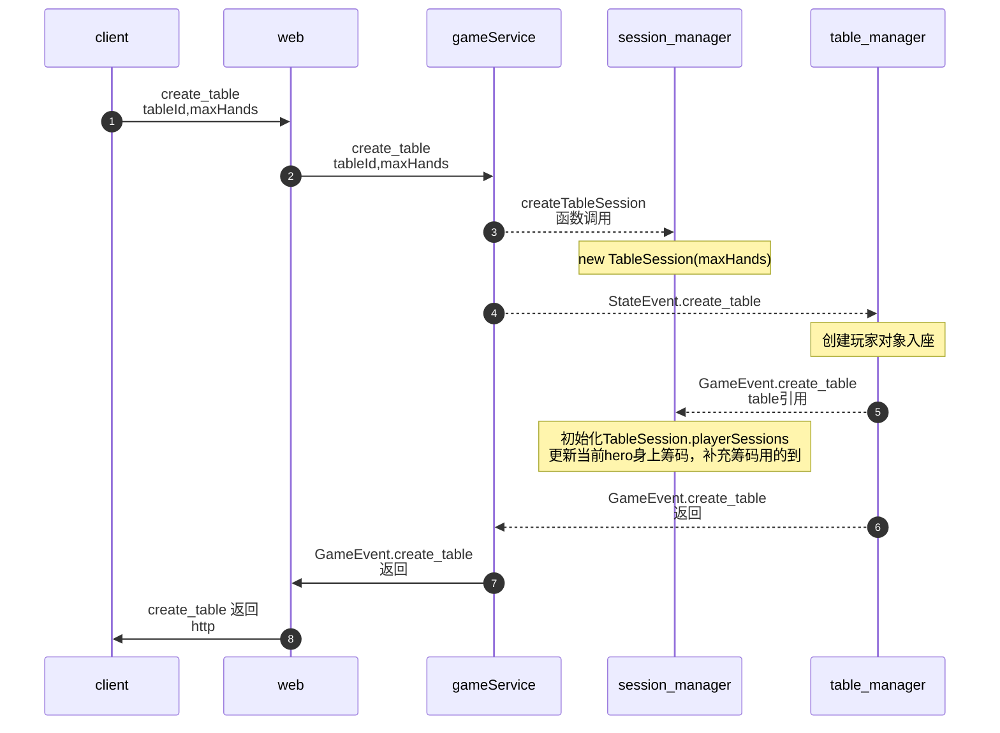
```mermaid
sequenceDiagram
  participant c as client
  participant w as web
  participant gs as gameService
  participant sm as session_manager
  participant tm as table_manager
  autonumber
  c->>w: create_table<br>tableId,maxHands
  w->>gs: create_table<br>tableId,maxHands
  gs-->>sm: createTableSession<br>函数调用
  note over sm, sm: new TableSession(maxHands)
  gs-->>tm: StateEvent.create_table
  note over tm, tm: 创建玩家对象入座
  tm-->>sm: GameEvent.create_table<br>table引用
  note over sm, sm: 初始化TableSession.playerSessions<br>更新当前hero身上筹码，补充筹码用的到
  tm-->>gs: GameEvent.create_table<br>返回
  gs->>w: GameEvent.create_table<br>返回
  w->>c: create_table 返回<br>http
```

**注**：

- 后续如果牌桌周边业务需要检查各种条件才能通过，都放在gameService和session_manager检查,table_manager只做条件成功后执行

#### 3.2.1.2 牌局结束

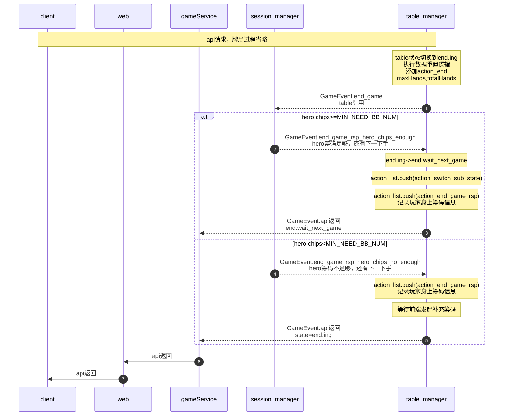
```mermaid
sequenceDiagram
  participant c as client
  participant w as web
  participant gs as gameService
  participant sm as session_manager
  participant tm as table_manager
  autonumber
  note over c, tm: api请求，牌局过程省略
  note over tm, tm: table状态切换到end.ing<br>执行数据重置逻辑<br>添加action_end<br>maxHands,totalHands
  tm-->>sm: GameEvent.end_game<br>table引用
  alt hero.chips>=MIN_NEED_BB_NUM
    sm-->>tm: GameEvent.end_game_rsp_hero_chips_enough<br>hero筹码足够，还有下一下手
    note over tm, tm: end.ing->end.wait_next_game
    note over tm, tm: action_list.push(action_switch_sub_state) 
   note over tm, tm:action_list.push(action_end_game_rsp)<br>记录玩家身上筹码信息
   tm-->>gs: GameEvent.api返回<br>end.wait_next_game
  else hero.chips<MIN_NEED_BB_NUM
    sm-->>tm: GameEvent.end_game_rsp_hero_chips_no_enough<br>hero筹码不足够，还有下一下手
    note over tm, tm:action_list.push(action_end_game_rsp)<br>记录玩家身上筹码信息
    note over tm, tm: 等待前端发起补充筹码
    tm-->>gs: GameEvent.api返回<br>state=end.ing
  end
  gs->>w: api返回
  w->>c: api返回
```

**注**：牌局结束和下一局开始前，牌局数量进度带给前端，前端根据这2个数据弹牌局结束弹窗

**注**：牌局结束和下一局开始前，前端需要检测hero.chips<=MIN_NEED_BB_NUM and state=end.ing,则强制弹补码弹窗

**注**： 牌局局数没有达到上限，且hero筹码>=MIN_NEED_BB_NUM，则前端调用next_game开始下一局游戏

#### 3.2.1.3 下一局游戏

1. 牌局局数没有达到上限，且hero筹码>=MIN_NEED_BB_NUM

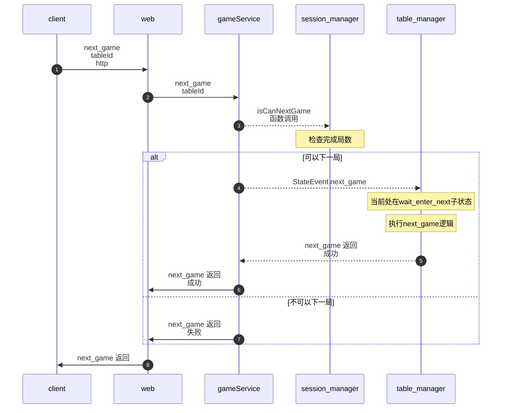
```mermaid
sequenceDiagram
  participant c as client
  participant w as web
  participant gs as gameService
  participant sm as session_manager
  participant tm as table_manager
  autonumber
  c->>w: next_game<br>tableId<br>http
  w->>gs: next_game<br>tableId
  gs-->>sm: isCanNextGame<br>函数调用
  note over sm,sm: 检查完成局数
  alt 可以下一局
    gs-->>tm: StateEvent.next_game
    note over tm, tm: 当前处在wait_enter_next子状态
    note over tm, tm: 执行next_game逻辑
    tm-->>gs: next_game 返回 <br> 成功
    gs->>w: next_game 返回 <br> 成功
  else 不可以下一局
    gs->>w: next_game 返回 <br> 失败
  end
  w->>c: next_game 返回
```

2. 牌局局数没有达到上限，且hero筹码<MIN_NEED_BB_NUM
- 看后面补充筹码流程
3. 牌局局数达到上限
- 看后面行动统计流程

### 3.2.2 下注超时

1. hero未离线，未在ai请求返回前退出游戏

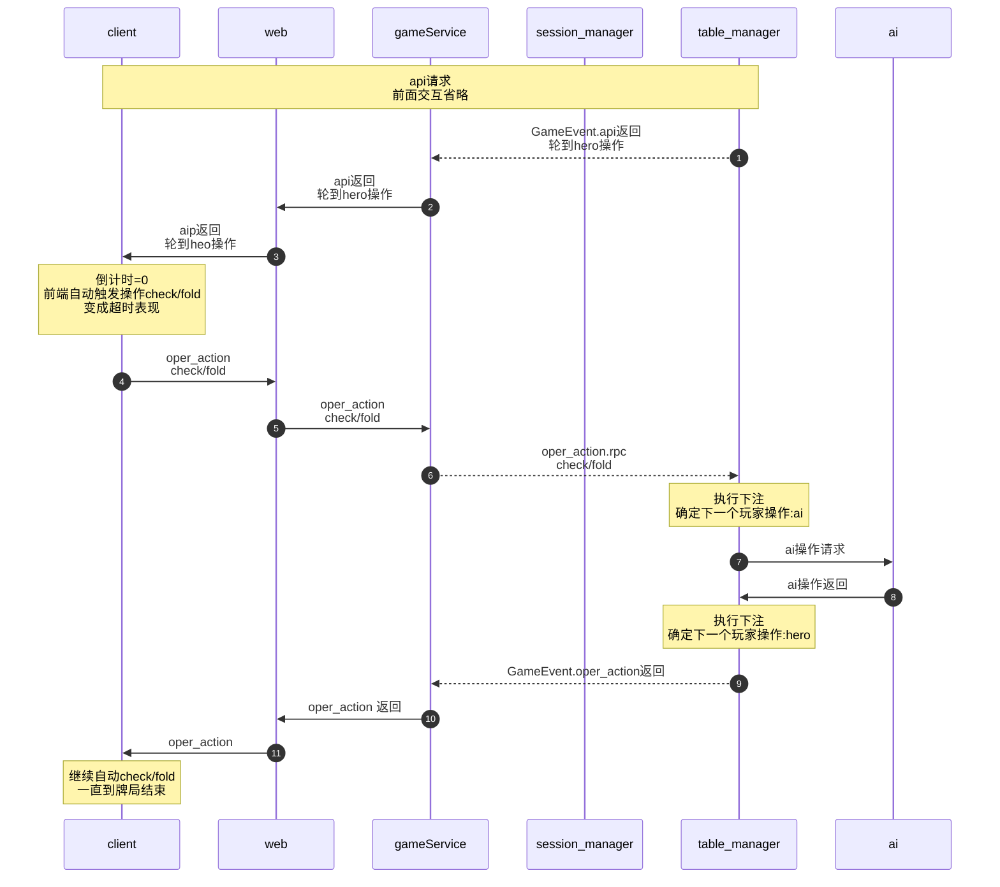
```mermaid
sequenceDiagram
  participant c as client
  participant w as web
  participant gs as gameService
  participant sm as session_manager
  participant tm as table_manager
  participant ai as ai
  autonumber
  note over c, tm: api请求<br>前面交互省略
  tm -->> gs: GameEvent.api返回<br>轮到hero操作
  gs ->> w: api返回<br>轮到hero操作
  w ->> c: aip返回<br>轮到heo操作
  note over c, c: 倒计时=0<br>前端自动触发操作check/fold<br>变成超时表现<br>
  c ->> w: oper_action<br>check/fold
  w ->> gs: oper_action<br>check/fold
  gs -->> tm: oper_action.rpc<br>check/fold
  note over tm, tm: 执行下注<br>确定下一个玩家操作:ai
  tm ->> ai: ai操作请求
  ai ->> tm: ai操作返回
  note over tm, tm: 执行下注<br>确定下一个玩家操作:hero
  tm-->>gs: GameEvent.oper_action返回
  gs ->> w: oper_action 返回
  w ->> c: oper_action
  note over c, c: 继续自动check/fold<br>一直到牌局结束
```

2. hero未离线，在ai请求返回前退出游戏
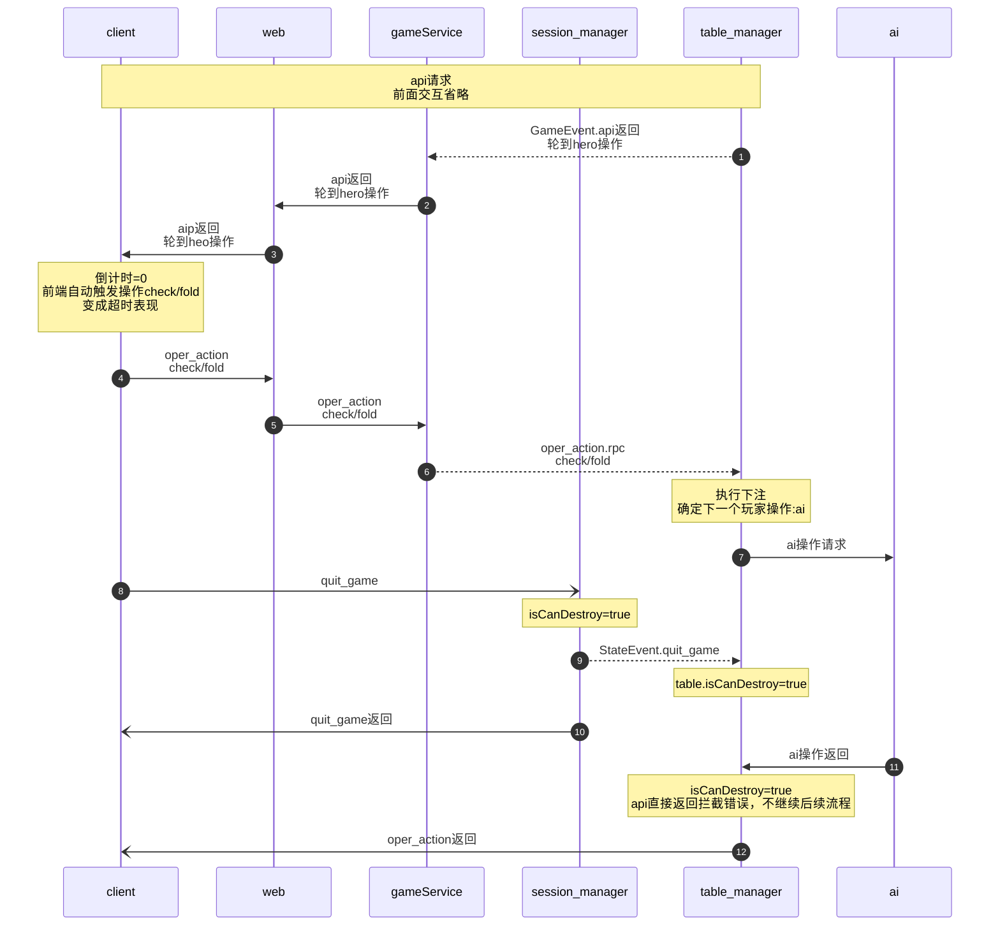
```mermaid
sequenceDiagram
  participant c as client
  participant w as web
  participant gs as gameService
  participant sm as session_manager
  participant tm as table_manager
  participant ai as ai
  autonumber
  note over c, tm: api请求<br>前面交互省略
  tm -->> gs: GameEvent.api返回<br>轮到hero操作
  gs ->> w: api返回<br>轮到hero操作
  w ->> c: aip返回<br>轮到heo操作
  note over c, c: 倒计时=0<br>前端自动触发操作check/fold<br>变成超时表现<br>
  c ->> w: oper_action<br>check/fold
  w ->> gs: oper_action<br>check/fold
  gs -->> tm: oper_action.rpc<br>check/fold
  note over tm, tm: 执行下注<br>确定下一个玩家操作:ai
  tm ->> ai: ai操作请求
  c-)sm: quit_game
  note over sm, sm: isCanDestroy=true
  sm-->>tm: StateEvent.quit_game
  note over tm,tm: table.isCanDestroy=true
  sm-)c: quit_game返回
  ai ->> tm: ai操作返回
  note over tm, tm: isCanDestroy=true<br>api直接返回拦截错误，不继续后续流程
  tm -) c: oper_action返回
```

3. hero离线重新登录，继续原牌局

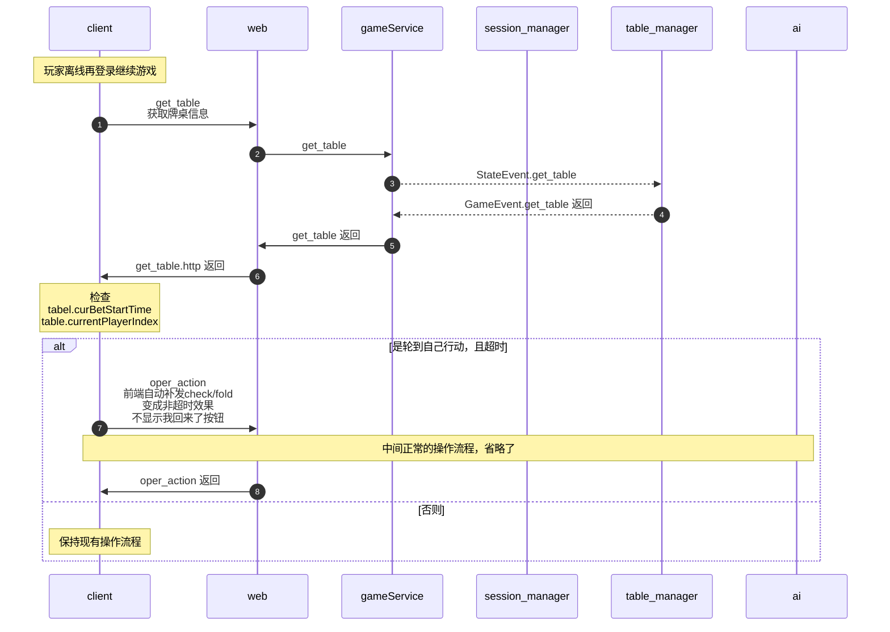
```mermaid
sequenceDiagram
  participant c as client
  participant w as web
  participant gs as gameService
  participant sm as session_manager
  participant tm as table_manager
  participant ai as ai
  autonumber
  note over c, c: 玩家离线再登录继续游戏
  c ->> w: get_table<br>获取牌桌信息
  w ->> gs: get_table
  gs -->> tm: StateEvent.get_table
  tm -->> gs: GameEvent.get_table 返回
  gs ->> w: get_table 返回
  w ->> c: get_table.http 返回
  note over c, c: 检查<br>tabel.curBetStartTime<br>table.currentPlayerIndex
  alt 是轮到自己行动，且超时
    c ->> w: oper_action<br>前端自动补发check/fold<br>变成非超时效果<br>不显示我回来了按钮
    note over c, ai:中间正常的操作流程，省略了
    w ->> c: oper_action 返回
  else 否则
    note over c, c: 保持现有操作流程
  end
```

**注**：table.currentPlayerIndex=hero.seatIdx 且 now()-table.currentPlayerIndex > 20秒(产品配置)则说明下注超时了，对应数据会在get_table里面拿到

**建议**：离线再登录，或者断线重连，调用get_table,都默认玩家回来了，直接恢复到正常非下注超时状态
**注**：返回的是时间戳，没有时区区分，前端可以拿本地时间戳进行计算

3. 未离线-已sitout,牌局进行,完整流程
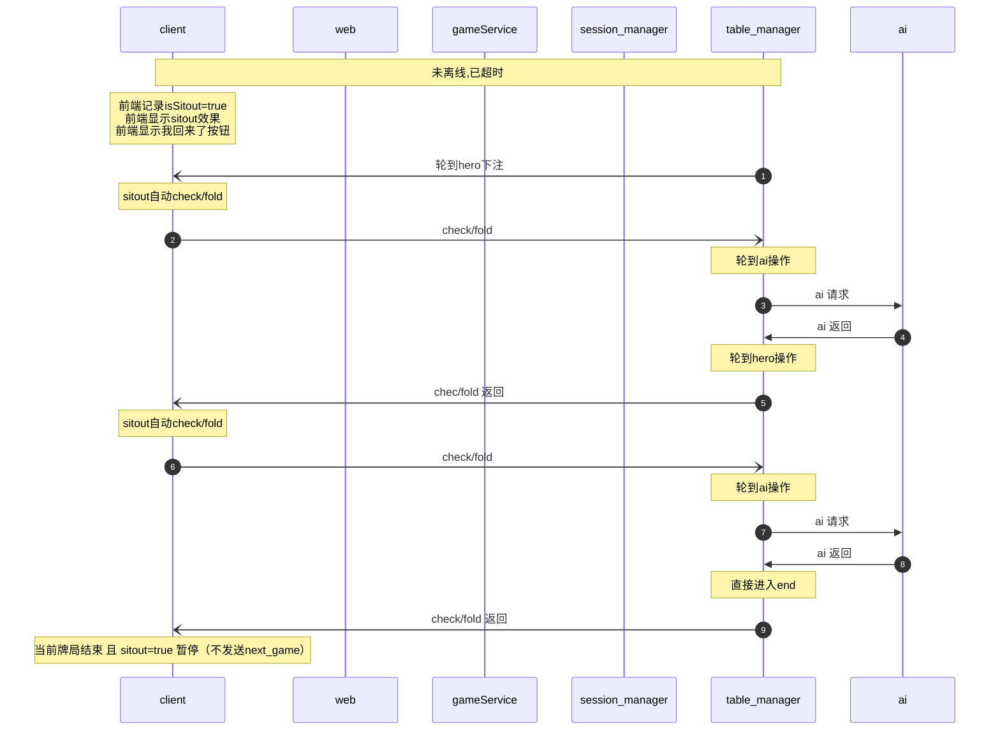
```mermaid
sequenceDiagram
  participant c as client
  participant w as web
  participant gs as gameService
  participant sm as session_manager
  participant tm as table_manager
  participant ai as ai
  autonumber
  note over c, tm:  未离线,已超时
  note over c, c: 前端记录isSitout=true<br>前端显示sitout效果<br>前端显示我回来了按钮
  tm -) c: 轮到hero下注 
  note over c,c:sitout自动check/fold  
  c -) tm: check/fold
  note over tm, tm: 轮到ai操作
  tm ->> ai: ai 请求
  ai ->> tm: ai 返回
  note over tm, tm: 轮到hero操作
  tm -) c: chec/fold 返回
  note over c,c:sitout自动check/fold
  c -) tm: check/fold
  note over tm, tm: 轮到ai操作
  tm ->> ai: ai 请求
  ai ->> tm: ai 返回
  note over tm, tm: 直接进入end
  tm -) c: check/fold 返回  
  note over c, c:当前牌局结束 且 sitout=true 暂停（不发送next_game）
```
**注**：此时后端并没有标记hero.isSitout=true,前端发送next_game,就会自动下一局

4. 未离线-已sitout,牌局进行到结束，点我回来了

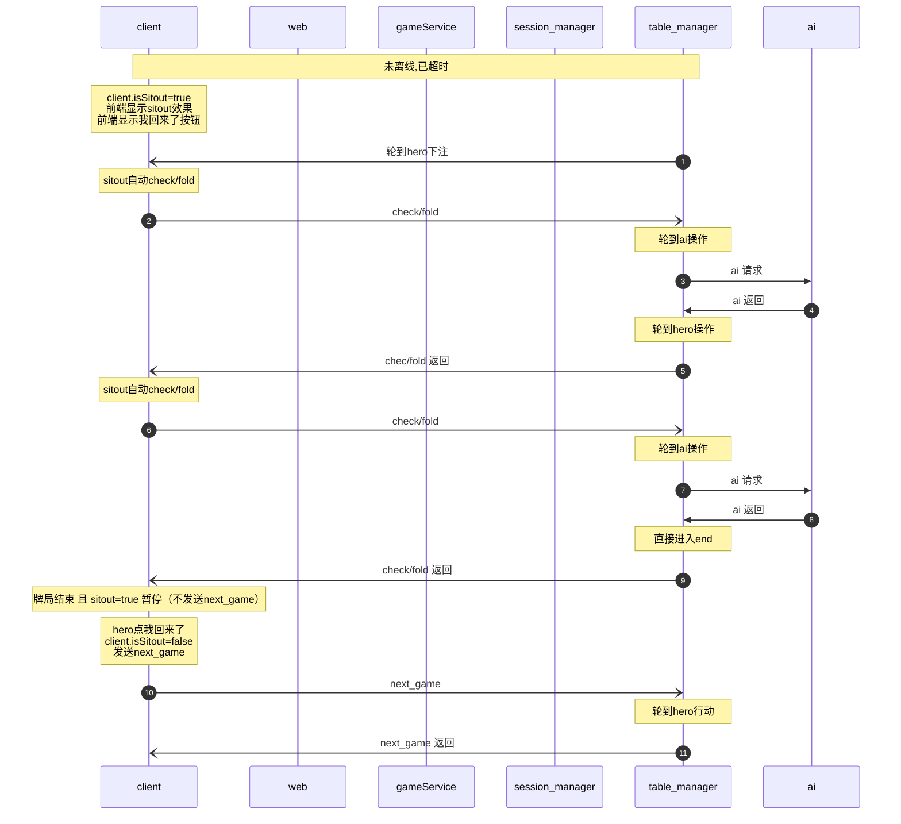
```mermaid
sequenceDiagram
  participant c as client
  participant w as web
  participant gs as gameService
  participant sm as session_manager
  participant tm as table_manager
  participant ai as ai
  autonumber
  note over c, tm:  未离线,已超时
  note over c, c: client.isSitout=true<br>前端显示sitout效果<br>前端显示我回来了按钮
  tm -) c: 轮到hero下注
  note over c,c:sitout自动check/fold
  c -) tm: check/fold
  note over tm, tm: 轮到ai操作
  tm ->> ai: ai 请求
  ai ->> tm: ai 返回
  note over tm, tm: 轮到hero操作
  tm -) c: chec/fold 返回
  note over c,c:sitout自动check/fold
  c -) tm: check/fold
  note over tm, tm: 轮到ai操作
  tm ->> ai: ai 请求
  ai ->> tm: ai 返回
  note over tm, tm: 直接进入end
  tm -) c: check/fold 返回  
  note over c, c:牌局结束 且 sitout=true 暂停（不发送next_game）
  note over c, c:hero点我回来了<br>client.isSitout=false<br>发送next_game
  c-)tm: next_game
  note over tm, tm: 轮到hero行动
  tm-)c: next_game 返回  
```

5, 未离线- 已sitout后（自动过牌），牌局还在过程中，点我回来了
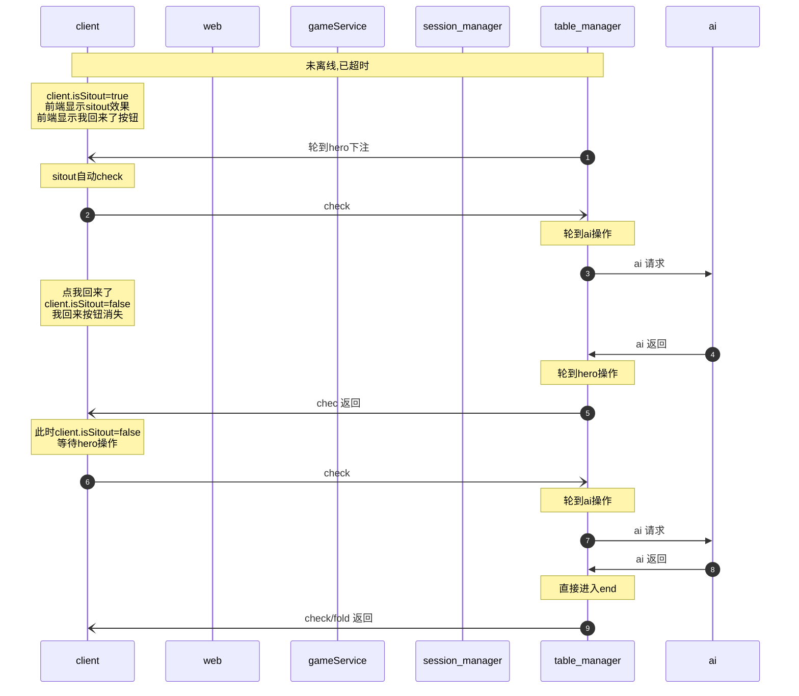
```mermaid
sequenceDiagram
  participant c as client
  participant w as web
  participant gs as gameService
  participant sm as session_manager
  participant tm as table_manager
  participant ai as ai
  autonumber
  note over c, tm:  未离线,已超时
  note over c, c: client.isSitout=true<br>前端显示sitout效果<br>前端显示我回来了按钮
  tm -) c: 轮到hero下注
  note over c,c:sitout自动check
  c -) tm: check
  note over tm, tm: 轮到ai操作
  tm ->> ai: ai 请求
  note over c, c: 点我回来了<br>client.isSitout=false<br>我回来按钮消失
  ai ->> tm: ai 返回
  note over tm, tm: 轮到hero操作
  tm -) c: chec 返回
  note over c,c:此时client.isSitout=false<br>等待hero操作
  c -) tm: check
  note over tm, tm: 轮到ai操作
  tm ->> ai: ai 请求
  ai ->> tm: ai 返回
  note over tm, tm: 直接进入end
  tm -) c: check/fold 返回 
```

6， 未离线-已sitout后（已经被自动弃牌了），牌局还在过程中，hero没有行动机会，点我回来了
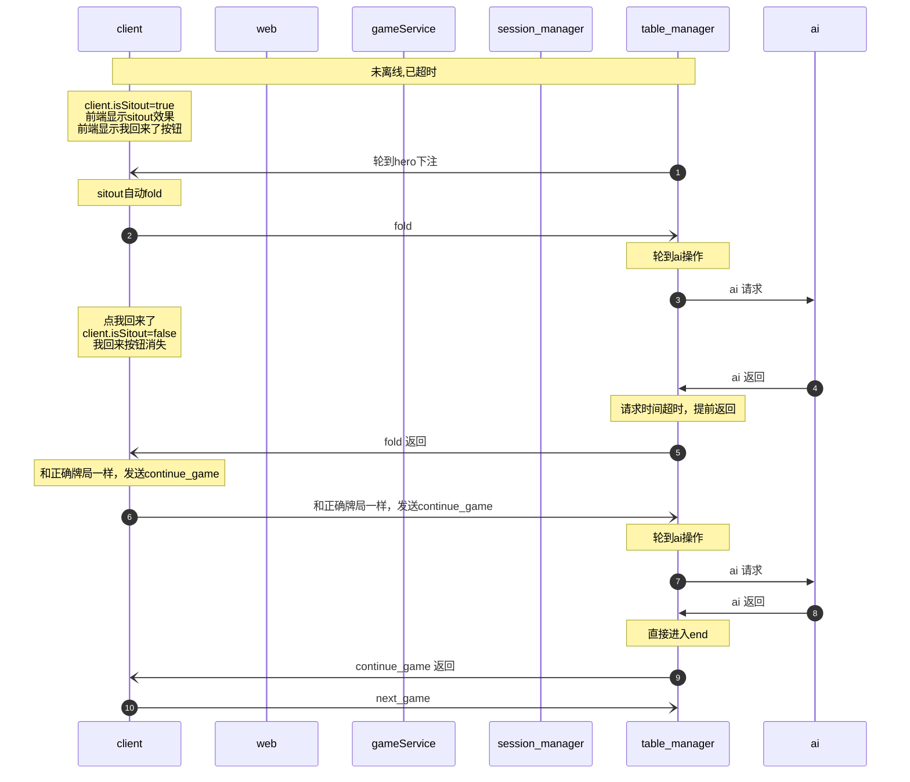
```mermaid
sequenceDiagram
  participant c as client
  participant w as web
  participant gs as gameService
  participant sm as session_manager
  participant tm as table_manager
  participant ai as ai
  autonumber
  note over c, tm:  未离线,已超时
  note over c, c: client.isSitout=true<br>前端显示sitout效果<br>前端显示我回来了按钮
  tm -) c: 轮到hero下注
  note over c,c:sitout自动fold
  c -) tm: fold
  note over tm, tm: 轮到ai操作
  tm ->> ai: ai 请求
  note over c, c: 点我回来了<br>client.isSitout=false<br>我回来按钮消失
  ai ->> tm: ai 返回
  note over tm, tm: 请求时间超时，提前返回
  tm -) c: fold 返回
  note over c,c:和正确牌局一样，发送continue_game
  c -) tm: 和正确牌局一样，发送continue_game
  note over tm, tm: 轮到ai操作
  tm ->> ai: ai 请求
  ai ->> tm: ai 返回
  note over tm, tm: 直接进入end
  tm -) c: continue_game 返回
  c -) tm: next_game
```

**注1**：没有api交互，后端不记录player超时状态
**注2**：操作倒计时前端如果需要显示特殊效果，根据table上面轮到当前操作和开始下注时间判断
**注3**：目前这里只记录下注开始时间，这里涉及到前后端时间同步问题，目前都是在同一个时区，需要再细想，或者换其他方案，比如返回一个倒计时剩余多少秒


### 3.2.3 补充筹码

1. hero提前主动补充（不是在end.ing状态）

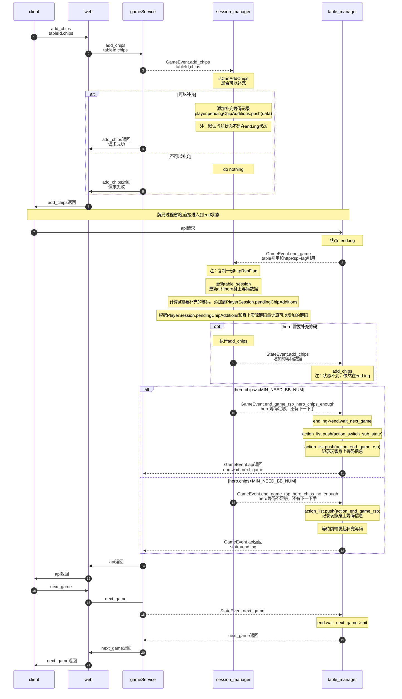
```mermaid
sequenceDiagram
  participant c as client
  participant w as web
  participant gs as gameService
  participant sm as session_manager
  participant tm as table_manager
  autonumber
  c->>w: add_chips<br>tableId,chips
  w->>gs: add_chips<br>tableId,chips
  gs-->>sm: GameEvent.add_chips<br>tableId,chips
  note over sm, sm: isCanAddChips<br>是否可以补充
  alt 可以补充
    note over sm, sm: 添加补充筹码记录<br>player.pendingChipAdditions.push(data)
    note over sm, sm: 注：默认当前状态不是在end.ing状态
    gs ->> w: add_chips返回<br>请求成功
  else 不可以补充
    note over sm, sm: do nothing
    gs ->> w: add_chips返回<br>请求失败
  end
  w ->> c: add_chips返回
  note over c, tm:牌局过程省略,直接进入到end状态
  c-)tm: api请求
  note over tm, tm: 状态=end.ing  
  tm -->> sm: GameEvent.end_game<br>table引用和httpRspFlag引用
  note over sm, sm: 注：复制一份httpRspFlag
  note over sm, sm: 更新table_session<br>更新ai和hero身上筹码数据
  note over sm, sm: 计算ai需要补充的筹码，添加到PlayerSession.pendingChipAdditions
  note over sm, sm: 根据PlayerSession.pendingChipAdditions和身上实际筹码量计算可以增加的筹码
  opt hero 需要补充筹码  
    note over sm, sm: 执行add_chips
    sm-->>tm: StateEvent.add_chips<br>增加的筹码数据
    note over tm, tm: add_chips<br>注：状态不变，依然在end.ing
  end
   alt hero.chips>=MIN_NEED_BB_NUM
    sm-->>tm: GameEvent.end_game_rsp_hero_chips_enough<br>hero筹码足够，还有下一下手
    note over tm, tm: end.ing->end.wait_next_game
    note over tm, tm: action_list.push(action_switch_sub_state) 
   note over tm, tm:action_list.push(action_end_game_rsp)<br>记录玩家身上筹码信息
   tm-->>gs: GameEvent.api返回<br>end.wait_next_game
  else hero.chips<MIN_NEED_BB_NUM
    sm-->>tm: GameEvent.end_game_rsp_hero_chips_no_enough<br>hero筹码不足够，还有下一下手
    note over tm, tm:action_list.push(action_end_game_rsp)<br>记录玩家身上筹码信息
    note over tm, tm: 等待前端发起补充筹码
    tm-->>gs: GameEvent.api返回<br>state=end.ing
  end 
  gs ->> w: api返回
  w ->> c: api返回  
  c->>w: next_game
  w->gs: next_game
  gs-->>tm: StateEvent.next_game
  note over tm, tm: end.wait_next_game->init
  tm-->>gs: next_game返回
  gs->>w: next_game返回
  w->>c: next_game返回

```

**注1**：最后一局的时候，不能发起补充筹码

2. ai被动补充

牌局结束，ai筹码不足，触发被动自动补充

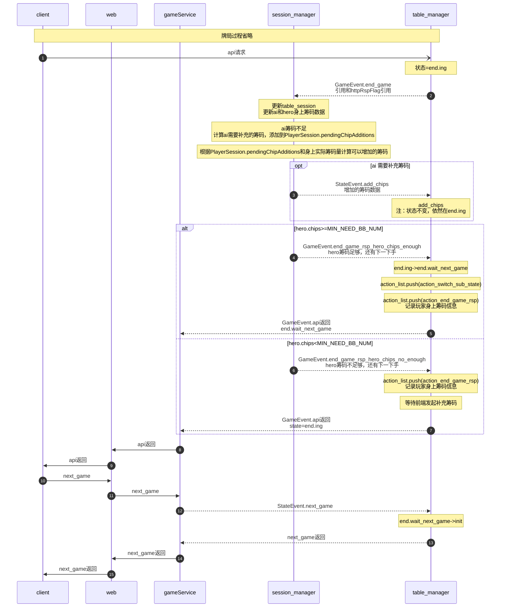
```mermaid
sequenceDiagram
  participant c as client
  participant w as web
  participant gs as gameService
  participant sm as session_manager
  participant tm as table_manager
  autonumber
  note over c, tm:牌局过程省略
  c-)tm: api请求
  note over tm, tm: 状态=end.ing  
  tm -->> sm: GameEvent.end_game<br>引用和httpRspFlag引用
  note over sm, sm: 更新table_session<br>更新ai和hero身上筹码数据
  note over sm, sm: ai筹码不足<br>计算ai需要补充的筹码，添加到PlayerSession.pendingChipAdditions
  note over sm, sm: 根据PlayerSession.pendingChipAdditions和身上实际筹码量计算可以增加的筹码
  opt ai 需要补充筹码
    sm-->>tm: StateEvent.add_chips<br>增加的筹码数据
    note over tm, tm: add_chips<br>注：状态不变，依然在end.ing
  end  
   alt hero.chips>=MIN_NEED_BB_NUM
    sm-->>tm: GameEvent.end_game_rsp_hero_chips_enough<br>hero筹码足够，还有下一下手
    note over tm, tm: end.ing->end.wait_next_game
    note over tm, tm: action_list.push(action_switch_sub_state) 
   note over tm, tm:action_list.push(action_end_game_rsp)<br>记录玩家身上筹码信息
   tm-->>gs: GameEvent.api返回<br>end.wait_next_game
  else hero.chips<MIN_NEED_BB_NUM
    sm-->>tm: GameEvent.end_game_rsp_hero_chips_no_enough<br>hero筹码不足够，还有下一下手
    note over tm, tm:action_list.push(action_end_game_rsp)<br>记录玩家身上筹码信息
    note over tm, tm: 等待前端发起补充筹码
    tm-->>gs: GameEvent.api返回<br>state=end.ing
  end
  gs->>w: api返回
  w->>c: api返回
  c->>w: next_game
  w->>gs: next_game
  gs-->>tm: StateEvent.next_game
  note over tm, tm: end.wait_next_game->init
  tm-->>gs: next_game返回
  gs->>w: next_game返回
  w->>c: next_game返回
```

**注**：不论是hero还是ai,补充筹码都放在PlayerSession.pendingChipAdditions,再由下面统一逻辑补到牌桌上面

3，牌局结束，hero没有补码，筹码输光流程

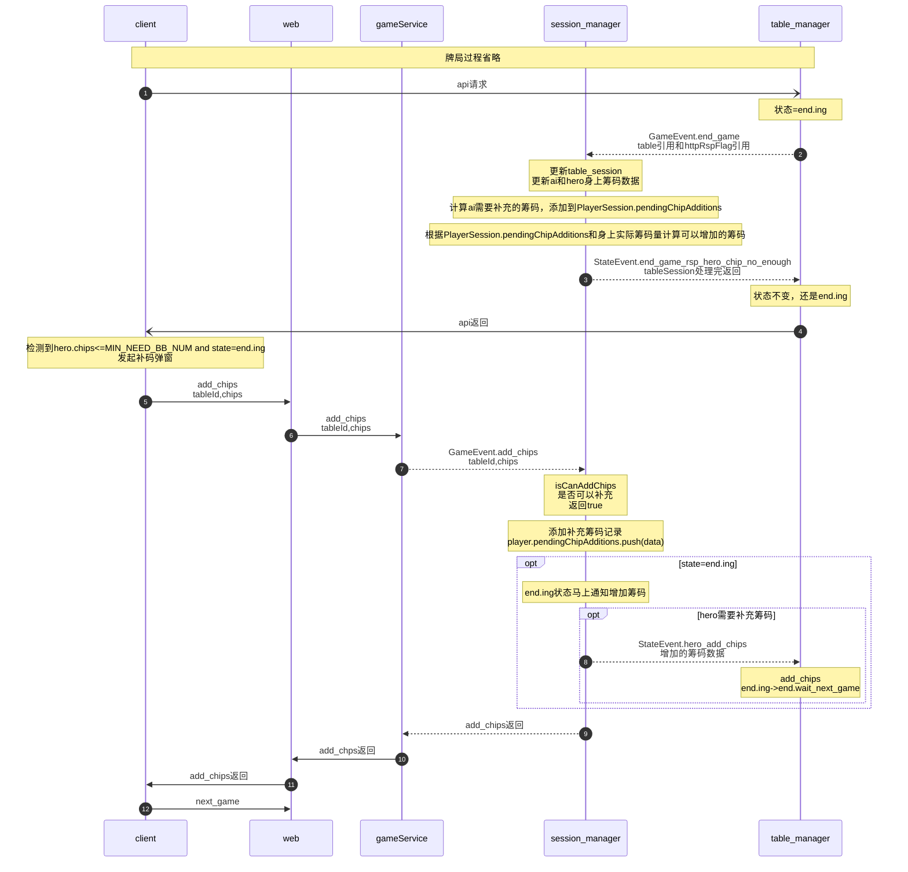
```mermaid
sequenceDiagram
  participant c as client
  participant w as web
  participant gs as gameService
  participant sm as session_manager
  participant tm as table_manager
  autonumber
  note over c, tm:牌局过程省略
  c-)tm: api请求
  note over tm, tm: 状态=end.ing  
  tm -->> sm: GameEvent.end_game<br>table引用和httpRspFlag引用
  note over sm, sm: 更新table_session<br>更新ai和hero身上筹码数据
  note over sm, sm: 计算ai需要补充的筹码，添加到PlayerSession.pendingChipAdditions
  note over sm, sm: 根据PlayerSession.pendingChipAdditions和身上实际筹码量计算可以增加的筹码
  sm-->>tm: StateEvent.end_game_rsp_hero_chip_no_enough<br>tableSession处理完返回  
  note over tm, tm: 状态不变，还是end.ing  
  tm-)c: api返回  
  note over c, c: 检测到hero.chips<=MIN_NEED_BB_NUM and state=end.ing<br>发起补码弹窗
  c->>w: add_chips<br>tableId,chips
  w->>gs: add_chips<br>tableId,chips
  gs-->>sm: GameEvent.add_chips<br>tableId,chips
  note over sm, sm: isCanAddChips<br>是否可以补充<br>返回true
  note over sm, sm: 添加补充筹码记录<br>player.pendingChipAdditions.push(data)
  opt state=end.ing    
    note over sm, sm: end.ing状态马上通知增加筹码
    opt hero需要补充筹码
      sm-->>tm: StateEvent.hero_add_chips<br>增加的筹码数据
      note over tm, tm: add_chips<br>end.ing->end.wait_next_game     
    end
  end  
  sm -->> gs: add_chips返回
  gs ->> w: add_chps返回
  w ->> c: add_chips返回
  c ->> w: next_game
```

4. hero主动发起了补码，牌局进入补码流程前，hero主动退出了
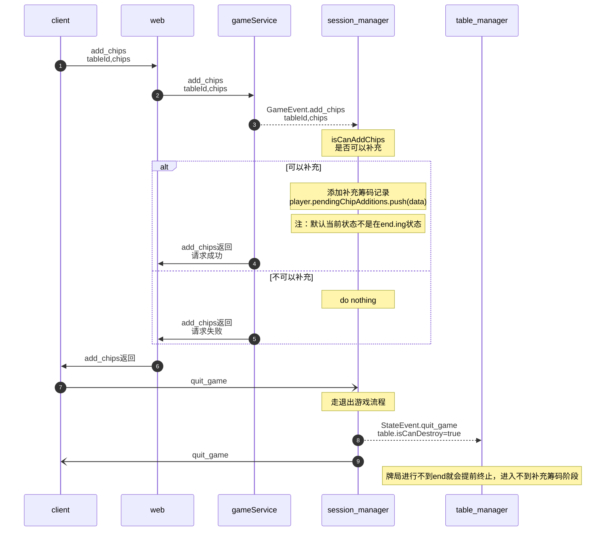
```mermaid
sequenceDiagram
  participant c as client
  participant w as web
  participant gs as gameService
  participant sm as session_manager
  participant tm as table_manager
  autonumber
  c->>w: add_chips<br>tableId,chips
  w->>gs: add_chips<br>tableId,chips
  gs-->>sm: GameEvent.add_chips<br>tableId,chips
  note over sm, sm: isCanAddChips<br>是否可以补充
  alt 可以补充
    note over sm, sm: 添加补充筹码记录<br>player.pendingChipAdditions.push(data)
    note over sm, sm: 注：默认当前状态不是在end.ing状态
    gs ->> w: add_chips返回<br>请求成功
  else 不可以补充
    note over sm, sm: do nothing
    gs ->> w: add_chips返回<br>请求失败
  end
  w ->> c: add_chips返回
  c -) sm: quit_game
  note over sm, sm: 走退出游戏流程
  sm -->>tm: StateEvent.quit_game<br>table.isCanDestroy=true
  sm-)c: quit_game
  note over tm, tm: 牌局进行不到end就会提前终止，进入不到补充筹码阶段
```

5.hero主动发起了补码，牌局进入补码流程时，hero主动退出了【不存在流程】
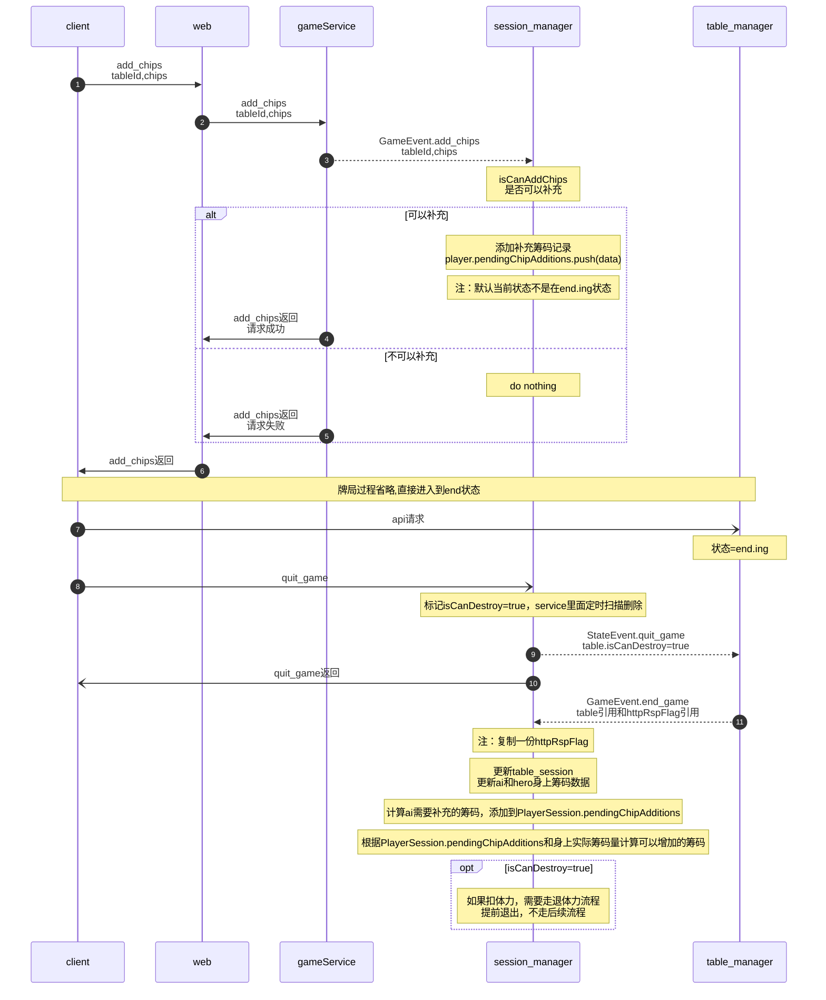
```mermaid
sequenceDiagram
  participant c as client
  participant w as web
  participant gs as gameService
  participant sm as session_manager
  participant tm as table_manager
  autonumber
  c->>w: add_chips<br>tableId,chips
  w->>gs: add_chips<br>tableId,chips
  gs-->>sm: GameEvent.add_chips<br>tableId,chips
  note over sm, sm: isCanAddChips<br>是否可以补充
  alt 可以补充
    note over sm, sm: 添加补充筹码记录<br>player.pendingChipAdditions.push(data)
    note over sm, sm: 注：默认当前状态不是在end.ing状态
    gs ->> w: add_chips返回<br>请求成功
  else 不可以补充
    note over sm, sm: do nothing
    gs ->> w: add_chips返回<br>请求失败
  end
  w ->> c: add_chips返回
  note over c, tm:牌局过程省略,直接进入到end状态
  c-)tm: api请求
  note over tm, tm: 状态=end.ing  
  c-)sm: quit_game
  note over sm, sm: 标记isCanDestroy=true，service里面定时扫描删除
  sm -->>tm: StateEvent.quit_game<br>table.isCanDestroy=true
  sm -) c: quit_game返回   
  tm -->> sm: GameEvent.end_game<br>table引用和httpRspFlag引用
  note over sm, sm: 注：复制一份httpRspFlag
  note over sm, sm: 更新table_session<br>更新ai和hero身上筹码数据
  note over sm, sm: 计算ai需要补充的筹码，添加到PlayerSession.pendingChipAdditions
  note over sm, sm: 根据PlayerSession.pendingChipAdditions和身上实际筹码量计算可以增加的筹码
  opt isCanDestroy=true
    note over sm, sm: 如果扣体力，需要走退体力流程 <br> 提前退出，不走后续流程    
  end
```

**注注**：上面这个流程是不存在的，因为进入到end.ing状态到GameEvent.end_game之间，是同步的，插入不了quit_game的流程

6. hero补充筹码-不预扣体力-加筹码时扣体力-正常流程
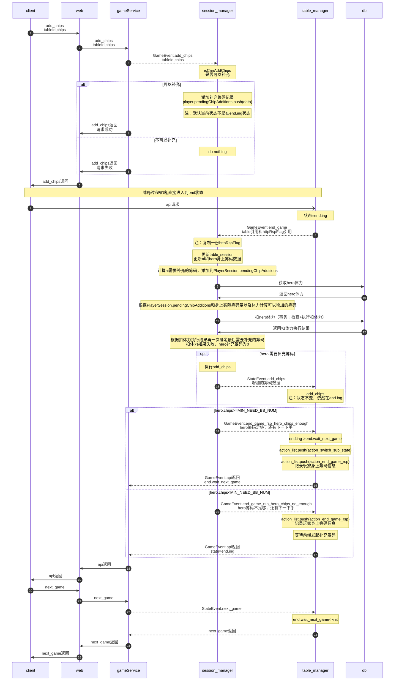
```mermaid
sequenceDiagram
  participant c as client
  participant w as web
  participant gs as gameService
  participant sm as session_manager
  participant tm as table_manager
  participant db as db
  autonumber
  c->>w: add_chips<br>tableId,chips
  w->>gs: add_chips<br>tableId,chips
  gs-->>sm: GameEvent.add_chips<br>tableId,chips
  note over sm, sm: isCanAddChips<br>是否可以补充
  alt 可以补充
    note over sm, sm: 添加补充筹码记录<br>player.pendingChipAdditions.push(data)
    note over sm, sm: 注：默认当前状态不是在end.ing状态
    gs ->> w: add_chips返回<br>请求成功
  else 不可以补充
    note over sm, sm: do nothing
    gs ->> w: add_chips返回<br>请求失败
  end
  w ->> c: add_chips返回
  note over c, tm:牌局过程省略,直接进入到end状态
  c-)tm: api请求
  note over tm, tm: 状态=end.ing  
  tm -->> sm: GameEvent.end_game<br>table引用和httpRspFlag引用
  note over sm, sm: 注：复制一份httpRspFlag
  note over sm, sm: 更新table_session<br>更新ai和hero身上筹码数据
  note over sm, sm: 计算ai需要补充的筹码，添加到PlayerSession.pendingChipAdditions
  sm ->> db: 获取hero体力
  db ->> sm: 返回hero体力  
  note over sm, sm: 根据PlayerSession.pendingChipAdditions和身上实际筹码量以及体力计算可以增加的筹码
  sm ->> db: 扣hero体力（事务：检查+执行扣体力）
  db ->> sm: 返回扣体力执行结果
  note over sm, sm: 根据扣体力执行结果再一次确定最后需要补充的筹码<br>扣体力如果失败，hero补充筹码为0
  opt hero 需要补充筹码  
    note over sm, sm: 执行add_chips
    sm-->>tm: StateEvent.add_chips<br>增加的筹码数据
    note over tm, tm: add_chips<br>注：状态不变，依然在end.ing
  end
  alt hero.chips>=MIN_NEED_BB_NUM
    sm-->>tm: GameEvent.end_game_rsp_hero_chips_enough<br>hero筹码足够，还有下一下手
    note over tm, tm: end.ing->end.wait_next_game
    note over tm, tm: action_list.push(action_switch_sub_state) 
   note over tm, tm:action_list.push(action_end_game_rsp)<br>记录玩家身上筹码信息
   tm-->>gs: GameEvent.api返回<br>end.wait_next_game
  else hero.chips<MIN_NEED_BB_NUM
    sm-->>tm: GameEvent.end_game_rsp_hero_chips_no_enough<br>hero筹码不足够，还有下一下手
    note over tm, tm:action_list.push(action_end_game_rsp)<br>记录玩家身上筹码信息
    note over tm, tm: 等待前端发起补充筹码
    tm-->>gs: GameEvent.api返回<br>state=end.ing
  end
  gs->>w: api返回
  w->>c: api返回  
  c->>w: next_game
  w->>gs: next_game
  gs-->>tm: StateEvent.next_game
  note over tm, tm: end.wait_next_game->init
  tm-->>gs: next_game返回
  gs->>w: next_game返回
  w->>c: next_game返回
```

**注**：第9-10，11-12步异步调用，存在其他退出游戏的可能

7. hero补充筹码-不预扣体力-加筹码时扣体力-在请求hero体力返回前退出了游戏
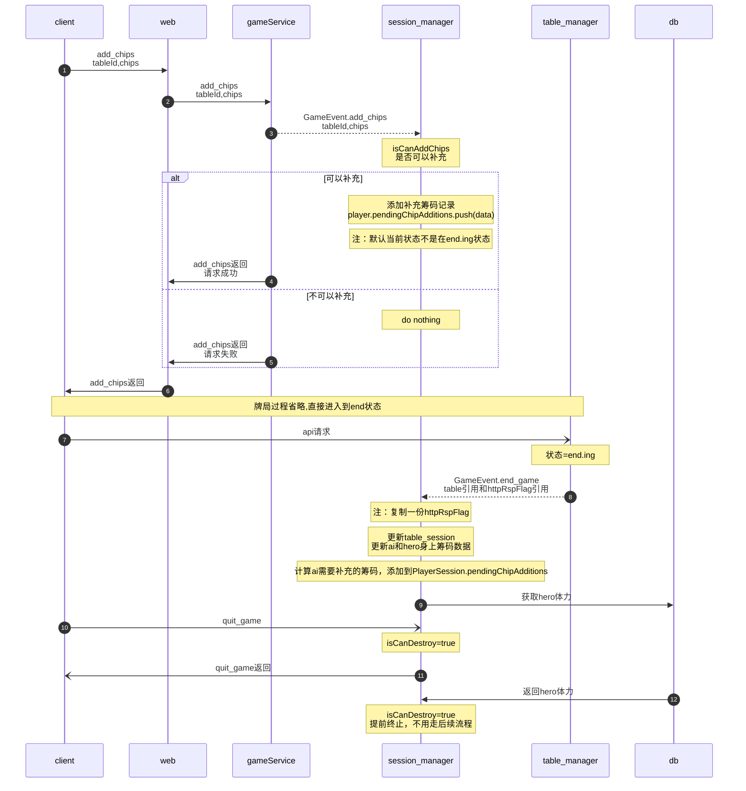
```mermaid
sequenceDiagram
  participant c as client
  participant w as web
  participant gs as gameService
  participant sm as session_manager
  participant tm as table_manager
  participant db as db
  autonumber
  c->>w: add_chips<br>tableId,chips
  w->>gs: add_chips<br>tableId,chips
  gs-->>sm: GameEvent.add_chips<br>tableId,chips
  note over sm, sm: isCanAddChips<br>是否可以补充
  alt 可以补充
    note over sm, sm: 添加补充筹码记录<br>player.pendingChipAdditions.push(data)
    note over sm, sm: 注：默认当前状态不是在end.ing状态
    gs ->> w: add_chips返回<br>请求成功
  else 不可以补充
    note over sm, sm: do nothing
    gs ->> w: add_chips返回<br>请求失败
  end
  w ->> c: add_chips返回
  note over c, tm:牌局过程省略,直接进入到end状态
  c-)tm: api请求
  note over tm, tm: 状态=end.ing  
  tm -->> sm: GameEvent.end_game<br>table引用和httpRspFlag引用
  note over sm, sm: 注：复制一份httpRspFlag
  note over sm, sm: 更新table_session<br>更新ai和hero身上筹码数据
  note over sm, sm: 计算ai需要补充的筹码，添加到PlayerSession.pendingChipAdditions
  sm ->> db: 获取hero体力
  c -) sm: quit_game
  note over sm, sm: isCanDestroy=true
  sm -) c: quit_game返回
  db ->> sm: 返回hero体力  
  note over sm,sm: isCanDestroy=true<br>提前终止，不用走后续流程
```

8. hero补充筹码-不预扣体力-加筹码时扣体力-在执行扣体力的过程种退出了游戏
```mermaid
sequenceDiagram
  participant c as client
  participant w as web
  participant gs as gameService
  participant sm as session_manager
  participant tm as table_manager
  participant db as db
  autonumber
  c->>w: add_chips<br>tableId,chips
  w->>gs: add_chips<br>tableId,chips
  gs-->>sm: GameEvent.add_chips<br>tableId,chips
  note over sm, sm: isCanAddChips<br>是否可以补充
  alt 可以补充
    note over sm, sm: 添加补充筹码记录<br>player.pendingChipAdditions.push(data)
    note over sm, sm: 注：默认当前状态不是在end.ing状态
    gs ->> w: add_chips返回<br>请求成功
  else 不可以补充
    note over sm, sm: do nothing
    gs ->> w: add_chips返回<br>请求失败
  end
  w ->> c: add_chips返回
  note over c, tm:牌局过程省略,直接进入到end状态
  c-)tm: api请求
  note over tm, tm: 状态=end.ing  
  tm -->> sm: GameEvent.end_game<br>table引用和httpRspFlag引用
  note over sm, sm: 注：复制一份httpRspFlag
  note over sm, sm: 更新table_session<br>更新ai和hero身上筹码数据
  note over sm, sm: 计算ai需要补充的筹码，添加到PlayerSession.pendingChipAdditions
  sm ->> db: 获取hero体力
  db ->> sm: 返回hero体力  
  note over sm, sm: 根据PlayerSession.pendingChipAdditions和身上实际筹码量以及体力计算可以增加的筹码
  sm ->> db: 扣hero体力（事务：检查+执行扣体力）
  c-)sm: quit_game
  note over sm, sm: 标记isCanDestroy=true
  sm-)c: quit_game
  db ->> sm: 返回扣体力执行结果 
  sm ->> db: 增加扣掉的体力
  db ->> sm: 返回增加结果
  note over sm, sm: 提前结束后续流程  
```

**注1**：最后一局的时候，不能发起补充筹码


9.根据待补充筹码列表数据计算实际可以补充筹码列表

```mermaid
flowchart TD
  s1[牌局结束] --> s2[计算最终筹码<br>finalChips = 当前筹码]
  s2 --> s3[遍历pendingChipAdditions列表<br>筛选isApplied=false and isReturned=false]
  s3 --> s4{还有未处理的补充筹码?}
  s4 -->|是| s5[取下一个补充筹码<br>addition = next]
  s5 --> s6{finalChips + addition.chips < 2000?}
  s6 -->|是| s7[应用补充筹码<br>finalChips += addition.chips<br>addition.isApplied = true]
  s7 --> s3
  s6 -->|否| s8[标记为返回<br>addition.isReturned = true<br>后续所有补充筹码也标记isReturned = true]
  s8 --> s9[结束处理]
  s4 -->|否| s9
  s9 --> s10[更新最终筹码]
```

**详细说明**：

1. **初始化**：计算最终筹码 `finalChips = 玩家当前筹码`
2. **筛选待处理补充筹码**：遍历 `player.pendingChipAdditions` 列表，只处理 `isApplied=false` 且 `isReturned=false` 的记录
3. **按顺序处理**：
   - 对每个补充筹码，判断 `finalChips + addition.chips < 2000`
   - **可以补充**：更新 `finalChips += addition.chips`，标记 `addition.isApplied = true`，继续处理下一个
   - **不能补充**：标记 `addition.isReturned = true`，并将后续所有未处理的补充筹码也标记 `isReturned = true`，结束处理
4. **更新最终筹码**：将计算得到的 `finalChips` 更新到玩家筹码

**关键要点**：

- 按顺序处理补充筹码列表，一旦超过2000立即停止后续处理
- 超过限制后，当前补充筹码及后续所有补充筹码均标记为返回（`isReturned = true`）
- 只更新成功应用的补充筹码状态（`isApplied = true`）

**注**：目前补充筹码没有消耗（比如体力），所以只需要标记isReturned=false

### 3.2.4 获取牌谱

```mermaid
sequenceDiagram
  participant c as client
  participant w as web
  participant gs as gameService
  participant sm as session_manager
  participant tm as table_manager
  autonumber
  c ->> w: get_hand_history
  w ->> gs: get_hand_history
  gs -->> tm: StateEvent.get_hand_history<br>StateEvent
  note over tm, tm: 计算实时运行牌谱
  tm -->> gs: GameEvent.get_hand_history 返回
  gs ->> w: get_hand_history 返回
  w ->> c: get_hand_history 返回
```

### 3.2.5 退出牌局

```mermaid
sequenceDiagram
  participant c as client
  participant w as web
  participant gs as gameService
  participant sm as session_manager
  participant tm as table_manager
  autonumber
  c ->> w: quit_game
  w ->> gs: quit_game
  gs -->> sm: GameEvent.quit_game
  note over sm, sm: 加个标记isCanDestroy，service里面定时扫描,检查到删除
  sm ->> tm: StateEvent.quit_game
  note over tm, tm: table.isCanDestroy=true
  sm -->> gs: quit_game 返回
  gs ->> w: quit_game 返回
  w ->> c: quit_game 返回
```

### 3.2.6 获取对战报告

1. 主动打完获取对战报告

```mermaid
sequenceDiagram
  participant c as client
  participant w as web
  participant gs as gameService
  participant sm as session_manager
  participant tm as table_manager
  autonumber
  note over c, tm: api请求，其他过程省略
  note over tm, tm: 牌局结束，进入end.ing状态<br>totalHands+=1
  tm -->> sm: GameEvent.end_game<br>table对象引用
  note over sm, sm: 更新table_session<br>更新对战报告相关数据player.bestCardSession等<br>更新totalHands<br>补充筹码流程
  sm -->> tm: StateEvent.end_game_rsp
  tm -) c: api返回<br>maxHands和totalHand
  opt maxHands<=totalHand
    c ->> w: get_report
    w ->> gs: get_report
    gs -->> sm: GameEvent.get_report
    note over sm, sm: 根据本地数据计算report
    sm -->> gs: get_report 返回
    gs ->> w: get_report 返回
    w ->> c: get_report 返回 
  end
```

2. 提前离开获取对战报告流程
```mermaid
sequenceDiagram
  participant c as client
  participant w as web
  participant gs as gameService
  participant sm as session_manager
  participant tm as table_manager
  autonumber
  c ->> w: quit_game
  w ->> gs: quit_game
  gs -->> sm: GameEvent.quit_game
  note over sm, sm: do end game some thing
  sm -->> gs: quit_game 返回
  gs ->> w: quit_game 返回
  w ->> c: quit_game 返回
  c ->> w: get_report
  w -->> gs: get_report
  gs -->> sm: GameEvent.get_report
  note over sm, sm: 根据本地数据计算report
  sm -->> gs: get_report 返回
  gs -->> w: get_report 返回
  w ->> c: get_report 返回
```

注：把结束游戏和获取对战报告分开，好处是随时可以获取对战报告


### 3.2.7 行动统计

1. session正常结束
```mermaid
sequenceDiagram
  participant c as client
  participant w as web
  participant gs as gameService
  participant sm as session_manager
  participant tm as table_manager
  participant ai as ai
  autonumber
  note over c, ai: api请求<br>过程省略
  tm ->> ai: ai action require
  ai ->> tm: ai action  response
  note over tm, tm: 下一个轮到hero行动
  tm ->> ai: hero action require
  ai ->> tm: hero action response
  tm -->> sm: GameEvent.hero_ai_response.event<br>seatIdx, ai response<br>注：这里会有ai返回失败的情况，null
  note over sm, sm: 记录对应玩家ai返回数据
  tm-->>gs: api 返回
  gs ->> w: api 返回
  w ->> c: api 返回
  c ->> w: oper_action
  w ->> gs: oper_action
  gs -->> tm: oper_action<br>state.event
  note over tm, tm:执行操作<br>
  opt 是hero操作
    tm -->> sm: GameEvent.hero_oper_action<br>event
    note over sm, sm: 更新正确和争议数量<br>ai返回结果为null,默认当作是正确
  end
  note over tm, tm: <br>设置下一个行动玩家
```

2. hero行动完成后，主动退出 和上面情况一样，
```mermaid
sequenceDiagram
  participant c as client
  participant w as web
  participant gs as gameService
  participant sm as session_manager
  participant tm as table_manager
  participant ai as ai
  autonumber
  note over c, ai: api请求<br>过程省略
  tm ->> ai: ai action require
  ai ->> tm: ai action  response
  note over tm, tm: 下一个轮到hero行动
  tm ->> ai: hero action require
  ai ->> tm: hero action response
  tm -->> sm: GameEvent.hero_ai_response.event<br>seatIdx, ai response<br>注：这里会有ai返回失败的情况，null
  note over sm, sm: 记录对应玩家ai返回数据
  tm-->>gs: api 返回
  gs ->> w: api 返回
  w ->> c: api 返回
  c ->> w: oper_action
  w ->> gs: oper_action
  gs -->> tm: oper_action<br>state.event
  note over tm, tm:执行操作<br>
  opt 是hero操作
    tm -->> sm: GameEvent.hero_oper_action<br>event
    note over sm, sm: 更新正确和争议数量<br>ai返回结果为null,默认当作是正确
  end
  c -) sm: quit_game<br>结束游戏
  note over sm, sm: 前面统计次数已经更新完毕<br>走退出游戏流程
```

3. 轮到hero行动时，主动退出
```mermaid
sequenceDiagram
  participant c as client
  participant w as web
  participant gs as gameService
  participant sm as session_manager
  participant tm as table_manager
  participant ai as ai
  autonumber
  note over c, ai: api请求<br>过程省略
  tm ->> ai: ai action require
  ai ->> tm: ai action  response
  note over tm, tm: 下一个轮到hero行动
  tm ->> ai: hero action require
  ai ->> tm: hero action response
  tm -->> sm: GameEvent.hero_ai_response.event<br>seatIdx, ai response<br>注：这里会有ai返回失败的情况，null
  note over sm, sm: 记录对应玩家ai返回数据
  tm-->>gs: api 返回
  gs ->> w: api 返回
  c ->> w: quit_game
  w -> gs: quit_game
  gs -->> sm: quit_game
  note over sm, sm: 此时hero正确次数和争议次数都不会加1
  sm -->> gs: quit_game    
  gs ->> w: quit_game 
  w ->> c: quit_game
  c ->> w: oper_action
  w ->> gs: oper_action
  gs -->> tm: oper_action
  note over tm, tm: isCanDestroy=true<br>直接返回错误
```

**注**：

- 在 wait_player_oper 事件中，获取到 AI 推荐后立即存储
- 在玩家操作后，立即比对并统计
- 在牌局结束后，清空当前轮次的推荐
- 如果ai返回失败，目前默认处理为正确，后续想更好的替代方案
- **需求：轮到hero行动时，hero未操作，直接退出，正确数量和争议数量都不加1，直接忽略**


# 四、 协议设计

## 4.1 CS协议定义

## 4.2 SS协议定义

## 4.3 DB协议定义

# 五、 内存、流量分析

## 5.1 内存分析

## 5.2 流量分析

# 六、 实现细节

**\[约定：新增（蓝色）、有调整（红色）、不变的用黑色，以便能清晰的看出调整部分的内容]**
**\[至少包括主逻辑的流程图、配置表格设计]**

# 七、 运营能力

## 7.1 软隔离开关(DivideScheme.xml)

**\[哪些功能需要做隔离策略支持，如加好友需要支持全区、同帐号、同平台三个级别]**

## 7.2 运营开关(FeatureToggle.xml)

**\[哪些功能需要做开关，如装备需要能关闭装备模块、关闭装备某个功能等]**

# 八、 监控告警

## 8.1 监控告警的链接

## 8.2 监控告警的核心指标

**\[验证系统是否正常的关键指标]**

# 九、 经分需求

**\[贴上相关的流水]**

# 十、 可测试性

## 10.1 CMD 命令

## 10.2 场景测试单链接

## 10.3 边界测试单链接

## 10.4 单元测试文件链接

# 十一、排期

**\[分解task，每个task最大粒度是一天，不允许超过一天的task存在，单元测试/场景测试/流水单独建tapd单，工期1天]**

| 项目                  | 开发时间 | 调试时间 | 总时间 |
| --------------------- | -------- | -------- | ------ |
| 基础环境准备              | 1      | 0        | 1    |
| 补充筹码              | 1        | 0        | 1      |
| 对战报告-记录数据     | 1.5      | 0        | 1.5    |
| 对战报告-获取报告接口 | 0.5      | 0        | 0.5    |
| 亮牌表现和结束筹码提示准备数据          | 0.5      | 0        | 0.5    |
| 自测                  | 1        | 0        | 1      |
| 联调                  | 1        | 0        | 1      |

**总时间**：6.5