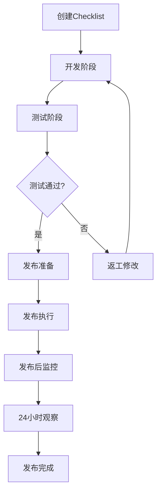

# 后端功能发布Checklist（带负责人跟踪）

## 基础信息

| 项目 | 内容 | 负责人 | 状态 | 完成时间 | 备注 |
|------|------|--------|------|----------|------|
| 功能名称 | `[填写]` | `[PM]` | 待办 | | |
| JIRA/任务号 | `[链接]` | `[PM]` | 待办 | | |
| 合并分支 | `feature/xxx → main` | `[DEV]` | 待办 | | |
| 发布日期 | `YYYY-MM-DD` | `[TL]` | 待办 | | |

---

## 开发阶段（开发负责人填写）

### 1. 协议层变更

| 检查项 | 具体内容 | 负责人 | 状态 | 完成时间 | 验证人 |
|--------|----------|--------|------|----------|--------|
| 新增API接口 | `[列出端点]` | `[后端]` | 待办 | | `[前端]` |
| 修改API接口 | `[说明兼容性]` | `[后端]` | 待办 | | `[前端]` |
| API文档更新 | Swagger/OpenAPI | `[后端]` | 待办 | | `[QA]` |
| 消息协议变更 | `[如RabbitMQ/Kafka]` | `[后端]` | 待办 | | `[相关消费者负责人]` |

### 2. 数据层变更

| 检查项 | 具体内容 | 负责人 | 状态 | 完成时间 | DBA审核 |
|--------|----------|--------|------|----------|---------|
| 新增表结构 | `[表名.sql]` | `[后端]` | 待办 | | `[DBA]` |
| 修改表结构 | `[ALTER语句]` | `[后端]` | 待办 | | `[DBA]` |
| 数据迁移脚本 | `[迁移逻辑说明]` | `[后端]` | 待办 | | `[DBA]` |
| 回滚脚本 | `[rollback.sql]` | `[后端]` | 待办 | | `[DBA]` |
| 缓存策略变更 | `[Redis键模式]` | `[后端]` | 待办 | | `[架构师]` |

---

## 测试阶段（测试负责人填写）

### 3. 测试验证

| 检查项 | 验收标准 | 负责人 | 状态 | 完成时间 | 通过率 |
|--------|----------|--------|------|----------|--------|
| 单元测试 | 覆盖率 ≥ 80% | `[开发]` | 待办 | | `[%]` |
| 集成测试 | 所有用例通过 | `[QA]` | 待办 | | `[通过数/总数]` |
| API测试 | Postman/自动化 | `[QA]` | 待办 | | `[通过数/总数]` |
| 性能测试 | 响应时间 < 200ms | `[QA]` | 待办 | | `[报告链接]` |
| 兼容性测试 | 历史数据/接口 | `[QA]` | 待办 | | `[通过数/总数]` |

---

## 发布准备（运维/发布负责人填写）

### 4. 部署清单

| 检查项 | 操作内容 | 负责人 | 状态 | 计划时间 | 实际时间 |
|--------|----------|--------|------|----------|----------|
| 数据库执行 | 生产环境执行SQL | `[DBA]` | 待办 | `[时间]` | |
| 配置发布 | 配置文件更新 | `[运维]` | 待办 | `[时间]` | |
| 代码部署 | 服务重启/更新 | `[运维]` | 待办 | `[时间]` | |
| 服务验证 | 健康检查通过 | `[运维]` | 待办 | `[时间]` | |
| 监控配置 | 新增监控项 | `[运维]` | 待办 | `[时间]` | |

---

## 发布后跟踪（值班负责人填写）

### 5. 发布后监控（24小时观察期）

| 时间窗口 | 监控项 | 负责人 | 状态 | 检查时间 | 问题记录 |
|----------|--------|--------|------|----------|----------|
| 0-1小时 | 错误日志监控 | `[值班1]` | 待办 | `[时间]` | |
| 1-4小时 | 性能指标 | `[值班1]` | 待办 | `[时间]` | |
| 4-8小时 | 业务指标 | `[值班2]` | 待办 | `[时间]` | |
| 8-24小时 | 用户反馈 | `[值班2]` | 待办 | `[时间]` | |

---

## 状态说明

### 状态标签说明

- **待办**：未开始处理
- **进行中**：正在处理
- **已完成**：已完成，待验证
- **已验证**：已由验证人确认完成
- **阻塞**：遇到问题，需要协助
- **延期**：计划延期

### 责任人角色说明

| 角色代码 | 实际人员 | 联系方式 | 职责 |
|----------|----------|----------|------|
| PM | `[姓名]` | `[企微/钉钉]` | 产品经理，需求方 |
| TL | `[姓名]` | `[联系方式]` | 技术负责人，审批 |
| DEV | `[姓名]` | `[联系方式]` | 后端开发，主要实现 |
| QA | `[姓名]` | `[联系方式]` | 测试工程师 |
| DBA | `[姓名]` | `[联系方式]` | 数据库管理员 |
| 运维 | `[姓名]` | `[联系方式]` | 运维工程师 |
| 前端 | `[姓名]` | `[联系方式]` | 前端开发 |

---

## 附件和链接

| 文档类型 | 文件/链接 | 上传人 | 上传时间 | 状态 |
|----------|-----------|--------|----------|------|
| SQL脚本 | `[文件链接]` | `[DEV]` | | 待办 |
| API文档 | `[Swagger链接]` | `[DEV]` | | 待办 |
| 测试报告 | `[测试平台链接]` | `[QA]` | | 待办 |
| 部署手册 | `[Confluence链接]` | `[运维]` | | 待办 |

---

## 审批流程

### 阶段审批记录

| 审批阶段 | 审批人 | 状态 | 审批时间 | 意见 |
|----------|--------|------|----------|------|
| 技术方案评审 | `[TL]` | 待办 | | |
| 代码Review完成 | `[Reviewer]` | 待办 | | |
| 测试验收通过 | `[QA Lead]` | 待办 | | |
| 发布预审批 | `[TL]` | 待办 | | |
| 最终发布批准 | `[PM/TL]` | 待办 | | |

---

## 工作流程

### 使用说明

1. **创建模板副本**：每次新功能发布时创建新的Checklist副本
2. **分配负责人**：项目经理或技术负责人在创建时分配各环节负责人
3. **状态更新**：各负责人完成自己的任务后及时更新状态
4. **进度跟踪**：通过每日站会或定期检查Checklist进度，及时解决阻塞项
5. **状态通知**：建议配置状态变更自动通知相关责任人
6. **文档归档**：发布完成后将Checklist归档到知识库，便于后续参考

---

## 工具支持

本Checklist适用于以下协作工具：

1. **Confluence**：使用表格模板和任务列表功能
2. **Notion**：使用数据库视图，支持分配和状态管理
3. **腾讯文档/飞书文档**：使用在线协作表格
4. **JIRA + Confluence**：任务与文档关联管理
5. **GitHub Projects**：使用项目管理看板功能

---

## 附录

本Checklist模板旨在规范后端功能发布流程，确保每个环节都有明确的责任人和可追踪的状态，提升团队协作效率和发布质量。
