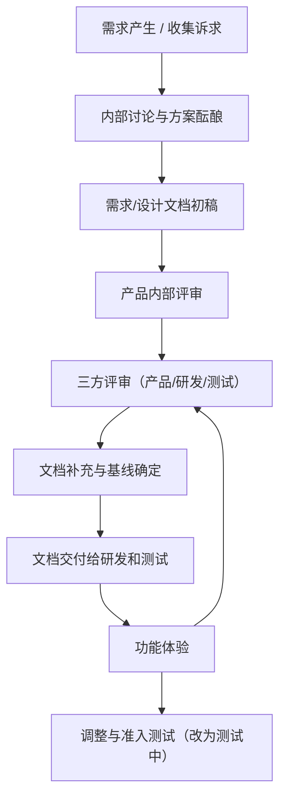
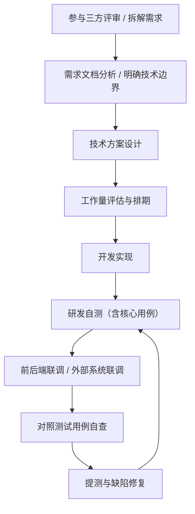
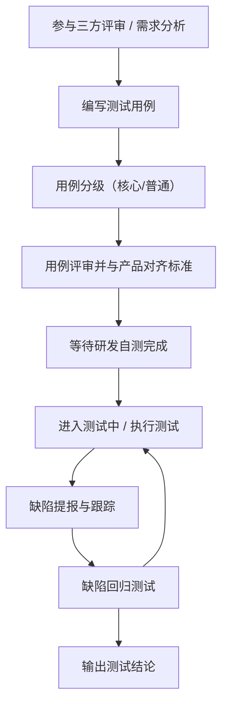

## 项目研发流程（正式版）

本流程适用于本项目及类似中小型互联网项目，目标是规范产品、研发、测试三方在一个需求从「提出」到「上线」全过程中的职责与协作方式，确保：
- 需求清晰可落地；
- 设计合理可实现；
- 实现过程可跟踪；
- 质量结果可验证。

---

## 一、角色与总体原则

- **涉及角色**：产品、研发（后端/前端等）、测试。
- **总体原则**：
  - 任何需求在进入开发前，必须完成充分讨论与文档沉淀；
  - 研发与测试应在需求阶段提前介入，共同发现风险与遗漏；
  - 三方并非互相挑错，而是共同把事情做好的协作关系。

## 二、产品流程

产品负责从业务视角驱动需求，对需求的完整性、合理性与可验证性负责。

### 1. 需求形成与评审

1. **需求产生**：收集业务诉求、用户反馈或内部改进建议，形成需求池条目；
2. **方案酝酿**：在产品内部进行讨论和头脑风暴，形成初步解决方案；
3. **文档初稿**：编写需求/设计文档初稿，至少包含：
   - 业务背景与目标；
   - 主要使用场景与用户角色；
   - 业务流程与状态流转；
   - 规则说明与异常场景；
4. **产品内部评审**：在产品团队内先行评审，修正文档中明显缺陷与歧义；
5. **三方评审**（产品 + 研发 + 测试）：
   - 从业务、技术、测试三个角度补全需求；
   - 明确边界条件、异常情况及兼容/回滚策略；
   - 初步评估技术风险与实现复杂度。

> 说明：三方评审的最终目的，是从三个不同视角完善需求文档，使其真正达到「可开发、可测试、可验收」的标准。

#### 产品流程小结（流程图）

### 2. 文档完善与交付

1. **补充说明**：
   - 对复杂逻辑、特殊规则、跨系统依赖等内容给出清晰描述；
   - 对容易产生歧义的点，通过示例、流程图、状态图等方式加以说明；
2. **文档基线**：
   - 对关键细节达成一致后，形成当前版本的「文档基线」；
   - 后续如有变更，需要在文档中体现版本与变更说明；
3. **文档交付**：
   - 正式将文档交付给研发团队，用于技术方案设计与开发实现；
   - 同时交付给测试团队，作为测试用例设计和验收标准的依据。

### 3. 研发过程中的产品参与

1. **持续答疑**：在研发和测试过程中，如出现需求疑问，由产品负责解释，并在必要时同步更新文档；
2. **功能体验**：
   - 在研发完成自测后，产品对功能进行体验；
   - 重点关注核心业务流程、关键规则、交互与文案；
3. **准入测试**：
   - 当产品认为功能已达到「可测试」标准（主流程可用、无明显逻辑错误）时，将需求状态调整为「测试中」，正式进入测试阶段。

---

## 三、研发流程

研发负责从技术视角实现需求，对代码质量、技术方案合理性与实现进度负责。

### 1. 需求理解与技术方案

1. **参与三方评审**：在评审阶段充分了解业务背景、范围边界与业务优先级；
2. **需求分析**：对需求文档进行技术视角的拆解，识别：
   - 复杂点与潜在风险；
   - 与现有系统的耦合点与影响面；
3. **技术方案设计**（视需求复杂度）：
   - 模块与接口划分；
   - 数据结构与数据库变更设计；
   - 外部依赖（缓存、消息队列、第三方服务等）方案；
4. **工作量评估与排期建议**：
   - 进行工作量评估，给出合理的开发与联调周期；
   - 配合团队制定整体上线计划。

#### 研发流程小结（流程图）

### 2. 开发与自测

1. **编码实现**：
   - 按技术方案进行编码，遵循团队代码规范与评审流程；
2. **研发自测**：
   - 覆盖主流程、重要分支及关键异常场景；
   - 对数据库变更、缓存、配置等进行基础验证；
3. **联调验证**：
   - 前后端之间进行接口联调，校验数据结构和交互逻辑；
   - 与相关外部系统（如消息系统、第三方接口）进行必要联调；
4. **对照测试用例自查**：
   - 在提测前，尽量基于测试用例进行自查，减少明显问题进入测试环节；
   - 对测试侧标记为「核心用例」的部分，研发必须在提测前完成自测，并对发现的问题进行修复与回归，确保主流程和关键功能点稳定。

### 3. 提测与问题修复

1. **提测条件**：
   - 自测通过，无已知致命缺陷；
   - 与产品就已实现效果达成共识；
2. **提测说明**：
   - 说明本次改动范围、影响模块和已知限制；
   - 如有暂不支持或后续计划实现的内容，需要在说明中明确标记；
3. **缺陷处理**：
   - 对测试反馈的问题进行分析、修复和自测回归；
   - 如问题涉及需求理解偏差或文档不清，应及时与产品沟通，并修订文档。

---

## 四、测试流程

测试负责从质量与风险控制视角，对需求进行验证与把关。

### 1. 测试设计

1. **参与三方评审**：
   - 从测试角度提出应覆盖的场景、边界条件与异常情况；
2. **需求分析**：
   - 对需求文档进行细致拆解，确保每一个功能点在测试侧都有对应的验证方案；
3. **编写测试用例**：
   - 覆盖正常流程、异常流程、边界输入、权限控制等；
   - 标注优先级（如 P0 / P1 / P2），便于测试排期与执行策略；
4. **用例分级（核心 / 普通）**：
   - 将测试用例按照重要程度划分为「核心用例」和「普通用例」；
   - 核心用例通常包括：主业务流程、关键业务规则、资金/订单等高风险逻辑、重要数据一致性等；
   - 普通用例用于覆盖非核心分支、次要功能和辅助体验类场景；
   - 用例分级结果需要在测试用例文档中明确标记，便于研发自测和测试执行时有清晰的优先级参考。
5. **用例评审**：
   - 将测试用例交由产品审核，确认测试标准与业务预期一致；
   - 根据产品反馈补充或调整测试场景。

> 说明：测试需要对需求做到「心中有数」，即对每个点期望行为明确；有疑问应在执行前与产品沟通并在文档中补充说明。

### 2. 测试执行

1. **前置条件**：
   - 研发完成自测与联调；
   - 产品确认主要功能可用，将需求状态调整为「测试中」；
2. **执行过程**：
   - 按测试用例执行，记录实际结果与预期结果；
   - 对发现的问题进行分级、归类，并在缺陷管理系统中登记；
3. **回归测试**：
   - 缺陷修复后进行针对性回归测试；
   - 对高风险模块和核心业务链路进行必要的扩展回归；
4. **测试结论**：
   - 输出测试结论或测试报告，说明通过情况、遗留风险和上线建议。

#### 测试流程小结（流程图）

---

## 五、三方协作原则

1. **信息透明**：
   - 需求文档、设计文档、测试用例、缺陷记录等应尽可能在统一平台中管理和共享；
   - 需求和方案的变更需要有清晰的记录、通知和确认流程。

2. **前置沟通**：
   - 尽量在需求阶段解决大部分分歧和疑问，减少开发后返工成本；
   - 研发与测试应主动参与需求与设计阶段的讨论。

3. **尊重专业分工**：
   - 产品主导业务决策和需求优先级；
   - 研发主导技术实现路径和架构选型；
   - 测试主导质量标准和风险评估；
   - 在各自专业领域相互尊重、充分信任，同时保持坦诚沟通。

4. **共同目标一致**：
   - 三方的共同目标是：在合理成本和时间范围内交付稳定、可维护、可迭代的功能，而非证明责任归属。

---
