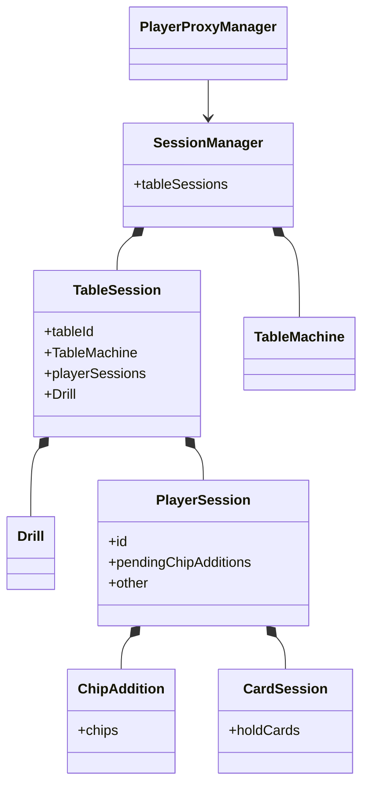
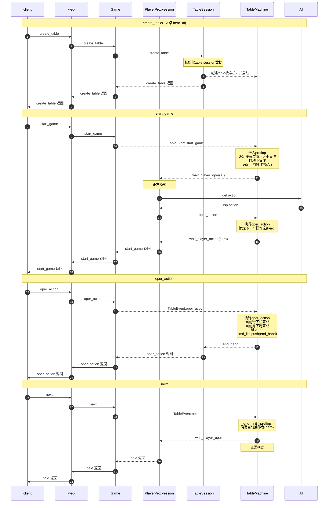

新增PlayerProxyManager,处理玩家相关纯逻辑业务，可以通过SessionManger获取TableSession

### 类结构图

### 正常模式（创建桌子 → 开始游戏 → 等待玩家操作）

以 **2 人桌（Hero + AI）** 为例。正常模式下无 Drill 配置、无 ActionRoute、无 DrillExecutor；创建桌子后 start_game，状态机进入 preflop 并下盲注，随后按当前操作者区分：**等待 Hero** 时由客户端提交 oper_action，**等待 AI** 时由 Game 服向 AI 服务请求决策并自动提交 oper_action。下图分别体现两种等待的时序。

### 时序图二：Drill 模式（创建场景 → 到达 Hero 决策点)，6人桌，vs3bet

**场景语义说明（6max, vs3bet）**：

- 本场景约定为：**Hero 作为 preflop 主动加注者（open/raise）**，随后**某一对手对 Hero 的 open 做 3bet**；
- 其他玩家根据脚本依次 fold / 不再参与，最终**轮到 Hero 面对这手 3bet 决策**（call / fold / 4bet 等）；
- 示例座位：6max（UTG/HJ/CO/BTN/SB/BB）中，可约定 **Hero=CO，对手=SB**，SB/BB 为盲注位，其余玩家在本局 preflop 中均根据脚本弃牌。

仅描述从创建 Drill 场景到返回 table + 决策点的流程，不涉及 AI 服务。流程与时序图一一致：**先返回 create_drill_table**，再由客户端发起 **start_game** 后进入预生成行动循环。

```mermaid
sequenceDiagram
    participant c as client
    participant w as web
    participant g as Game
    participant pp as PlayerProxyession
    participant ts as TableSession
    participant ta as TableMachine    
    participant ai as AI
    autonumber

    Note over c, ai: create_drill_table(6人桌 hero+ai)
    c->>w: create_drill_table
    w->>g: create_drill_table

    Note over g: 配置解析与获取第三方结果（6max + vs3bet）
    g-->>g: 解析 DrillConfig<br/>确定桌型为 6max（UTG/HJ/CO/BTN/SB/BB）<br/>解析 heroPosition / opponentPosition / relativeHeroPosition<br/>从 preflopActions 中选择 vs3bet 场景
    g-->>g: 组装 getDrillsConfig 入参<br/>players=6max / game_type=vs3bet / hero_position / opponent_position*
    g->>g: 调用 getDrillsConfig 获取 holecard / actions（异步）
    g-->>g: 应用 holecard 至座位；公共牌本地随机或按 board 约束

    Note over g: 将 getDrillsConfig.actions 转为 ActionRoute
    g-->>g: 传入 getDrillsConfig 返回的 holecard / actions<br/>（preflop 包含 blinds/open/3bet 等，vs3bet：Hero open 后对手 3bet）
    g-->>g: 按街解析 actions → 转为 AbstractAction[] → 验证 → 基于 preflop 脚本确定 Hero 决策点（vs3bet：Hero 面对 3bet）    

    g-->>ts: create_drill_table(drillConfig, actionRoute)
    note over ts, ts: 初始化table session数据<br>tableSession.playType=drill
    note over ts: 创建drill并初始化(drillConfig, actionRoute)<br>drill.isDrill=true
    ts-->>ta: 创建table状态机，并启动   
    ts-->>g: create_drill_table 返回
    g->>w: create_drill_table 返回
    w->>c: create_drill_table 返回   

    note over c, ai: start_game
    c->>w: start_game
    w->>g: start_game
    g-->>ta: TableEvent.start_game    
    note over ta, ta: 进入preflop<br>确定庄家位置，大小盲注<br>自动下盲注<br>确定当前操作者(AI)

    loop 遍历 drill.actions 直至到达 hero 决策点（vs3bet）
        ta-->>pp: GameEvent.wait_player_oper(UTG)        
        note over pp, pp: drill玩法且isDrill=true<br>未到hero决策点<br>读取当前drill.actions[drill.actionIdx]<br>drill.actionIdx+=1
        pp-->>ta: GameEvent.oper_action(fold)        
        note over ta: 执行oper_action，更新 table / aiActionList / command_list<br/>确定下一个操作者HJ

        ta-->>pp: GameEvent.wait_player_oper(HJ)        
        note over pp, pp: drill玩法且isDrill=true<br>未到hero决策点<br>读取当前drill.actions[drill.actionIdx]<br>drill.actionIdx+=1
        pp-->>ta: GameEvent.oper_action(fold)        
        note over ta: 执行oper_action，更新 table / aiActionList / command_list<br/>确定下一个操作者CO

        ta-->>pp: GameEvent.wait_player_oper(CO)        
        note over pp, pp: drill玩法且isDrill=true<br>未到hero决策点<br>读取当前drill.actions[drill.actionIdx]<br>drill.actionIdx+=1
        pp-->>ta: GameEvent.oper_action(bet)        
        note over ta: 执行oper_action，更新 table / aiActionList / command_list<br/>确定下一个操作者BTN

        ta-->>pp: GameEvent.wait_player_oper(BTN)        
        note over pp, pp: drill玩法且isDrill=true<br>未到hero决策点<br>读取当前drill.actions[drill.actionIdx]<br>drill.actionIdx+=1
        pp-->>ta: GameEvent.oper_action(fold)        
        note over ta: 执行oper_action，更新 table / aiActionList / command_list<br/>确定下一个操作者SB

        ta-->>pp: GameEvent.wait_player_oper(SB)        
        note over pp, pp: drill玩法且isDrill=true<br>未到hero决策点<br>读取当前drill.actions[drill.actionIdx]<br>drill.actionIdx+=1
        pp-->>ta: GameEvent.oper_action(raise)        
        note over ta: 执行oper_action，更新 table / aiActionList / command_list<br/>确定下一个操作者BB

        ta-->>pp: GameEvent.wait_player_oper(BB)        
        note over pp, pp: drill玩法且isDrill=true<br>未到hero决策点<br>读取当前drill.actions[drill.actionIdx]<br>drill.actionIdx+=1
        pp-->>ta: GameEvent.oper_action(fold)        
        note over ta: 执行oper_action，更新 table / aiActionList / command_list<br/>确定下一个操作者CO

        ta-->>pp: GameEvent.wait_player_oper(CO)        
        note over pp, pp: drill玩法且isDrill=true<br>到hero决策点<br>退出循环            
    end
    pp-->>ts: tableSession.isDrill=false
    pp->>ai: 请求 hero action
    ai->>pp: 返回 hero action
    pp-->>g: start_game 返回      
    g-->w: start_game 返回
    w-->>c: start_game 返回
    
    note over c, ai: oper_action
    c->>w: oper_action
    w->>g: oper_action
    g-->>ta: TableEvent.oper_action
    note over ta, ta: 执行oper_action<br>当前街下注完成<br>当前局下周完成<br>进入end<br>cmd_list.push(end_hand)
    ta-->>ts: end_hand
    ts-->>g: oper_action 返回
    g->>w: oper_action 返回    
    w->>c: oper_action 返回

    note over c, ai: next
    c->>w: next
    w->>g: next

    note over g: 配置解析与获取第三方结果（6max + vs3bet）
    g-->>ts: 获取 drillConfig  
    ts-->>g: 返回 drillConfig  
    g-->>g: 解析 DrillConfig<br/>确定桌型为 6max（UTG/HJ/CO/BTN/SB/BB）<br/>解析 heroPosition / opponentPosition / relativeHeroPosition<br/>从 preflopActions 中选择 vs3bet 场景
    g-->>g: 组装 getDrillsConfig 入参<br/>players=6max / game_type=vs3bet / hero_position / opponent_position*
    g->>g: 调用 getDrillsConfig 获取 holecard / actions（异步）
    g-->>g: 应用 holecard 至座位；公共牌本地随机或按 board 约束

    Note over g: 将 getDrillsConfig.actions 转为 ActionRoute
    g-->>g: 传入 getDrillsConfig 返回的 holecard / actions<br/>（preflop 包含 blinds/open/3bet 等，vs3bet：Hero open 后对手 3bet）
    g-->>g: 按街解析 actions → 转为 AbstractAction[] → 验证 → 基于 preflop 脚本确定 Hero 决策点（vs3bet：Hero 面对 3bet） 

    g-->>ts: tableSession.updateDrill(actionRoute)
    note over ts: tableSession.isDrill=true
    g-->>ta: TableEvent.next
    note over ta, ta: end->init->preflop<br>确定当前操作者(hero)


    loop 遍历 drill.actions 直至到达 hero 决策点（vs3bet）
        ta-->>pp: GameEvent.wait_player_oper(UTG)        
        note over pp, pp: drill玩法且isDrill=true<br>未到hero决策点<br>读取当前drill.actions[drill.actionIdx]<br>drill.actionIdx+=1
        pp-->>ta: GameEvent.oper_action(fold)        
        note over ta: 执行oper_action，更新 table / aiActionList / command_list<br/>确定下一个操作者HJ

        note over pp, ta: 中间交互省略了

        ta-->>pp: GameEvent.wait_player_oper(CO)        
        note over pp, pp: drill玩法且isDrill=true<br>到hero决策点<br>退出循环            
    end
```

