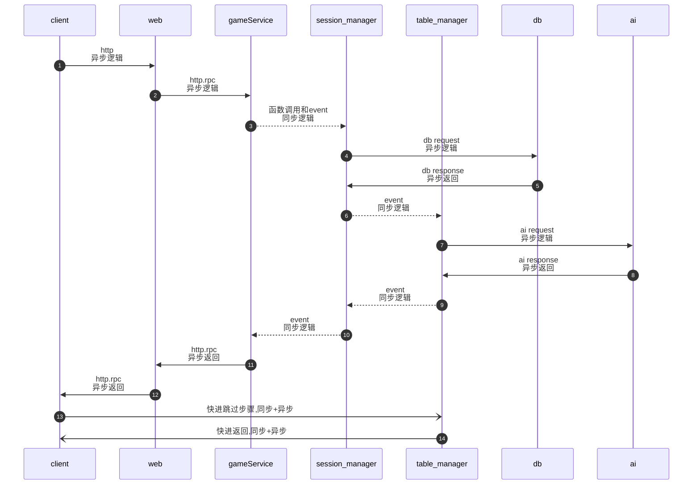
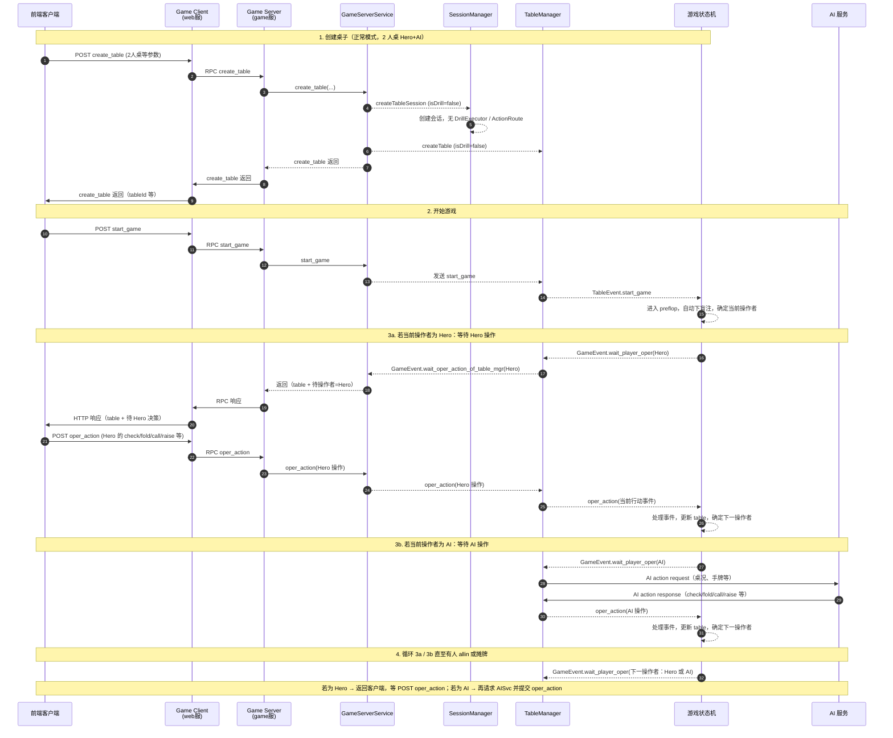
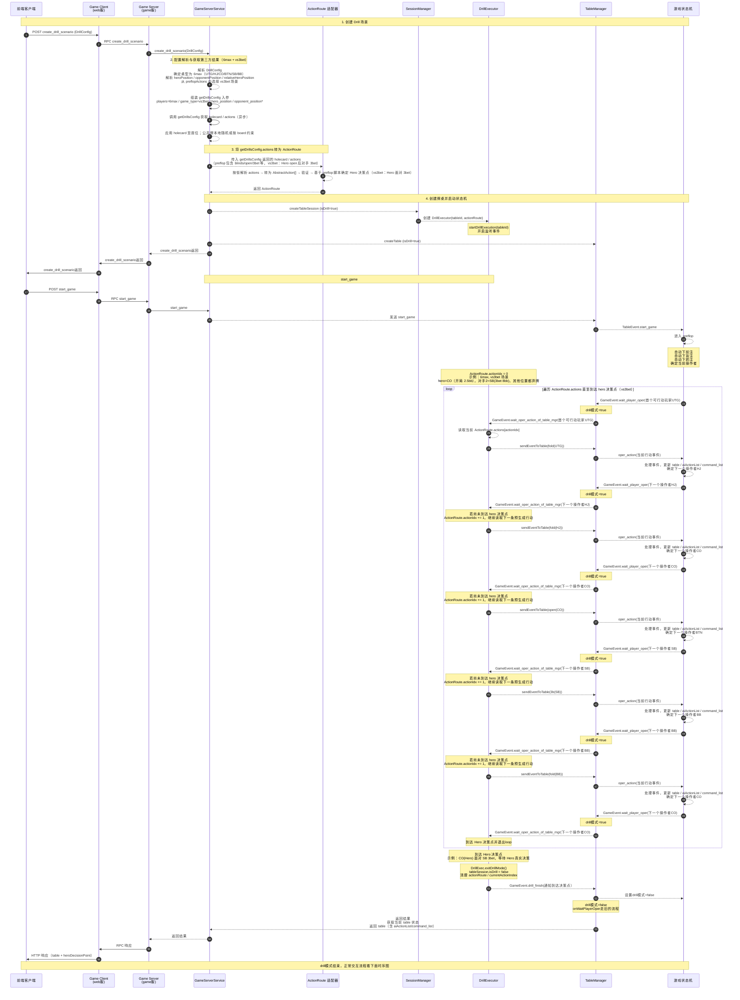
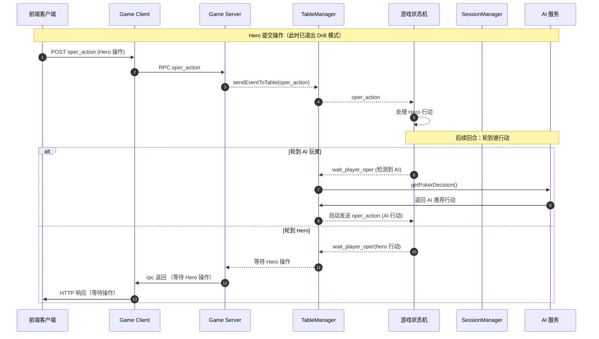
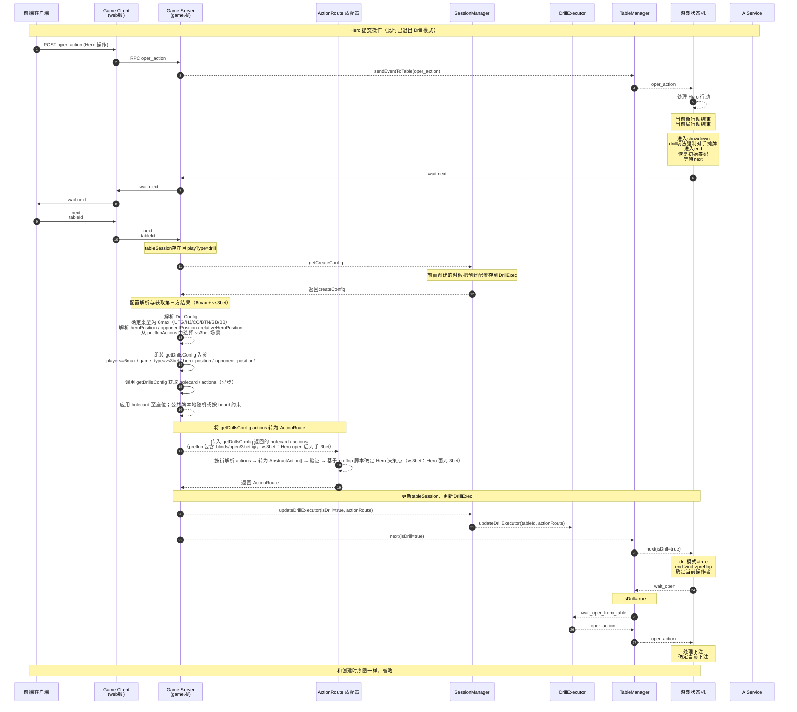
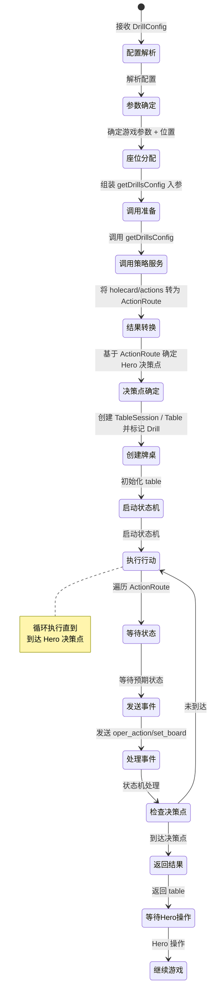

# 自定义牌局 Drill 开发设计

> 说明：如本开发设计与《803-自定牌局drill需求》中约定存在冲突，**以 803 需求文档为准**。本设计在原 801 基础上，已按 803 中“由第三方 `getDrillsConfig` 统一返回 hero/对手手牌与各街行动线（preflop/flop/turn/river）”的方案做了更新。

## 总体架构思路

### 核心目标

将一组自定义配置转换为完整的牌局轨迹（包含牌、行动、动画命令），**在不改变既有「游戏状态机 + table_manager + session_manager」设计的前提下**，最大程度复用当前实现，最小化新增代码和分支。

在新的需求下，Drill 系统不再在 game 内部自行构造完整的行动路线和手牌，而是：

- 基于 `drillConfig` 解析出桌型、场景类型（`game_type`）、hero/opponent 位置等语义信息；
- 组装成第三方服务 `getDrillsConfig` 所需的参数；
- 调用第三方获取 **hero/对手 holecard + 各街 actions 脚本**（理论上含 preflop/flop/turn/river）；
- 将返回结果按街转换为内部的 `ActionRoute`，再由状态机执行到 hero 决策点。

### 实现方案选择

**方案A（推荐）**：通过状态机事件驱动，逐步执行**第三方返回的各街行动脚本**，让状态机自然推进到 hero 决策点。

**方案B（备选）**：直接构造静态 table 快照，跳过状态机执行路径。

本文档重点描述**方案A**的实现思路。

### table增加playType字段

```typescript
// 在 convertCreateTableDataToTableData 或 create_drill_scenario 中
const tableData: table_Type = {
  ...getDefaultTableInfo(tableId),
  playType: playType.drill, // 新增 drill 类型，或使用 playType.reveiw
  isCanSetCard: true, // Drill 需要预设牌功能
  predealHands: predealHands,
  predefinedStreets: predefinedStreets,
  // ...
}

// src/feature/game_server/mode/basic.ts
export enum playType {
  ai = 1, // ai练习场
  reveiw = 2, // 复盘玩法
  pvp = 3, // 真人互相对抗
  drill = 4, // 自定义drill（新增）
}

// src/feature/game_server/mode/table.ts
export const table = t.Recursive(() =>
  t.Object({
    tableId: t.String({
      minLength: 0,
      description: '牌桌id',
    }),
    ...

    // ----------------复盘玩法用到-------------------
    isCanSetCard: t.Boolean({
      default: false,
      description: '是否能设置牌，包含手牌，公共牌，游戏开始前，和开始后都能随时改动',
    }),
    predealHands: t.Record(
      t.Number(),
      t.Array(card, {
        minItems: 0,
        maxItems: 2,
        default: [],
        description: '玩家手牌',
      }),
      { default: {}, description: `预发手牌，索引对应不同的玩家 {seatIdx: card []}` }
    ),
    predefinedStreets: t.Object({
      flop: t.Array(card, {
        minItems: 0,
        maxItems: 3,
        default: [],
        description: '预发翻牌',
      }),
      turn: t.Array(card, {
        minItems: 0,
        maxItems: 1,
        default: [],
        description: '预发转牌',
      }),
      river: t.Array(card, {
        minItems: 0,
        maxItems: 1,
        default: [],
        description: '预发河牌',
      }),
    }),
  })
)
```

**注1**：项目里面以前用isCanSetCard地方改成用playType判断，语义会更清晰些

**注2**：提前分配手牌和公共牌复用table对象中predealHands和predefinedStreets字段

**注3**：提前确定的小盲位置，大盲位置，玩家分别在什么位置都可以服用类似复盘流程

---

### 时序图潜规则

**注：时序图需要明显看到同步和异步逻辑，划线定义**

- 尖角实线表示异步逻辑
- 虚线表示同步逻辑
- 圆角实现表示快速跳过步骤（异步+同步）



---

## 总体架构流程图

### 时序图零：正常模式（创建桌子 → 开始游戏 → 等待玩家操作）

以 **2 人桌（Hero + AI）** 为例。正常模式下无 Drill 配置、无 ActionRoute、无 DrillExecutor；创建桌子后 start_game，状态机进入 preflop 并下盲注，随后按当前操作者区分：**等待 Hero** 时由客户端提交 oper_action，**等待 AI** 时由 Game 服向 AI 服务请求决策并自动提交 oper_action。下图分别体现两种等待的时序。



### 时序图二：Drill 模式（创建场景 → 到达 Hero 决策点)，6人桌，vs3bet

**场景语义说明（6max, vs3bet）**：

- 本场景约定为：**Hero 作为 preflop 主动加注者（open/raise）**，随后**某一对手对 Hero 的 open 做 3bet**；
- 其他玩家根据脚本依次 fold / 不再参与，最终**轮到 Hero 面对这手 3bet 决策**（call / fold / 4bet 等）；
- 示例座位：6max（UTG/HJ/CO/BTN/SB/BB）中，可约定 **Hero=CO，对手=SB**，SB/BB 为盲注位，其余玩家在本局 preflop 中均根据脚本弃牌。

仅描述从创建 Drill 场景到返回 table + 决策点的流程，不涉及 AI 服务。流程与时序图一一致：**先返回 create_drill_scenario**，再由客户端发起 **start_game** 后进入预生成行动循环。



**注**：自动下前注、盲注不在预先生成的行动线里，由状态机自动完成。

### 时序图三：正常游戏模式（Hero 操作与后续回合）

描述 Drill 决策点之后，Hero 真实操作及后续轮流行动（Hero / AI）的流程。此时 Drill 标记已在到达决策点时由 SessionMgr.exitDrillMode 取消，table 处于正常游戏模式。



**注**：暂时hero决策点操作后，正常完成所有街

### 时序图: 下一局



**注**：getCreateConfig后一段流程和前面时序图一样，考虑抽出来共用

### 核心流程

```mermaid
flowchart TD
    Start([前端请求创建 Drill 场景]) --> ParseConfig[解析 DrillConfig]

    ParseConfig --> DetermineParams[确定游戏参数<br/>桌型/盲注/筹码/下注尺寸]
    DetermineParams --> AssignSeats[分配座位<br/>Hero位置/对手位置]

    AssignSeats --> PrepareReq[组装 getDrillsConfig 入参<br/>game_type / hero_position 等]
    PrepareReq --> CallService[调用 getDrillsConfig<br/>获取 holecard / actions]

    CallService --> ApplyResult[应用第三方结果<br/>构建 ActionRoute / 校验数据]

    ApplyResult --> CreateSession[创建 TableSession<br/>标记 Drill 模式，保存 ActionRoute]
    CreateSession --> CreateTable[创建 Table 对象<br/>初始化座位/手牌/筹码<br/>标记 Drill 模式]
    CreateTable --> StartStateMachine[启动游戏状态机<br/>发送 start_game 事件]

    StartStateMachine --> CreateDrillExec[创建 DrillExecutor<br/>执行各街行动脚本]
    CreateDrillExec --> ExecuteActions{遍历 ActionRoute.actions<br/>包含 Hero 和对手预生成行动}

    ExecuteActions --> WaitState[等待状态机到达预期状态<br/>wait_oper_action]
    WaitState --> CheckActionType{行动类型?}
    CheckActionType -->|Hero 预生成行动| SendHeroAction[发送 oper_action<br/>Hero 预生成行动]
    CheckActionType -->|对手预生成行动| SendOpponentAction[发送 oper_action<br/>对手预生成行动<br/>跳过 AI 请求]
    SendHeroAction --> ProcessEvent[状态机处理事件<br/>更新状态/写入数据]
    SendOpponentAction --> ProcessEvent
    ProcessEvent --> CheckComplete{是否到达<br/>Hero决策点?}

    CheckComplete -->|否| ExecuteActions
    CheckComplete -->|是| ReturnResult[返回 table + heroDecisionPoint<br/>给前端]

    ReturnResult --> WaitHero[等待 Hero 真实操作]
    WaitHero --> HeroAction[Hero 发送 oper_action]
    HeroAction --> ExitDrill[退出 Drill 模式]
    ExitDrill --> ContinueGame[继续正常游戏流程]

    ContinueGame --> CheckPlayerType{当前玩家类型?}
    CheckPlayerType -->|AI玩家| RequestAI[请求 AI 服务<br/>getPokerDecision]
    CheckPlayerType -->|Hero玩家| WaitHeroAction[等待 Hero 操作]
    RequestAI --> ProcessAIAction[处理 AI 返回<br/>自动发送 oper_action]
    ProcessAIAction --> ContinueGame
    WaitHeroAction --> HeroAction

    style Start fill:#e1f5ff
    style ReturnResult fill:#c8e6c9
    style WaitHero fill:#fff9c4
    style ContinueGame fill:#f3e5f5
```



### 状态转换图：整体流程状态



## 1. 配置模型与数据结构

### 1.1 DrillConfig 配置结构

> 这是配置的核心，整体结构不能随意变动；具体字段实现时可以用 TypeScript 类型约束。

```typescript
interface DrillConfig {
  game: {
    solutions: {
      // select which game format you would like to study.
      // cash 现金桌， mtt 锦标赛, 只能选择一个，默认 'cash'
      gameFormat: 'cash' | 'mtt'

      // gameType, 即游戏类型
      // classic: regular cash game without any ante or straddle
      // short: every player starts with 5 to 10bb starting stack and builds his stack up
      // ante: cash game with ante
      // straddle: format with forced straddle for utg
      // straddle+ante: format with forced ante and straddle
      // 只能选择一个，默认 classic
      gameType: 'classic' | 'short' | 'ante' | 'straddle' | 'straddle+ante'

      // players: select how many players are sitting at the table
      // 6max: 6人桌；8max：8人桌；9max：9人桌
      // 只能选择一个，默认 6max
      players: '6max' | '8max' | '9max'

      // avaliableSpots: solutions are available only for preflop, or also for postflop
      // preflopOnly: solutions are available only for preflop
      // postflop: solutions are available for preflop, flop, turn and river
      // 只能选择一个，默认 postflop
      avaliableSpots: 'postflop' | 'preflopOnly'

      // betSizeType:
      // simple: fewer bet sizes，复杂度低
      // simplified: 极简 bet sizes，hero 一两个 size，villain 多 size
      // general: 中等复杂度的 bet size 方案
      // 只能选择一个
      betSizeType: 'simple' | 'simplified' | 'general'

      // rake: 只能选择一个, 默认 nl500, 即大盲注是 5，小盲是 2.5
      rake: 'nl50' | 'nl500'

      // openSize: select from multiple different opening sizes for each position
      // 可以选择任意一个，或者全部，不能为空，默认全部，多选时从中随机一个
      openSize: Array<'gto' | '2.5x'>

      // threeBetSize:
      // gto: game theory optimal 3bet sizes
      // smaller: smaller 3bet sizes compared to GTO
      // 可以选择任意一个，或者全部，不能为空，默认全部，多选时从中随机一个
      threeBetSize: Array<'gto' | 'smaller'>

      // effectiveStack: select which stack depth you would like to study
      // 100 表示初始筹码 100bb
      // 可以选择任意一个，或者全部，不能为空，默认全部，多选时从中随机一个
      effectiveStack: number[]
    }

    // startSpot: hand will start after defined preflop/flop/custom actions.
    // preflop: hand will start after defined preflop actions.
    // flop: hand will start after defined flop actions.
    // custom: hand will start anywhere you choose.
    // 只能选择一个，默认 preflop
    startSpot: 'preflop' | 'flop' | 'custom'

    // preflopActions: hand will start after defined preflop line
    // rfi: raise first in - action folds to you.
    // vsOpen: hand will start facing an opening raise
    // vs3bet/4bet/5bet: hand will facing a raise as the previous raiser, e.g. facing 4bet as the 3bettor.
    // vsLimp: hand will start facing a limp
    // vsRaiseCall: someone has opened, and another player has called. action has foled to you with the option to squeeze.
    // vsSqueeze: you've either opened or called an open, and a third player has now raised.
    // vsIso: hand will start facing a raise after you have limped.
    // fromStart: simulates real game scenario.
    // 可以选择多个，默认是全部；实际在多个中随机选择一种场景进行练习
    preflopActions: Array<
      | 'rfi'
      | 'vsOpen'
      | 'vs3bet'
      | 'vs4bet'
      | 'vs5bet'
      | 'vsLimp'
      | 'vsRaiseCall'
      | 'vsSqueeze'
      | 'vsIso'
      | 'fromStart'
    >

    // heroPosition: hero 对应的位置，可以选择多个，默认全部，实际随机一个
    // 6max: ['utg', 'hj', 'co', 'btn', 'sb', 'bb']
    // 9max: ['utg', 'utg1', 'utg2', 'lj', 'hj', 'co', 'btn', 'sb', 'bb']
    heroPosition: string[]

    // opponentPosition: 对手位置，同上，可以选择多个，默认全部，实际随机一个
    opponentPosition: string[]

    // relativeHeroPosition:
    // ip: hero in position
    // oop: hero out of position, acting first postflop.
    // 可以选择多个，默认 [ip, oop]，实际在选中的里随机一个
    relativeHeroPosition: Array<'ip' | 'oop'>

    // alternatePosition: 交换位置
    // off: 关闭；on: ip/oop 同时存在，一会 ip 一会 oop 随机的
    // 只能选择一个, 默认 off
    alternatePosition: 'off' | 'on'
  }

  board: {
    // 公共牌相关设置，比如 ['As', 'Ah', 'Ac', 'Ad']，最多 5 张
    specificBoard: string[]
    // 其他待定
  }

  hands: {
    // 手牌相关设置，比如 ['As', 'Ah']，最多 2 张
    manual: string[]
    // 其他待定
  }

  modes: {
    // gameModle:
    // fullHand: play the hand to showdown, or until someone folds
    // street: practice one street
    // spot: practice one decision point
    // 只能选择一个，默认 fullHand
    gameModle: 'fullHand' | 'street' | 'spot'
    // 其他待定
  }
}
```

### 1.2 配置校验规则

- **solutions 配置校验**
  - `gameFormat`、`gameType`、`players`、`avaliableSpots`、`betSizeType`、`rake`：只能选择一个值
  - `openSize`、`threeBetSize`、`effectiveStack`：数组不能为空，多选时实际随机一个
  - `effectiveStack` 影响初始筹码计算（例如 100 表示 100bb）

- **位置校验**
  - `heroPosition` 和 `opponentPosition` 必须在对应桌型（6max/8max/9max）的有效位置范围内
  - 如果两者都指定了，需要确保不冲突（hero 和对手不能在同一位置）
  - 如果 `opponentPosition` 未指定，从除 hero 外的所有位置中按场景需求选择

- **场景+位置校验**：某些 preflopAction 在特定位置不合理，需要禁止
  - 例如（6max）：hero 在 UTG 位置不能是 `vsOpen`、`vs4bet`、`vsRaiseCall`、`vsLimp`、`vsIso`
  - 例如（6max）：hero 在 BB 位置不能是 `rfi`、`vs3bet`、`vs5bet`、`vsSqueeze`、`vsIso`
  - 需要根据桌型和位置建立不合理场景的过滤规则表

- **街+场景校验**：某些 preflopAction 只能在特定街出现
  - 例如：`vs4bet`、`vs5bet` 通常只在 preflop 出现
  - `startSpot` 为 `flop` 时，某些 preflopAction 可能不适用

- **相对位置校验**
  - `relativeHeroPosition` 和 `alternatePosition` 需要与实际的 hero/opponent 位置关系匹配
  - 如果 `alternatePosition='on'`，需要在多局训练中支持位置切换

- **手牌与公共牌冲突校验**
  - `hands.manual` 和 `board.specificBoard` 中的牌不能重复
  - 如果冲突，需要重新随机替换冲突的牌

- **场景组合校验**：多个 preflopAction 组合时，需要检查逻辑合理性（当前实现中，每局只随机选择一个场景）

---

## 2. 牌与座位分配（带约束的随机）

### 2.1 游戏参数确定

根据 `game.solutions` 配置，确定游戏基础参数：

1. **桌型与玩家数**
   - 根据 `players`（6max/8max/9max）确定座位总数和位置名称映射
   - 6max: `['UTG', 'HJ', 'CO', 'BTN', 'SB', 'BB']`
   - 9max: `['UTG', 'UTG1', 'UTG2', 'LJ', 'HJ', 'CO', 'BTN', 'SB', 'BB']`

2. **盲注结构**
   - 根据 `rake`（nl50/nl500）确定大盲注和小盲注
   - 根据 `gameType` 确定是否需要 ante/straddle
     - `classic`: 无 ante，无 straddle
     - `ante`: 有 ante
     - `straddle`: UTG 强制 straddle
     - `straddle+ante`: 同时有 ante 和 straddle

3. **初始筹码**
   - 从 `effectiveStack` 数组中随机选择一个值（例如 100）
   - 初始筹码 = effectiveStack × bb（例如 100bb = 100 × 5 = 500）

4. **下注尺寸策略**
   - 根据 `betSizeType`（simple/simplified/general）确定下注尺寸范围,默认general
   - 根据 `openSize` 和 `threeBetSize` 随机选择具体的 open/3bet 尺寸

### 2.2 座位分配流程

1. **Hero 位置分配**
   - 如果 `heroPosition` 指定了多个位置，从中随机选择一个；
   - 如果未指定或为空，在该桌型下所有合法位置中随机；
   - 选定后转换为 `getDrillsConfig` 所需的 `hero_position`（如 UTG / CO / BTN 等）。

2. **对手位置分配**
   - 根据选中的 `preflopAction` 场景，确定至少需要几个对手、各自扮演什么角色（open/3bet/4bet/...）；
   - 如果 `opponentPosition` 指定了多个位置，从中随机选择所需数量的对手位置；
   - 如果未指定，从除 hero 外的所有位置中按场景需求选择最小需要数量的对手；
   - 确保 hero 和对手位置不冲突；
   - 将实际启用的对手位置映射为 `getDrillsConfig` 的 `opponent_position` / `opponent_position2` 等参数。

3. **相对位置验证**
   - 根据 hero 和对手的实际位置关系，验证是否符合 `relativeHeroPosition`（ip/oop）的要求；
   - 如果不符合，需要调整对手位置或重新选择；
   - `alternatePosition` 为 `on` 时，需要在多局训练中跨局调整 hero / opponent 的位置组合。

### 2.3 牌分配流程（结合第三方结果）

在新方案中，**hero 与对手的 holecard 由第三方 `getDrillsConfig` 统一返回**，game 侧的职责从“生成牌”变为“应用 + 校验牌”。  
公共牌的来源则与**起始街道**有关：

- 如果 Drill 的开始行动点在 **preflop / 翻牌前**，默认仍由 game 本地生成公共牌（结合 `board.specificBoard` 约束）；
- 如果开始行动点在 **翻牌后（flop/turn/river）**，则**优先使用第三方接口在 `actions` 中返回的公共牌信息**；若该局未返回对应公共牌脚本，则视为 `isDrill=false`，公共牌生成逻辑退回到“自由练习场”同款路径。

1. **初始化牌堆**
   - 创建完整 52 张牌堆；
   - 先“拿走”已锁定的公共牌：`board.specificBoard` 中的公共牌（最多 5 张）。

2. **应用第三方返回的 holecard**
   - 从 `getDrillsConfig` 返回的 `holecard[]` 中，根据 seat 与本局的座位映射关系，将 hero 与对手手牌写入 table；
   - 在写入前，需检查：
     - 是否与 `board.specificBoard` 中的公共牌冲突；
     - 是否存在重复牌或非法牌面；
   - 如发现冲突或非法数据，应按策略：
     - 直接报错并中止创建 drill 场景，返回错误给调用方；或
     - 记录告警日志，进行必要的防御性修正（例如丢弃冲突公共牌重新随机）。

3. **公共牌分配**
   - 根据本局 Drill 的**起始街道**以及第三方返回内容决定公共牌来源：
     - 若开始街在 preflop / 翻牌前：
       - 如果 `board.specificBoard` 已指定部分公共牌，使用指定的牌；
       - 对未指定的公共牌（flop/turn/river），从剩余牌堆顺序抽取；
       - 如果指定的公共牌与 hero/对手手牌冲突，冲突的公共牌需要重新从剩余牌中随机替换；
       - 此时公共牌生成逻辑完全在 game 内完成。
     - 若开始街在翻牌后（例如从 flop/turn/river 的某个决策点开始）：
       - 优先解析 `getDrillsConfig.actions` 中携带的公共牌信息（如专门的“设置 board”行动或在特定脚本中隐含的 flop/turn/river）；
       - 如果该局脚本中**未返回所需街道的公共牌**，则认为当前局已不再处于 Drill 模式（`isDrill=false`），公共牌改由现有“自由练习场”逻辑生成；
       - 退出 Drill 模式后，后续流程完全按普通自由练习局处理，不再依赖 DrillExecutor。

4. **约束保证**
   - 所有与牌相关的随机都在独立模块中完成；
   - 保证牌不重复、不冲突；
   - 预留 seed 机制，支持可重放（可选）。

---

## 3. 行动路线转换（Scenario 适配引擎）

### 3.1 抽象行动步骤数据结构

```typescript
interface AbstractAction {
  // 基本信息
  seatIdx: number // 执行行动的玩家座位索引
  street: table_state_Type // 所在行动街
  sequence: number // 行动序列号（在同一街内递增）

  // 行动类型
  actionType: 'fold' | 'check' | 'call' | 'bet' | 'raise' | 'allin'

  // 行动参数
  amount?: number // 下注金额（bet/raise/allin 时需要）
  isBlind?: boolean // 是否为盲注行动（ante/sb/bb）
  isStraddle?: boolean // 是否为 straddle

  // 上下文信息
  potBefore: number // 行动前底池
  potAfter: number // 行动后底池
  currentMaxBet: number // 当前最大下注额
  toCall: number // 需要跟注的金额
}

interface ActionRoute {
  // 路线元信息
  config: DrillConfig
  heroSeat: number
  villainSeats: number[]

  // 行动步骤列表（按时间顺序）
  actions: AbstractAction[]

  // Hero 决策点
  heroDecisionPoint: {
    street: table_state_Type
    actionIndex: number // actions 数组中的索引，表示 hero 需要在此处决策
    context: {
      pot: number
      currentMaxBet: number
      toCall: number
      availableActions: string[] // 可选操作列表
    }
  }
}
```

### 3.2 行动路线适配逻辑

> 说明：原始方案中，本节描述了“在 game 内部基于 preflopActions + solutions 生成完整行动路线”的过程。根据 803 新需求，这部分职责整体下沉到第三方服务 `getDrillsConfig`，game 侧只负责**解析场景 → 调用第三方 → 把返回的 `actions[]` 适配为内部 `ActionRoute`**。  
> 为此**刻意保留 RouteGen（ActionRoute 适配层）**，而不是在各处直接使用 `getDrillsConfig.actions`，主要原因是：
>
> - **解耦外部协议与内部模型**：第三方返回结构（字段名、是否带 street、seat 标识等）可能演进，而 `ActionRoute/AbstractAction` 需要长期稳定；通过适配层，把所有“协议细节”和兼容逻辑集中在一处。
> - **集中做上下文补全与合法性校验**：例如补齐 `street/pot/toCall/currentMaxBet`，校验下注是否合理、是否违反状态机规则等；如果协议变更或发现 bug，只需修改适配层即可。
> - **保持执行层简单稳定**：`DrillExecutor` 和状态机只认 `ActionRoute`，不感知第三方协议细节，后续可以无感切换/升级 `getDrillsConfig` 或增加本地降级方案（例如只用 holecard、不用脚本）。
> - **便于测试与调试**：适配层可以单独对“某一份 `actions` → 期望的 `ActionRoute`”做单元测试，出问题时更容易定位到是“协议解析问题”还是“执行问题”。

#### 3.2.1 场景解析与接口入参

1. **确定本局练习场景（game_type）**
   - 从 `game.preflopActions` 中按规则（通常为随机）选择一个场景，例如 `rfi` / `vsOpen` / `vs3bet` 等；
   - 将该场景映射为 `getDrillsConfig.game_type`。

2. **转换座位信息**
   - 使用第 2 章已确定的 hero / opponent 位置；
   - 将内部的座位标识映射为 `hero_position` / `opponent_position` / `opponent_position2` 等入参。

3. **从 solutions 推导其它参数**
   - 根据 `game.solutions.players / rake / effectiveStack / openSize / threeBetSize / gameType` 等，推导出：
     - `playerCount`、`bbCount`、`antCount`、`straddle` 等；
   - 与 803 文档中的 `getDrillsConfig` 入参规则保持一致。

#### 3.2.2 调用 getDrillsConfig 并构建 ActionRoute

1. **调用第三方接口**
   - 以异步方式调用 `getDrillsConfig`，获取：
     - `holecard[]`：hero 与对手手牌；
     - `actions[]`：各街行动脚本（理论上可包含 preflop / flop / turn / river），每项包含 action / seat / amount，若第三方提供则含 street 或按顺序隐含街。

2. **actions → AbstractAction 转换**
   - 按照返回的顺序，将每一个 `action` 转换为 `AbstractAction`：
     - 将 seat 映射为内部 `seatIdx`；
     - 根据第三方返回的 `street` 或按顺序/分隔符推断当前街，补全 `street / potBefore / potAfter / toCall / currentMaxBet` 等上下文字段；
     - 将第三方的 `action` 字符串映射为内部的 `actionType`（fold / check / call / bet / raise / allin 等）；
     - 若 actions 中含发公共牌等特殊项（如翻牌面），需与状态机发牌节点对应。

3. **构建 ActionRoute 与 Hero 决策点**
   - 使用转换后的 `AbstractAction[]` 构建 `ActionRoute.actions`；
   - 根据 `modes.gameModle`（fullHand / street / spot）与实际行动线，确定 `heroDecisionPoint`：
     - `spot`：通常在第一次轮到 Hero 决策的位置；
     - `street`：在目标街内某个/最后一个 Hero 决策点；
     - `fullHand`：可以在整手牌流程中选取一个关键节点；
   - 校验：
     - 行动序列在状态机上是否可行（不违反筹码/下注规则）；
     - Hero 决策点是否存在且合理（不会在非法状态截断）。

4. **错误处理与降级（可选）**
   - 当 `getDrillsConfig` 返回的行动线与当前桌面规则冲突时：
     - 记录错误日志，返回明确错误码给前端；
     - 或在设计上预留降级策略（例如只使用手牌信息，放弃脚本），具体行为由产品侧决定。

**示例：`vsOpen` 场景（Hero 面对前面有人 open）**

```
1. 处理盲注/前注
2. 某个位置 open（根据 openSize 随机选择，例如：2.5bb）
3. Hero 在后续位置需要决策（call/fold/3bet）
```

**示例：`vs3bet` 场景（Hero open，面对对手 3bet）**

```
1. 处理盲注/前注
2. Hero 在某个位置 open（例如：2.5bb）
3. 后位对手对 Hero open 做 3bet（根据 threeBetSize 随机选择，例如：8bb 或 GTO 尺寸）
4. 其余玩家按脚本依次弃牌或不再参与
5. 轮到 Hero 面对这手 3bet 做决策（call/fold/4bet 等）
```

**示例：`vs4bet` 场景**

```
1. 处理盲注/前注
2. 某个位置 open（例如：2.5bb）
3. Hero 在后续位置 3bet（例如：8bb）
4. 某个位置 4bet（例如：20bb）
5. 轮到 Hero 决策（Hero 需要决定是否 call/fold/5bet）
```

**示例：`vsLimp` 场景（Hero 面对前面有人 limp）**

```
1. 处理盲注/前注
2. 某个位置 limp（跟注大盲）
3. Hero 在后续位置需要决策（fold/call/raise）
```

**示例：`vsRaiseCall` 场景（有人 open，有人 call，Hero 可以 squeeze）**

```
1. 处理盲注/前注
2. 某个位置 open（例如：2.5bb）
3. 另一个位置 call
4. Hero 在后续位置需要决策（fold/call/raise/squeeze）
```

**示例：`vsSqueeze` 场景（Hero open 或 call 后，有人 squeeze）**

```
1. 处理盲注/前注
2. 某个位置 open（例如：2.5bb）
3. Hero call 或 open
4. 第三个位置 raise（squeeze，例如：12bb）
5. 轮到 Hero 决策
```

**示例：`vsIso` 场景（Hero limp 后，有人 raise）**

```
1. 处理盲注/前注
2. Hero limp
3. 某个位置 raise（iso，例如：3bb）
4. 轮到 Hero 决策
```

**示例：`fromStart` 场景（模拟真实游戏场景）**

```
1. 处理盲注/前注
2. 从第一个位置开始，按正常游戏流程生成完整的 preflop 行动线
3. Hero 在某个位置需要决策
```

#### 3.2.2 生成算法流程

1. **确定场景和游戏参数**
   - 从 `preflopActions` 数组中随机选择一个场景（例如：`vs3bet`）
   - 从 `openSize`、`threeBetSize`、`effectiveStack` 中分别随机选择一个值
   - 根据 `gameType` 确定盲注/前注结构

2. **初始化路线**
   - 创建空的 `ActionRoute`
   - 设置 heroSeat 和 opponentSeats（根据 2.2 座位分配结果）

3. **处理盲注/前注阶段**
   - 根据 `gameType` 和位置关系，生成 ante/sb/bb/straddle 行动
   - 这些行动标记为 `isBlind: true` 或 `isStraddle: true`
   - 根据选中的 `rake` 确定盲注金额

4. **按场景生成 preflop 行动**
   - 根据选中的 `preflopAction` 场景，生成对应的行动序列
   - 根据选中的 `openSize` 和 `threeBetSize` 确定具体的下注金额
   - 确保行动顺序符合德州扑克规则（按位置顺序行动）

5. **处理到 Hero 决策点**
   - 根据 `modes.gameModle` 决定生成到哪个点：
     - `spot`：生成到 Hero 第一个决策点前的所有行动
     - `street`：生成到 Hero 在指定街的决策点前的所有行动（根据 `game.startSpot` 和 `game.avaliableSpots`）
     - `fullHand`：生成到 Hero 决策点，并预留后续行动空间（后续由状态机自然推进）

6. **验证路线合法性**
   - 检查行动顺序是否合理（按位置顺序）
   - 检查筹码计算是否正确（每个玩家的筹码变化、底池累计）
   - 检查底池计算是否正确
   - 检查 hero 和对手位置关系是否符合 `relativeHeroPosition` 要求

#### 3.2.3 场景选择与过滤

- 当前实现中，每局从 `preflopActions` 数组中**随机选择一个**场景进行练习（不是组合）
- 在选择场景前，需要根据 `heroPosition` 和桌型，过滤掉不合理的场景组合
- 例如（6max）：
  - hero 在 UTG：过滤掉 `vsOpen`、`vs4bet`、`vsRaiseCall`、`vsLimp`、`vsIso`
  - hero 在 BB：过滤掉 `rfi`、`vs3bet`、`vs5bet`、`vsSqueeze`、`vsIso`

### 3.3 行动路线生成实现方案（策略模式 + 模板方法）

#### 3.3.1 设计思路

采用**策略模式 + 模板方法**的组合设计，而非为每个场景独立实现模块：

- **策略模式**：每个 preflopAction 场景（`rfi`、`vsOpen`、`vs3bet` 等）作为一个独立的策略类，实现场景特定的行动生成逻辑
- **模板方法**：在 `ActionRouteGenerator` 中定义统一的生成流程（处理盲注 → 应用场景策略 → 验证 → 确定决策点），各场景共享公共逻辑
- **优势**：代码复用性强、易于扩展新场景、职责清晰、便于测试

#### 3.3.2 核心接口定义

```typescript
/**
 * 场景上下文信息
 * 包含生成行动所需的所有参数
 */
interface ScenarioContext {
  // 位置信息
  heroSeat: number
  heroPosition: string // 'UTG', 'CO', 'BTN' 等
  opponentSeats: number[]
  opponentPositions: string[]
  tableSize: '6max' | '8max' | '9max'

  // 游戏参数
  bb: number // 大盲注金额
  sb: number // 小盲注金额
  ante: number // 前注金额（如果有）
  isStraddle: boolean // 是否有 straddle

  // 下注尺寸
  openSize: number // open 尺寸（bb 倍数，例如 2.5）
  threeBetSize: number // 3bet 尺寸（bb 倍数，例如 8）
  effectiveStack: number // 有效筹码（bb 数）

  // 位置顺序（用于确定行动顺序）
  positionOrder: number[] // 按行动顺序排列的座位索引数组
}

/**
 * 场景策略接口
 * 每个 preflopAction 场景实现此接口
 */
interface PreflopScenarioStrategy {
  /**
   * 生成场景特定的行动序列（不包括盲注/前注）
   * @param context 场景上下文
   * @returns 行动序列
   */
  generateActions(context: ScenarioContext): AbstractAction[]

  /**
   * 场景名称
   */
  getName(): string

  /**
   * 场景是否适用于当前配置（位置过滤）
   * @param heroPosition hero 位置
   * @param tableSize 桌型
   * @returns 是否适用
   */
  isApplicable(heroPosition: string, tableSize: string): boolean

  /**
   * 获取场景所需的最小对手数量
   * @returns 最小对手数量
   */
  getMinOpponentCount(): number

  /**
   * 获取场景所需的对手角色列表
   * 例如：['open', 'call'] 表示需要一个 open 的对手和一个 call 的对手
   * @returns 对手角色列表
   */
  getRequiredOpponentRoles(): string[]
}

/**
 * 行动路线生成器（模板方法）
 */
class ActionRouteGenerator {
  private strategies: Map<string, PreflopScenarioStrategy> = new Map()

  constructor() {
    // 注册所有场景策略
    this.registerStrategies()
  }

  /**
   * 注册所有场景策略
   */
  private registerStrategies(): void {
    this.strategies.set('rfi', new RfiScenario())
    this.strategies.set('vsOpen', new VsOpenScenario())
    this.strategies.set('vs3bet', new Vs3betScenario())
    this.strategies.set('vs4bet', new Vs4betScenario())
    this.strategies.set('vs5bet', new Vs5betScenario())
    this.strategies.set('vsLimp', new VsLimpScenario())
    this.strategies.set('vsRaiseCall', new VsRaiseCallScenario())
    this.strategies.set('vsSqueeze', new VsSqueezeScenario())
    this.strategies.set('vsIso', new VsIsoScenario())
    this.strategies.set('fromStart', new FromStartScenario())
  }

  /**
   * 生成完整行动路线（模板方法）
   * @param config DrillConfig 配置
   * @param seatAssignment 座位分配结果（heroSeat, opponentSeats）
   * @param gameParams 游戏参数（bb, sb, ante, openSize, threeBetSize, effectiveStack）
   * @returns 完整行动路线
   */
  generateRoute(
    config: DrillConfig,
    seatAssignment: { heroSeat: number; opponentSeats: number[] },
    gameParams: {
      bb: number
      sb: number
      ante: number
      isStraddle: boolean
      openSize: number
      threeBetSize: number
      effectiveStack: number
    }
  ): ActionRoute {
    // 步骤1：构建场景上下文
    const context = this.buildScenarioContext(config, seatAssignment, gameParams)

    // 步骤2：选择并过滤场景
    const scenario = this.selectScenario(config, context)

    // 步骤3：处理盲注/前注（公共逻辑）
    const blindActions = this.generateBlindActions(context, config)

    // 步骤4：生成场景特定行动（差异点）
    const scenarioActions = scenario.generateActions(context)

    // 步骤5：合并行动序列
    const allActions = [...blindActions, ...scenarioActions]

    // 步骤6：验证路线合法性（公共逻辑）
    this.validateRoute(allActions, context)

    // 步骤7：确定 Hero 决策点（公共逻辑）
    const heroDecisionPoint = this.findHeroDecisionPoint(allActions, context, config)

    return {
      config,
      heroSeat: context.heroSeat,
      villainSeats: context.opponentSeats,
      actions: allActions,
      heroDecisionPoint,
    }
  }

  /**
   * 构建场景上下文
   */
  private buildScenarioContext(
    config: DrillConfig,
    seatAssignment: { heroSeat: number; opponentSeats: number[] },
    gameParams: any
  ): ScenarioContext {
    // 获取位置名称映射
    const positionMapping = POSITION_MAPPING[this.getTableSizeNumber(config.game.solutions.players)]
    const activeSeats = [seatAssignment.heroSeat, ...seatAssignment.opponentSeats].sort(
      (a, b) => a - b
    )

    // 根据 BTN 位置确定位置顺序（需要从 table 中获取 btnSeatIdx）
    // 这里简化处理，实际需要根据 table.btnSeatIdx 计算
    const positionOrder = this.calculatePositionOrder(activeSeats, gameParams.btnSeatIdx)

    return {
      heroSeat: seatAssignment.heroSeat,
      heroPosition: this.getPositionName(seatAssignment.heroSeat, positionOrder, positionMapping),
      opponentSeats: seatAssignment.opponentSeats,
      opponentPositions: seatAssignment.opponentSeats.map((seat) =>
        this.getPositionName(seat, positionOrder, positionMapping)
      ),
      tableSize: config.game.solutions.players,
      bb: gameParams.bb,
      sb: gameParams.sb,
      ante: gameParams.ante,
      isStraddle: gameParams.isStraddle,
      openSize: gameParams.openSize,
      threeBetSize: gameParams.threeBetSize,
      effectiveStack: gameParams.effectiveStack,
      positionOrder,
    }
  }

  /**
   * 根据配置选择场景（带过滤）
   */
  private selectScenario(config: DrillConfig, context: ScenarioContext): PreflopScenarioStrategy {
    // 过滤不合理的场景组合
    const applicable = config.preflopActions.filter((name) => {
      const strategy = this.strategies.get(name)
      if (!strategy) return false
      return strategy.isApplicable(context.heroPosition, context.tableSize)
    })

    if (applicable.length === 0) {
      throw new Error(
        `没有可用的场景，heroPosition=${context.heroPosition}, tableSize=${context.tableSize}`
      )
    }

    // 随机选择一个
    const selected = applicable[Math.floor(Math.random() * applicable.length)]
    return this.strategies.get(selected)!
  }

  /**
   * 生成盲注/前注行动（公共逻辑）
   */
  private generateBlindActions(context: ScenarioContext, config: DrillConfig): AbstractAction[] {
    const actions: AbstractAction[] = []
    let sequence = 0
    let pot = 0

    // 处理前注（ante）
    if (
      config.game.solutions.gameType === 'ante' ||
      config.game.solutions.gameType === 'straddle+ante'
    ) {
      const activePlayers = [context.heroSeat, ...context.opponentSeats]
      activePlayers.forEach((seatIdx) => {
        actions.push({
          seatIdx,
          street: table_state_Type.preflop,
          sequence: sequence++,
          actionType: 'bet',
          amount: context.ante,
          isBlind: true,
          potBefore: pot,
          potAfter: (pot += context.ante),
          currentMaxBet: context.ante,
          toCall: 0,
        })
      })
    }

    // 处理小盲注（SB）
    actions.push({
      seatIdx: this.getSbSeat(context), // 需要根据 table.sbSeatIdx 确定
      street: table_state_Type.preflop,
      sequence: sequence++,
      actionType: 'bet',
      amount: context.sb,
      isBlind: true,
      potBefore: pot,
      potAfter: (pot += context.sb),
      currentMaxBet: context.sb,
      toCall: 0,
    })

    // 处理大盲注（BB）
    actions.push({
      seatIdx: this.getBbSeat(context), // 需要根据 table.bbSeatIdx 确定
      street: table_state_Type.preflop,
      sequence: sequence++,
      actionType: 'bet',
      amount: context.bb,
      isBlind: true,
      potBefore: pot,
      potAfter: (pot += context.bb),
      currentMaxBet: context.bb,
      toCall: 0,
    })

    // 处理 Straddle（如果有）
    if (
      config.game.solutions.gameType === 'straddle' ||
      config.game.solutions.gameType === 'straddle+ante'
    ) {
      const straddleSeat = this.getStraddleSeat(context) // UTG 位置
      actions.push({
        seatIdx: straddleSeat,
        street: table_state_Type.preflop,
        sequence: sequence++,
        actionType: 'bet',
        amount: context.bb * 2, // straddle 通常是 2bb
        isBlind: false,
        isStraddle: true,
        potBefore: pot,
        potAfter: (pot += context.bb * 2),
        currentMaxBet: context.bb * 2,
        toCall: 0,
      })
    }

    return actions
  }

  /**
   * 验证路线合法性
   */
  private validateRoute(actions: AbstractAction[], context: ScenarioContext): void {
    // 检查行动顺序是否合理（按位置顺序）
    // 检查筹码计算是否正确
    // 检查底池计算是否正确
    // 检查 hero 和对手位置关系是否符合 relativeHeroPosition 要求
    // ... 具体验证逻辑
  }

  /**
   * 确定 Hero 决策点
   */
  private findHeroDecisionPoint(
    actions: AbstractAction[],
    context: ScenarioContext,
    config: DrillConfig
  ): ActionRoute['heroDecisionPoint'] {
    // 找到第一个轮到 hero 决策的行动索引
    const heroActionIndex = actions.findIndex(
      (action) => action.seatIdx === context.heroSeat && !action.isBlind && !action.isStraddle
    )

    if (heroActionIndex === -1) {
      throw new Error('未找到 Hero 决策点')
    }

    const heroAction = actions[heroActionIndex]
    const lastActionBeforeHero = actions[heroActionIndex - 1]

    return {
      street: heroAction.street,
      actionIndex: heroActionIndex,
      context: {
        pot: lastActionBeforeHero?.potAfter || 0,
        currentMaxBet: lastActionBeforeHero?.currentMaxBet || 0,
        toCall: this.calculateToCall(heroAction, lastActionBeforeHero),
        availableActions: this.getAvailableActions(heroAction, context),
      },
    }
  }

  // ... 其他辅助方法
}
```

#### 3.3.3 具体场景策略实现示例

```typescript
/**
 * RFI 场景策略（Hero 第一个行动下注）
 */
class RfiScenario implements PreflopScenarioStrategy {
  getName(): string {
    return 'rfi'
  }

  isApplicable(heroPosition: string, tableSize: string): boolean {
    // rfi 不能在 BB 位置（BB 已经下注了）
    return heroPosition !== 'BB'
  }

  getMinOpponentCount(): number {
    return 1 // 至少需要一个对手
  }

  getRequiredOpponentRoles(): string[] {
    return [] // rfi 场景不需要对手先行动
  }

  generateActions(context: ScenarioContext): AbstractAction[] {
    const actions: AbstractAction[] = []
    let sequence = 0 // 注意：这里 sequence 需要从盲注行动之后继续

    // 1. Hero 在指定位置 open
    const openAmount = context.openSize * context.bb
    actions.push({
      seatIdx: context.heroSeat,
      street: table_state_Type.preflop,
      sequence: sequence++,
      actionType: 'bet',
      amount: openAmount,
      potBefore: context.bb + context.sb + context.ante * (context.opponentSeats.length + 1),
      potAfter: 0, // 需要计算
      currentMaxBet: openAmount,
      toCall: 0,
    })

    // 2. 后续玩家依次行动（call/fold/3bet）
    // 根据 gameModle 决定生成到哪个点
    // 如果 gameModle=spot，生成到 Hero 第一个决策点
    // 如果 gameModle=fullHand，生成到 Hero 再次行动的点

    return actions
  }
}

/**
 * VS Open 场景策略（Hero 面对前面有人 open）
 */
class VsOpenScenario implements PreflopScenarioStrategy {
  getName(): string {
    return 'vsOpen'
  }

  isApplicable(heroPosition: string, tableSize: string): boolean {
    // vsOpen 不能在 UTG（UTG 是第一个行动位置，不可能面对 open）
    return heroPosition !== 'UTG'
  }

  getMinOpponentCount(): number {
    return 1 // 至少需要一个 open 的对手
  }

  getRequiredOpponentRoles(): string[] {
    return ['open'] // 需要一个 open 的对手
  }

  generateActions(context: ScenarioContext): AbstractAction[] {
    const actions: AbstractAction[] = []
    let sequence = 0

    // 1. 某个位置 open（根据 openSize 随机选择）
    const openSeat = this.selectOpenSeat(context) // 在 hero 之前的位置中选择
    const openAmount = context.openSize * context.bb

    actions.push({
      seatIdx: openSeat,
      street: table_state_Type.preflop,
      sequence: sequence++,
      actionType: 'bet',
      amount: openAmount,
      potBefore: 0, // 需要计算
      potAfter: 0, // 需要计算
      currentMaxBet: openAmount,
      toCall: 0,
    })

    // 2. Hero 在后续位置需要决策（call/fold/3bet）
    // 这里不生成 hero 的行动，因为这是决策点

    return actions
  }

  private selectOpenSeat(context: ScenarioContext): number {
    // 从 hero 之前的位置中选择一个作为 open 位置
    // 需要根据 positionOrder 确定
    // ...
  }
}

/**
 * VS 3bet 场景策略
 */
class Vs3betScenario implements PreflopScenarioStrategy {
  getName(): string {
    return 'vs3bet'
  }

  isApplicable(heroPosition: string, tableSize: string): boolean {
    // vs3bet 不能在 BB（BB 已经下注了，不能 3bet）
    return heroPosition !== 'BB'
  }

  getMinOpponentCount(): number {
    return 1 // 至少需要一个 3bet 的对手
  }

  getRequiredOpponentRoles(): string[] {
    return ['open', '3bet'] // 需要一个 open 的对手，然后这个对手 3bet
  }

  generateActions(context: ScenarioContext): AbstractAction[] {
    const actions: AbstractAction[] = []
    let sequence = 0

    // 1. 某个位置 open
    const openSeat = this.selectOpenSeat(context)
    const openAmount = context.openSize * context.bb

    actions.push({
      seatIdx: openSeat,
      street: table_state_Type.preflop,
      sequence: sequence++,
      actionType: 'bet',
      amount: openAmount,
      potBefore: 0,
      potAfter: 0,
      currentMaxBet: openAmount,
      toCall: 0,
    })

    // 2. Hero 在后续位置 3bet（预生成行动）
    const threeBetAmount = context.threeBetSize * context.bb
    actions.push({
      seatIdx: context.heroSeat,
      street: table_state_Type.preflop,
      sequence: sequence++,
      actionType: 'raise',
      amount: threeBetAmount,
      potBefore: 0,
      potAfter: 0,
      currentMaxBet: threeBetAmount,
      toCall: 0,
    })

    // 3. 某个位置 4bet
    const fourBetSeat = this.selectFourBetSeat(context, openSeat)
    const fourBetAmount = this.calculateFourBetSize(threeBetAmount, context)

    actions.push({
      seatIdx: fourBetSeat,
      street: table_state_Type.preflop,
      sequence: sequence++,
      actionType: 'raise',
      amount: fourBetAmount,
      potBefore: 0,
      potAfter: 0,
      currentMaxBet: fourBetAmount,
      toCall: 0,
    })

    // 4. 轮到 Hero 决策（Hero 需要决定是否 call/fold/5bet）
    // 这里不生成 hero 的行动，这是决策点

    return actions
  }

  private calculateFourBetSize(threeBetAmount: number, context: ScenarioContext): number {
    // 根据 3bet 尺寸计算 4bet 尺寸（通常是 3bet 的 2.2-2.5 倍）
    return threeBetAmount * 2.3
  }
}

// ... 其他场景策略类似实现
```

#### 3.3.4 文件组织建议

```
src/feature/game_server/drill/
├── drill_executor.ts           # DrillExecutor（执行预生成行动路线，支持各街）
├── route_generator.ts          # ActionRoute 适配器（将 getDrillsConfig.actions 按街转为 ActionRoute）
├── strategies/
│   ├── base_strategy.ts        # PreflopScenarioStrategy 接口定义
│   ├── rfi_strategy.ts         # RfiScenario
│   ├── vs_open_strategy.ts     # VsOpenScenario
│   ├── vs_3bet_strategy.ts     # Vs3betScenario
│   ├── vs_4bet_strategy.ts     # Vs4betScenario
│   ├── vs_5bet_strategy.ts     # Vs5betScenario
│   ├── vs_limp_strategy.ts     # VsLimpScenario
│   ├── vs_raise_call_strategy.ts # VsRaiseCallScenario
│   ├── vs_squeeze_strategy.ts  # VsSqueezeScenario
│   ├── vs_iso_strategy.ts      # VsIsoScenario
│   └── from_start_strategy.ts  # FromStartScenario
├── utils/
│   ├── blind_generator.ts      # 盲注生成公共逻辑（可提取到 route_generator）
│   ├── route_validator.ts      # 路线验证公共逻辑
│   ├── context_builder.ts      # 场景上下文构建辅助函数
│   └── position_utils.ts       # 位置相关工具函数（计算位置顺序、位置名称等）
└── types.ts                    # DrillConfig, ActionRoute, AbstractAction 等类型定义
```

**注意**：

- `create_drill_scenario` 方法放在 `game_server/service.ts` 的 `GameServerService` 类中，与其他 API 方法同级。
- Drill 场景管理（创建、执行、退出）放在 `SessionManager` 中。
- `DrillExecutor` 是执行器类（不是 Manager），负责执行预生成的行动路线（可跨 preflop/flop/turn/river）。

#### 3.3.5 实现要点

1. **位置计算**：需要根据 `table.btnSeatIdx`、`table.sbSeatIdx`、`table.bbSeatIdx` 计算位置顺序和位置名称，复用现有的 `POSITION_MAPPING` 逻辑

2. **筹码和底池计算**：每个 `AbstractAction` 需要正确计算 `potBefore`、`potAfter`、`currentMaxBet`、`toCall`，确保与状态机执行后的结果一致

3. **行动顺序**：严格按照德州扑克规则，按位置顺序（从 BTN 开始顺时针）生成行动

4. **场景过滤规则**：需要建立完整的场景+位置不合理组合表，在 `isApplicable` 中实现

5. **对手角色分配**：根据场景的 `getRequiredOpponentRoles()`，为对手分配合理的角色（open、call、3bet 等），并确保位置关系合理

6. **Hero 预生成行动**：某些场景需要包含 Hero 的预生成行动
   - **vs4bet 场景**：Hero 先 3bet，对手再 4bet，然后 Hero 到达决策点
   - **vs5bet 场景**：Hero 先 3bet，对手 4bet，Hero 再 5bet，对手再 6bet，然后 Hero 到达决策点
   - **vsSqueeze 场景**：Hero 先 open 或 call，对手 squeeze，然后 Hero 到达决策点
   - **vsIso 场景**：Hero 先 limp，对手 iso raise，然后 Hero 到达决策点
   - 这些 Hero 的预生成行动也需要包含在 `ActionRoute.actions` 中，由 DrillExecutor 执行

7. **gameModle 处理**：根据 `gameModle`（spot/street/fullHand）决定生成到哪个决策点

---

## 4. 从抽象行动到状态机执行（方案A核心）

### 4.1 转换层设计（薄封装，复用现有实现）

这里不重新实现一套「执行 + 记录」逻辑，而是：

- **执行侧**：把 `AbstractAction` 转成当前已经支持的事件，仍然通过 `table_manager.sendEventToTable` 驱动状态机（例如 `oper_action`、`set_hold_card`、`set_board` 等），就像现在玩家/AI 正常打牌一样。
- **记录侧**：完全复用 `player_action.ts` 中的 `recordPlayerAction`、各街道状态机中已有的 `command_xxx` 写入逻辑，让状态机自己往 `table.aiActionList` 和 `table.command_list` 里写。

因此，转换层更像是一个**脚本驱动器**，只负责把高层的 `AbstractAction` 映射成一连串已有的事件调用：

```typescript
interface ActionExecutor {
  /**
   * 根据 AbstractAction 构造并发送已有事件
   * - 下注类：构造 oper_action 事件，交给 player_action 状态机处理
   * - 发牌类：构造 set_hold_card / set_board 相关事件，交给街道状态机处理
   * - 盲注类：复用现有 ante/sb/bb/straddle 处理逻辑
   */
  executeAction(action: AbstractAction, tableId: string): Promise<void>
}
```

> 说明：`executeAction` 内部会调用 `table_manager.sendEventToTable(tableId, event)`，真正的筹码变化、`aiActionList` 和 `command_list` 写入都由现有状态机和 `recordPlayerAction` 完成，drill 逻辑只做「预先排好队的事件发送」。

### 4.2 行动执行映射

#### 4.2.1 行动类型到现有事件的映射

| AbstractAction.actionType | 已有事件/流程                                 | 说明                      |
| ------------------------- | --------------------------------------------- | ------------------------- |
| `fold`                    | `oper_action` (betType: fold)                 | 通过现有玩家行动流程弃牌  |
| `check`                   | `oper_action` (betType: check)                | 通过现有玩家行动流程过牌  |
| `call`                    | `oper_action` (betType: call)                 | 通过现有玩家行动流程跟注  |
| `bet`                     | `oper_action` (betType: bet)                  | 通过现有玩家行动流程下注  |
| `raise`                   | `oper_action` (betType: raise)                | 通过现有玩家行动流程加注  |
| `allin`                   | `oper_action` (betType: allin)                | 通过现有玩家行动流程全押  |
| `isBlind: true`           | 复用当前 ante/sb/bb/straddle 逻辑 + oper_flow | 利用现有盲注/前注处理分支 |

下注类行动走的都是现有 `player_action` 状态机路径，该路径内部已经统一调用 `recordPlayerAction` 来写 `aiActionList` 和下注相关 `command_player_bet_action`，drill 不需要重复造轮子。

#### 4.2.2 发牌相关映射（复用街道状态机）

发牌（发手牌、发公共牌）本质上是通过当前街道状态机（`preflop/flop/turn/river`）中的既有逻辑完成：

- 发手牌：复用当前系统里「发手牌 + `command_deal_hold_cards`」的逻辑，只是牌的来源由 drill 预先指定/随机。
- 发公共牌：复用 `street_machine.ts` / `action_set_board` / `command_deal_flop/turn/river` 相关逻辑。

Drill 只需要在合适的时机触发对应事件（例如模拟「牌已就绪」或调用已存在的自动发牌流程），不直接拼装发牌命令。

### 4.3 状态机驱动流程

#### 4.3.1 整体流程

```
1. 创建 Drill Table（复用 create_table 流程）
   ├─ 创建 TableSession（标记 Drill 模式，存储 DrillConfig 和 ActionRoute）
   ├─ 初始化 table 对象（分配座位、手牌、筹码，标记 isDrillMode=true）
   └─ 创建 table_machine（通过 tableManager.createTable）

2. 启动状态机并创建 DrillExecutor
   ├─ 发送 start_game 事件，状态机进入 preflop
   ├─ SessionManager 创建 DrillExecutor 实例，执行该 table 的 Drill 场景
   └─ DrillExecutor 持有 ActionRoute 和执行状态（当前行动索引）

3. 逐步执行行动路线（只通过事件驱动，不直接改 table）
   ├─ DrillExecutor 遍历 ActionRoute.actions（包含 Hero 和对手的预生成行动，可跨 preflop/flop/turn/river）
   ├─ 对每个 AbstractAction：
   │   ├─ 等待状态机到达对应状态（复用现有 state/subState，如 preflop.player_action 或 flop/turn/river 对应状态）
   │   ├─ 通过 `tableManager.sendEventToTable` 发送对应事件（oper_action / set_board 等）
   │   ├─ 等待状态机处理完成（观察状态/子状态与当前行动预期是否匹配）
   │   └─ 由状态机自身逻辑写入 aiActionList 和 command_list（`recordPlayerAction` 等）
   └─ 直到到达 Hero 决策点（ActionRoute.heroDecisionPoint.actionIndex）

4. 到达 Hero 决策点
   ├─ DrillExecutor 验证已执行到决策点
   ├─ 状态机进入既有的「等待玩家下注」状态（当前街的 player_action 等待节点）
   ├─ 返回 table 对象给前端（含 aiActionList/command_list）
   └─ 等待 Hero 真实操作
```

#### 4.3.2 状态同步机制

由于需要逐步执行行动，需要确保状态机在正确的时间点：

1. **状态等待**
   - 通过读取现有 table.state / table.subState / 当前街道子状态（如 player_action 子状态），判断是否可以执行下一步脚本行动
   - 不新增新的状态，只在外部判断「何时发送事件」

2. **事件发送时机**
   - 下注类：在街道状态机的 `player_action` 阶段，通过 `oper_action` 事件驱动（与普通玩家/AI 相同）
   - 发牌类：在 `check_street_card` 或对应的发牌状态，通过已有事件/函数触发（如自动发牌逻辑）

3. **异步处理**
   - 保持当前事件异步处理模式不变
   - Drill 调度器只在「上一次事件完成 + 状态稳定」之后，才发送下一步事件

#### 4.3.3 具体执行示例

**示例：执行某街的下注行动（如 preflop 的 open）**

```typescript
// 1. 等待状态机进入 preflop.player_action 状态
await waitForState(table, 'preflop.player_action')

// 2. 构造 oper_action 事件
const event = {
  type: 'oper_action',
  data: {
    tableId: table.tableId,
    cardId: table.cardId,
    seatIdx: action.seatIdx,
    betType: 'bet',
    chip: action.amount,
    // ... 其他参数
  },
}

// 3. 发送事件到状态机（复用现有入口）
tableManager.sendEventToTable(table.tableId, event)

// 4. 等待状态机处理完成（通过 table.state/subState 或回调判断）
await waitForActionComplete(table, action)

// 5. 不直接操作 aiActionList/command_list，记录工作由现有状态机完成（recordPlayerAction 等）
```

### 4.4 数据记录机制

#### 4.4.1 aiActionList 记录（完全复用现有逻辑）

- 下注相关记录：继续使用 `player_action.ts` 中的 `recordPlayerAction`，由现有流程在处理 `oper_action` 时统一写入 `table.aiActionList`。
- AI 请求：`game_utils.getAiReqData` 已经基于 `table.aiActionList` 构造 AI 所需的行动历史，drill 无需特殊处理。

#### 4.4.2 command_list 记录（完全复用现有命令设计）

- 下注命令：由 `recordPlayerAction` 内部写入 `command_player_bet_action`。
- 发牌命令：由当前各街道状态机（`street_machine.ts` 等）在发牌时写入 `command_deal_hold_cards` / `command_deal_flop` / `command_deal_turn` / `command_deal_river`。
- 其它命令：继续沿用现有 `command.ts` 里的定义及对应写入点（如更新筹码、设置公共牌等）。

> 总结：drill 层**不直接操作 `table.aiActionList` / `table.command_list`**，而是通过现有事件驱动，让状态机按原有设计自然记录。

---

## 5. 接口设计与集成点

### 5.1 服务架构设计

**分层架构**：

1. **GameServerService（服务层）**
   - 位置：`game_server/service.ts`（现有类）
   - 职责：处理所有 HTTP 请求，包括 `create_drill_scenario`
   - 特点：`create_drill_scenario` 作为 `GameServerService` 的静态方法，复用现有的 `PendingActionManager` 等基础设施

2. **SessionManager（管理层）**
   - 位置：`game_server/session_manager.ts`（现有类）
   - 职责：管理 Drill 场景的生命周期（创建、执行、退出）
   - 特点：在 `SessionManager` 中添加 Drill 相关方法，管理 `TableSession` 中的 Drill 数据

3. **DrillExecutor（执行层）**
   - 位置：`game_server/drill/drill_executor.ts`（新建文件）
   - 职责：执行预生成的行动路线，与 `TableManager` 的状态机进行 event 交互
   - 特点：执行器类（不是 Manager），由 `SessionManager` 创建和管理

4. **ActionRoute 适配器（原 ActionRouteGenerator）**
   - 位置：`game_server/drill/route_generator.ts`
   - 职责：将第三方 `getDrillsConfig` 返回的 `actions[]` 按街（preflop/flop/turn/river）适配为内部 `ActionRoute`，不在此生成行动线

**API 入口设计**：

- **game_server/controller.ts**：直接暴露 `/api/game_server/create_drill_scenario`（如果不需要用户认证）
- **game_client/controller.ts**：转发接口 `/api/game_client/create_drill_scenario`（如果需要用户认证，通过 RPC 调用 game_server）

### 5.2 新增接口

**POST /api/game_server/create_drill_scenario**（game服）

请求体：

```typescript
{
  uid: number
  config: DrillConfig
}
```

响应：

```typescript
{
  tableId: string
  cardId: string
  table: table_Type  // 包含 aiActionList 和 command_list
  heroDecisionPoint: {
    street: table_state_Type
    actionIndex: number
    context: {
      pot: number
      currentMaxBet: number
      toCall: number
      availableActions: string[]
    }
  }
}
```

**POST /api/game_client/create_drill_scenario**（web服，可选）

- 如果需要用户认证，在 `game_client` 添加转发接口
- 通过 RPC 调用 `game_server` 的接口

### 5.3 SessionManager 扩展（Drill 场景管理）

**SessionManager 新增方法**：

```typescript
class SessionManager {
  // ... 现有方法 ...

  /**
   * 创建 Drill 场景
   * @param tableId 牌桌ID
   * @param actionRoute 行动路线
   * @returns 是否创建成功
   */
  createDrillScenario(tableId: string, actionRoute: ActionRoute): boolean {
    const tableSession = this.getTableSession(tableId)
    if (!tableSession) return false

    tableSession.isDrillMode = true
    tableSession.actionRoute = actionRoute
    tableSession.currentActionIndex = 0
    return true
  }

  /**
   * 开始执行 Drill 行动路线
   * @param tableId 牌桌ID
   * @returns Promise，执行完成后 resolve
   */
  async startDrillExecution(tableId: string): Promise<void> {
    const tableSession = this.getTableSession(tableId)
    if (!tableSession?.actionRoute) return

    // 创建 DrillExecutor 并开始执行
    const executor = new DrillExecutor(tableId, tableSession.actionRoute)
    await executor.execute()
  }

  /**
   * 检查是否到达 Drill 决策点
   * @param tableId 牌桌ID
   * @returns 是否到达决策点
   */
  isReachedDrillDecisionPoint(tableId: string): boolean {
    const tableSession = this.getTableSession(tableId)
    if (!tableSession?.actionRoute) return false

    return (
      (tableSession.currentActionIndex ?? 0) >=
      tableSession.actionRoute.heroDecisionPoint.actionIndex
    )
  }

  /**
   * 退出 Drill 模式
   * @param tableId 牌桌ID
   */
  exitDrillMode(tableId: string): void {
    const tableSession = this.getTableSession(tableId)
    if (tableSession) {
      tableSession.isDrillMode = false
      tableSession.actionRoute = undefined
      tableSession.currentActionIndex = undefined
    }
  }
}
```

### 5.4 DrillExecutor 设计

**DrillExecutor 职责**：

1. **执行预生成行动路线**
   - 遍历 `ActionRoute.actions`（包含 Hero 和对手的预生成行动，可跨 preflop/flop/turn/river 各街）
   - 对每个 `AbstractAction`，等待状态机到达预期状态后发送对应事件
   - 跟踪执行进度，判断是否到达 Hero 决策点

2. **与 TableManager 的状态机进行 event 交互**
   - 通过 `tableManager.sendEventToTable()` 发送事件
   - 监听状态机状态变化，等待合适的时机发送下一个行动
   - 不直接操作 `table` 对象，只通过事件驱动

**DrillExecutor 接口设计**：

```typescript
class DrillExecutor {
  private tableId: string
  private actionRoute: ActionRoute
  private currentActionIndex: number
  private sessionManager: SessionManager

  /**
   * 构造函数
   * @param tableId 牌桌ID
   * @param actionRoute 行动路线
   */
  constructor(tableId: string, actionRoute: ActionRoute) {
    this.tableId = tableId
    this.actionRoute = actionRoute
    this.currentActionIndex = 0
    this.sessionManager = SessionManager.getInstance()
  }

  /**
   * 执行所有预生成行动，直到到达 Hero 决策点
   * @returns Promise，执行完成后 resolve
   */
  async execute(): Promise<void> {
    while (this.currentActionIndex < this.actionRoute.actions.length) {
      const action = this.actionRoute.actions[this.currentActionIndex]

      // 检查是否到达决策点
      if (this.currentActionIndex >= this.actionRoute.heroDecisionPoint.actionIndex) {
        break
      }

      // 等待状态机到达预期状态
      await this.waitForState(action)

      // 发送事件
      await this.sendActionEvent(action)

      // 更新执行进度
      this.currentActionIndex++
      this.updateSessionProgress()
    }
  }

  /**
   * 等待状态机到达预期状态
   */
  private async waitForState(action: AbstractAction): Promise<void> {
    // 实现状态等待逻辑
  }

  /**
   * 发送行动事件
   */
  private async sendActionEvent(action: AbstractAction): Promise<void> {
    // 构造并发送 oper_action 事件
  }

  /**
   * 更新 SessionManager 中的执行进度
   */
  private updateSessionProgress(): void {
    const tableSession = this.sessionManager.getTableSession(this.tableId)
    if (tableSession) {
      tableSession.currentActionIndex = this.currentActionIndex
    }
  }
}
```

**DrillExecutor 与 TableManager 交互方式**：

- DrillExecutor 通过 `tableManager.sendEventToTable()` 发送事件
- DrillExecutor 通过 `tableManager.getTable()` 获取状态机实例，监听状态变化
- DrillExecutor 不直接操作 `table` 对象，只通过事件驱动状态机

### 5.5 集成点

1. **service.ts 扩展（GameServerService）**
   - 在 `GameServerService` 类中添加 `create_drill_scenario` 静态方法
   - 处理 HTTP 请求、参数校验
   - 复用现有的 `PendingActionManager`、参数校验等基础设施
   - 调用 `SessionManager` 创建和管理 Drill 场景

2. **创建流程（复用 create_table）**
   - **步骤1**：创建 `TableSession`（标记 Drill 模式，存储 DrillConfig 和 ActionRoute）
     - 调用 `sessionManager.createTableSession(tableId, { isDrillMode: true, ... })`
   - **步骤2**：创建 `table_machine`（通过 `tableManager.createTable`，标记 `isDrillMode=true`）
   - **步骤3**：发送 `start_game` 事件，状态机进入 preflop
   - **步骤4**：调用 `sessionManager.startDrillExecution(tableId)`，创建 `DrillExecutor` 并开始执行
   - 与普通 `create_table` 流程一致，只是增加了 Drill 模式标记和 DrillExecutor 执行

3. **session_manager 扩展**
   - 在 `TableSession` 中增加 Drill 相关字段：
     - `isDrillMode?: boolean`
     - `drillConfig?: DrillConfig`
     - `actionRoute?: ActionRoute`
     - `currentActionIndex?: number` // 当前执行到的行动索引
   - 在 `SessionManager` 中添加 Drill 相关方法：
     - `createDrillScenario(tableId, actionRoute)`
     - `startDrillExecution(tableId)`
     - `isReachedDrillDecisionPoint(tableId)`
     - `exitDrillMode(tableId)`
   - 在 `SessionManager.onWaitPlayerOper` 中，如果是 Drill 模式且是预生成行动，跳过 AI 处理逻辑

4. **table_manager 扩展**
   - 不需要特殊扩展，复用现有的 `createTable` 和 `sendEventToTable` 方法
   - DrillExecutor 通过 `tableManager.sendEventToTable()` 发送事件

5. **状态机扩展**
   - **不新增新的状态/子状态**，只是在外部按顺序发送已有事件，让状态机按现有设计自然推进。
   - 在 `table` 对象中标记 `isDrillMode: true`，用于区分 Drill 模式和正常游戏模式。

6. **AI 请求处理（关键）**
   - **Drill 模式下的预生成行动**：所有预生成行动（包括 Hero 和对手）都不需要请求 AI 服务。
   - **处理机制**：
     - 在 `SessionManager.onWaitPlayerOper` 中，检测到 `table.isDrillMode === true` 且当前行动是预生成行动时，跳过 AI 处理逻辑。
     - DrillExecutor 直接发送预生成的 `oper_action` 事件，不等待 AI 请求。
   - **Hero 操作后**：根据 `gameModle` 决定是否退出 Drill 模式，后续流程按正常游戏处理（如果还有 AI 玩家，正常请求 AI 服务）。

---

## 6. 实现难点与解决方案

### 6.1 难点1：状态机同步

**问题**：如何确保状态机在执行每个行动时处于正确状态？

**解决方案**：

- 实现状态监听机制，等待状态机到达预期状态（如 `wait_oper_action`）
- 使用 Promise 或回调机制，确保异步操作顺序执行
- 通过 `table.state` 和 `table.subState` 判断当前状态是否可执行下一步行动

### 6.2 难点2：AI 请求拦截（关键难点）

**问题**：在 Drill 模式下，状态机进入 `wait_oper_action` 时会触发 `SessionManager.onWaitPlayerOper`，如果是 AI 玩家会自动请求 AI 服务。但 Drill 场景中对手的行动是预生成的，不需要请求 AI。

**解决方案**：

**方案A（推荐）**：在 Drill 执行阶段，直接发送 `oper_action` 事件，不等待状态机进入 `wait_oper_action` 状态

- 优点：完全避免触发 AI 请求逻辑
- 缺点：需要精确控制状态机状态，确保在正确的时机发送事件

**方案B**：在 `SessionManager.onWaitPlayerOper` 中增加 Drill 模式判断

- 检测 `table.isDrillMode === true` 且当前玩家不是 Hero
- 如果是 Drill 模式，不触发 `TableManager.handleAIPlayerOperation`
- 等待 Drill 执行器发送预生成的行动
- 优点：复用现有事件流程
- 缺点：需要修改现有逻辑，增加 Drill 模式判断分支

**方案C**：在 `TableManager.handleAIPlayerOperation` 中增加 Drill 模式判断

- 检测到 Drill 模式时，直接跳过 AI 请求，等待 Drill 执行器发送行动
- 优点：修改点集中
- 缺点：仍然会触发事件监听，只是不执行 AI 请求

**推荐使用方案B**：在 `SessionManager.onWaitPlayerOper` 中判断，如果是 Drill 模式且是预生成行动（通过 `TableSession` 标记），直接跳过 AI 处理逻辑。

### 6.3 难点3：行动路线合法性验证

**问题**：如何确保生成的行动路线在逻辑上合理？

**解决方案**：

- 实现路线验证器，检查筹码计算、底池计算、行动顺序
- 使用单元测试覆盖各种场景组合
- 验证每个行动的 `potBefore`、`potAfter`、`currentMaxBet`、`toCall` 是否正确

### 6.4 难点4：Hero 手牌合理性

**问题**：如何生成"合理"的 Hero 手牌？

**解决方案**：

- 根据场景和位置，使用手牌范围表
- 例如：UTG 位置的 `rfi` 场景，Hero 手牌应该在较紧的范围内
- 预留接口给"手牌范围/solver"模块

### 6.5 难点5：Drill 模式退出时机

**问题**：何时退出 Drill 模式，恢复正常游戏流程？

**解决方案**：

- **方案A**：Hero 第一次操作后立即退出 Drill 模式
  - 优点：简单明确
  - 缺点：如果后续还有预生成的行动（如 `gameModle=fullHand`），无法继续执行

- **方案B**：根据 `gameModle` 决定退出时机
  - `spot`：Hero 操作后立即退出
  - `street`：Hero 在该街操作后退出
  - `fullHand`：执行完所有预生成行动后退出
  - 优点：灵活支持不同模式
  - 缺点：需要跟踪执行进度

**推荐使用方案B**：在 `ActionRoute` 中记录已执行行动索引，Hero 操作后根据 `gameModle` 决定是否继续执行预生成行动或退出 Drill 模式。

### 6.6 难点6：场景组合复杂性

**问题**：多个 scenario 组合时，如何生成合理的行动路线？

**解决方案**：

- 当前实现：每局只随机选择一个场景（不是组合）
- 未来扩展：定义场景优先级和依赖关系，实现场景解析器，将组合场景拆解为基本场景序列

---

## 7. 开发阶段规划

### 阶段1：基础框架

- 实现 DrillConfig 数据结构和校验（包括 game.solutions、game、board、hands、modes）
- 实现游戏参数确定逻辑（桌型、盲注、初始筹码、下注尺寸）
- 实现牌和座位分配逻辑（考虑 relativeHeroPosition、alternatePosition）
- 实现基础的行动路线生成（单个 preflopAction 场景）

### 阶段2：状态机集成

- 实现 AbstractAction 到状态机事件的转换
- 实现状态机驱动机制
- 实现数据记录机制

### 阶段3：场景完善

- 实现所有 preflopAction 场景的生成逻辑（rfi、vsOpen、vs3bet、vs4bet、vs5bet、vsLimp、vsRaiseCall、vsSqueeze、vsIso、fromStart）
- 实现场景+位置不合理组合的过滤规则
- 完善 Hero 手牌合理性生成（根据 effectiveStack、betSizeType、行动线生成合理手牌范围）
- 完善对手手牌分配（根据行动线角色分配合理手牌范围）

### 阶段4：测试与优化

- 单元测试覆盖
- 集成测试
- 性能优化

---

## 8. 后续扩展方向

1. **手牌范围配置**：允许用户自定义 Hero 手牌范围
2. **对手策略配置**：允许配置对手的行动策略（紧/松/激进等）
3. **复盘功能**：支持保存和回放 drill 场景
4. **统计分析**：统计 Hero 在不同场景下的表现
