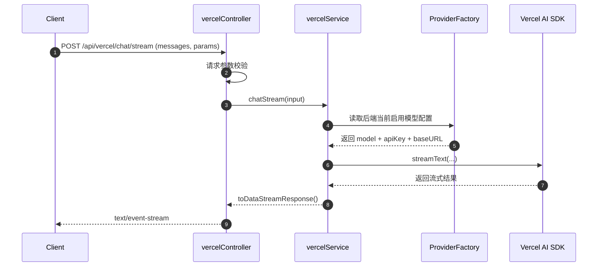

# Vercel 模块 streamText 聊天接口设计方案

| 时间       | 作者   | 备注 |
| ---------- | ------ | ---- |
| 2026.04.27 | Codex  | 初稿 |
| 2026.04.28 | Codex  | 增补：双模型预置方案（Gemini / DeepSeek） |

## 一、背景与目标

### 1.1 需求背景

当前项目已有 `module/controller/service/model` 的基础分层，但 `src/modules/vercel` 目录仍为空。  
本次目标是在该目录下设计并实现一个 **可测试、可演进** 的 `streamText` 聊天接口，用于验证 Vercel AI SDK 在 Bun + Elysia 服务中的流式输出能力。

### 1.2 目标定义

- 提供一个可在本地直接测试的流式聊天接口（SSE/Chunked Stream）。
- 保持与现有模块风格一致（`controller` 负责路由，`service` 负责业务逻辑，`model` 负责类型）。
- 支持最小可用能力：单轮/多轮消息、后端预置模型选择、流式返回。
- 明确错误码、超时、参数校验、日志与可观测性策略。
- 为后续扩展能力预留接口：工具调用（tools）、结构化输出、鉴权、限流与审计。

### 1.3 非目标（本期不做）

- 不接入复杂对话记忆存储（如 Redis/DB 持久化会话）。
- 不做前端 UI 组件封装（仅提供后端接口与调用约定）。
- 不做工具调用和多模态（图片/音频）实现，仅预留设计位。

---

## 二、技术选型与约束

### 2.1 技术栈

- 运行时：Bun
- Web 框架：Elysia
- AI SDK：Vercel AI SDK（`streamText`）
- 文档：`@elysiajs/swagger` 自动生成接口文档

### 2.2 环境变量建议

为满足“前端不传模型名”的需求，后端维护两套固定配置：

- **Gemini 套餐**
  - `AI_GEMINI_MODEL`：例如 `gemini-3-flash-preview`
  - `GOOGLE_GENERATIVE_AI_API_KEY`：Gemini Key
- **DeepSeek 套餐**
  - `AI_DEEPSEEK_MODEL`：例如 `deepseek-chat` 或 `deepseek-reasoner`
  - `DEEPSEEK_API_KEY`：DeepSeek Key
  - `DEEPSEEK_BASE_URL`：建议 `https://api.deepseek.com/v1`（如使用官方）
- **通用**
  - `AI_TIMEOUT_MS`（可选）：请求超时，默认建议 `30000`
  - `AI_MAX_OUTPUT_TOKENS`（可选）：输出上限，防止失控成本

### 2.3 模型选择策略（本次新增）

- 前端 **不再传 `model` 字段**。
- 前端 **不再传 `provider` 字段**。
- 后端在代码中手动写死当前启用模型（`gemini` 或 `deepseek`）。
- 后端根据“当前启用模型”从预置配置表中读取模型与 key。
- 切模型通过修改后端常量/配置完成，不通过请求参数切换。

### 2.4 约束说明

- 本项目已有 Redis 连接错误日志，说明基础设施可能不稳定；该接口应做到“依赖最小化”，即使 Redis 不可用也不影响流式聊天接口。
- 不阻塞主线程，不在流过程中执行重 I/O 操作。
- 返回体必须是标准流响应，确保浏览器、Postman、curl 均可消费。

---

## 三、目录与模块分层设计

目标目录：`src/modules/vercel`

### 3.1 文件职责

- `model.ts`
  - 定义请求/响应类型、错误码、默认参数、校验 Schema。
  - 统一模型消息结构（`system/user/assistant`）。
- `service.ts`
  - 封装 `streamText` 调用逻辑。
  - 处理参数合并（请求参数 + 默认参数）。
  - 统一错误转换（SDK 错误 -> 业务错误）。
- `controller.ts`
  - 定义 Elysia 路由与 Swagger 描述。
  - 调用 service 并返回流响应。
  - 处理输入校验失败的快速返回。

### 3.2 与主应用集成

- 在 `src/index.ts` 中 `.use(vercelController)` 挂载路由（建议前缀 `/api/vercel`）。
- Swagger 标签建议使用 `vercel`，便于与现有 `user/article/comment` 分类一致。

---

## 四、接口契约设计

### 4.1 路由定义

- 方法：`POST`
- 路径：`/api/vercel/chat/stream`
- Content-Type：`application/json`
- 响应类型：`text/event-stream` 或 SDK 默认流式响应头

### 4.2 请求体（建议）

```json
{
  "messages": [
    { "role": "system", "content": "你是一个简洁的中文助手" },
    { "role": "user", "content": "请用三句话介绍 Elysia" }
  ],
  "temperature": 0.7,
  "maxOutputTokens": 512
}
```

### 4.3 字段说明

- `messages`（必填）：消息数组，至少 1 条 user 消息。
- `temperature`（可选）：建议范围 `0~1`，默认 `0.7`。
- `maxOutputTokens`（可选）：输出上限，默认 `512`。

### 4.4 后端预置模型配置表（新增）

| provider | SDK provider | 模型来源 | key 来源 |
| ---- | ---- | ---- | ---- |
| gemini | `@ai-sdk/google` | `AI_GEMINI_MODEL` | `GOOGLE_GENERATIVE_AI_API_KEY` |
| deepseek | `@ai-sdk/openai`（兼容 OpenAI 协议） | `AI_DEEPSEEK_MODEL` | `DEEPSEEK_API_KEY` |

说明：
- DeepSeek 在 AI SDK 中建议通过 `createOpenAI({ baseURL })` 方式接入。
- 该表由后端维护，前端不可覆盖。

### 4.5 成功响应

- HTTP 状态码：`200`
- Body：流式分块返回（增量文本）。
- 客户端处理方式：持续读取 chunk，直到流结束。

### 4.6 失败响应（非流）

统一 JSON 错误格式：

```json
{
  "code": "AI_REQUEST_FAILED",
  "message": "模型请求失败",
  "requestId": "trace-xxx"
}
```

建议错误码：

- `INVALID_REQUEST`：参数校验失败
- `AI_CONFIG_MISSING`：缺少 API Key/模型配置
- `AI_REQUEST_TIMEOUT`：模型请求超时
- `AI_REQUEST_FAILED`：模型接口调用失败
- `INTERNAL_ERROR`：未分类服务端错误

---

## 五、核心流程设计

### 5.1 时序图



### 5.2 service 层伪代码

```ts
function chatStream(input) {
  const preset = resolvePresetByServerConfig(); // 仅后端可见
  const options = mergeDefaults(input);

  const result = streamText({
    model: createModelByPreset(preset),
    messages: options.messages,
    temperature: options.temperature,
    maxOutputTokens: options.maxOutputTokens
  });

  return result.toDataStreamResponse();
}
```

### 5.3 controller 层伪代码

```ts
post("/chat/stream", async ({ body, set }) => {
  // 1) 校验 messages
  // 2) 调用 service.chatStream
  // 3) 返回 stream response
  // 4) 捕获异常并输出统一错误 JSON
});
```

---

## 六、数据模型设计（model.ts）

### 6.1 类型定义建议

- `ChatRole = "system" | "user" | "assistant"`
- `ChatMessage = { role: ChatRole; content: string }`
- `ChatStreamRequest`
  - `messages: ChatMessage[]`
  - `temperature?: number`
  - `maxOutputTokens?: number`
- `ApiErrorResponse`
  - `code: string`
  - `message: string`
  - `requestId?: string`

### 6.2 校验规则建议

- `messages.length >= 1`
- 至少存在 1 条 `role=user` 消息
- `content` 非空且长度限制（如单条 <= 8000 字符）
- `temperature` 范围校验（`0~1`）
- `maxOutputTokens` 范围校验（`1~4096`）

### 6.3 ProviderFactory 设计（新增）

建议在 `service` 层内部引入工厂方法（不暴露给 controller）：

- 输入：后端固定配置（如 `ACTIVE_AI_PROVIDER`）
- 输出：
  - `providerName`
  - `modelName`
  - `apiKey`
  - `baseURL`（仅 deepseek 需要）

伪代码：

```ts
function resolvePresetByServerConfig() {
  const provider = ACTIVE_AI_PROVIDER; // 后端固定值

  if (provider === "gemini") {
    return {
      sdk: "google",
      model: env.AI_GEMINI_MODEL,
      apiKey: env.GOOGLE_GENERATIVE_AI_API_KEY
    };
  }

  if (provider === "deepseek") {
    return {
      sdk: "openai-compatible",
      model: env.AI_DEEPSEEK_MODEL,
      apiKey: env.DEEPSEEK_API_KEY,
      baseURL: env.DEEPSEEK_BASE_URL
    };
  }

  throw AI_PROVIDER_UNSUPPORTED;
}
```

---

## 七、异常处理与可观测性

### 7.1 异常分类

- 参数错误：直接返回 `400`
- 配置错误（Key 缺失）：返回 `500`（可细化为 `503`）
- 后端模型配置非法：返回 `500`
- 上游模型超时/限流：返回 `502/504`
- 未知错误：返回 `500`

### 7.2 日志策略

- 入参日志：仅记录结构摘要（消息条数、当前启用模型），不打印完整用户内容。
- 成功日志：记录请求耗时、输出 token 数（如可获取）。
- 失败日志：记录错误类型、堆栈、requestId。

### 7.3 追踪字段

- 生成 `requestId`（可用时间戳 + 随机串）。
- 将 `requestId` 写入响应头和错误体，便于排障。

---

## 八、安全与成本控制

### 8.1 基础安全

- API Key 仅从服务端环境变量读取，不下发客户端。
- 模型名仅在服务端配置，不接受客户端覆盖，避免越权调用高价模型。
- 限制请求体大小（防止超长 prompt）。
- 可选：按 IP/用户做基础限流（本期可先留 TODO）。

### 8.2 成本控制

- 默认 `maxOutputTokens` 设上限。
- 对历史消息做条数或 token 截断（本期先做条数截断）。
- 记录调用耗时与模型名，后续用于成本分析。

---

## 九、测试方案

### 9.1 手工测试用例

- 正常流式：合法消息，持续返回文本片段直到结束。
- 后端配置为 gemini：应命中 Gemini 预置模型并正常返回。
- 后端配置为 deepseek：应命中 DeepSeek 预置模型并正常返回。
- 后端模型配置非法：应返回 `500`。
- 空消息：应返回 `400 INVALID_REQUEST`。
- 缺少 Key：应返回 `AI_CONFIG_MISSING`。
- 大文本输入：触发长度保护并返回友好错误。
- 中途断开连接：服务端应可正常释放资源（无崩溃）。

### 9.2 命令行验证

```bash
curl -N -X POST "http://localhost:8000/api/vercel/chat/stream" \
  -H "Content-Type: application/json" \
  -d "{\"messages\":[{\"role\":\"user\",\"content\":\"你好，做个自我介绍\"}]}"
```

### 9.3 Swagger 验证

- 在 `/swagger` 中可见 `vercel` 标签。
- 可发起请求并观察是否为流式响应（Swagger 对 stream 展示能力有限，建议配合 curl）。

---

## 十、分期实施计划（建议 2 天）

| 任务 | 内容 | 预计 |
| ---- | ---- | ---- |
| D1-AM | 完成双模型预置结构（Gemini / DeepSeek）与 schema 调整 | 0.5 天 |
| D1-PM | service 增加 ProviderFactory 与环境变量校验 | 0.5 天 |
| D2-AM | 完善错误处理、日志、超时与参数保护 | 0.5 天 |
| D2-PM | 完成手工测试与文档补充 | 0.5 天 |

---

## 十一、后续扩展路线

### 11.1 可直接扩展的能力

- Tool Calling：在 `service.ts` 中增加 `tools` 配置与执行器。
- Structured Output：增加 schema 模式输出，用于稳定结构化结果。
- 会话记忆：将历史消息按 `sessionId` 存储到 Redis/DB。
- 权限与配额：按用户身份限制调用频次与额度。

### 11.2 推荐演进顺序

1. 先稳定流式聊天接口与错误处理  
2. 再增加结构化输出  
3. 最后引入工具调用与持久化会话

---

## 十二、实施注意事项

- `streamText` 返回的是流，不要先 `await` 完整文本再返回，否则会失去流式意义。
- 对异常要“尽早失败”，不要在流开始后再抛业务异常。
- 不要把完整用户输入直接写日志，避免隐私与安全问题。
- 客户端不参与模型选择，`modelName` 必须后端锁定，避免客户端绕过成本与安全策略。
- DeepSeek 如果走 OpenAI 兼容模式，必须固定 `baseURL`，禁止客户端覆盖。

